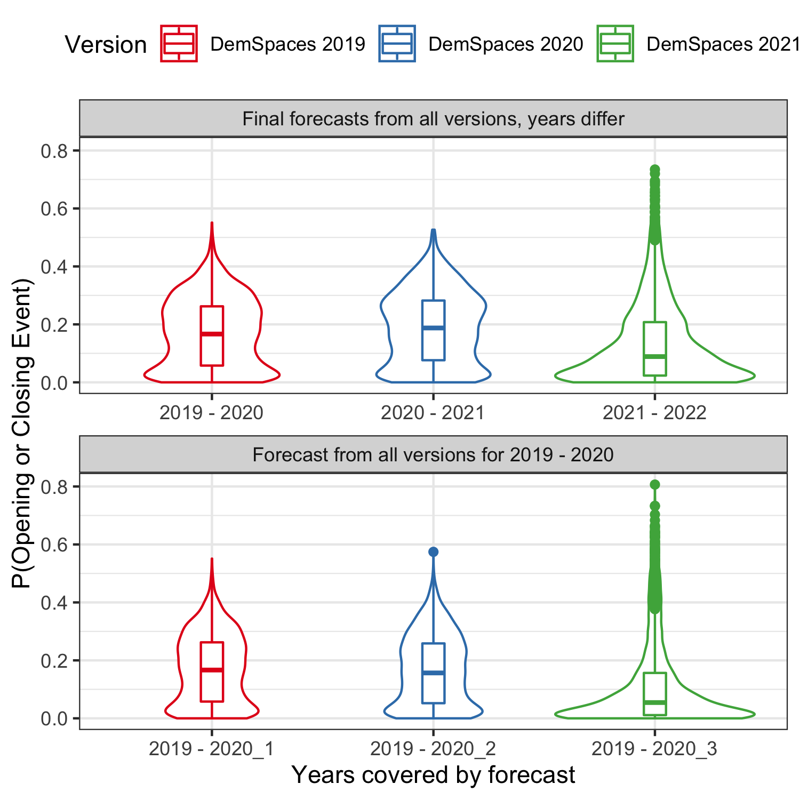
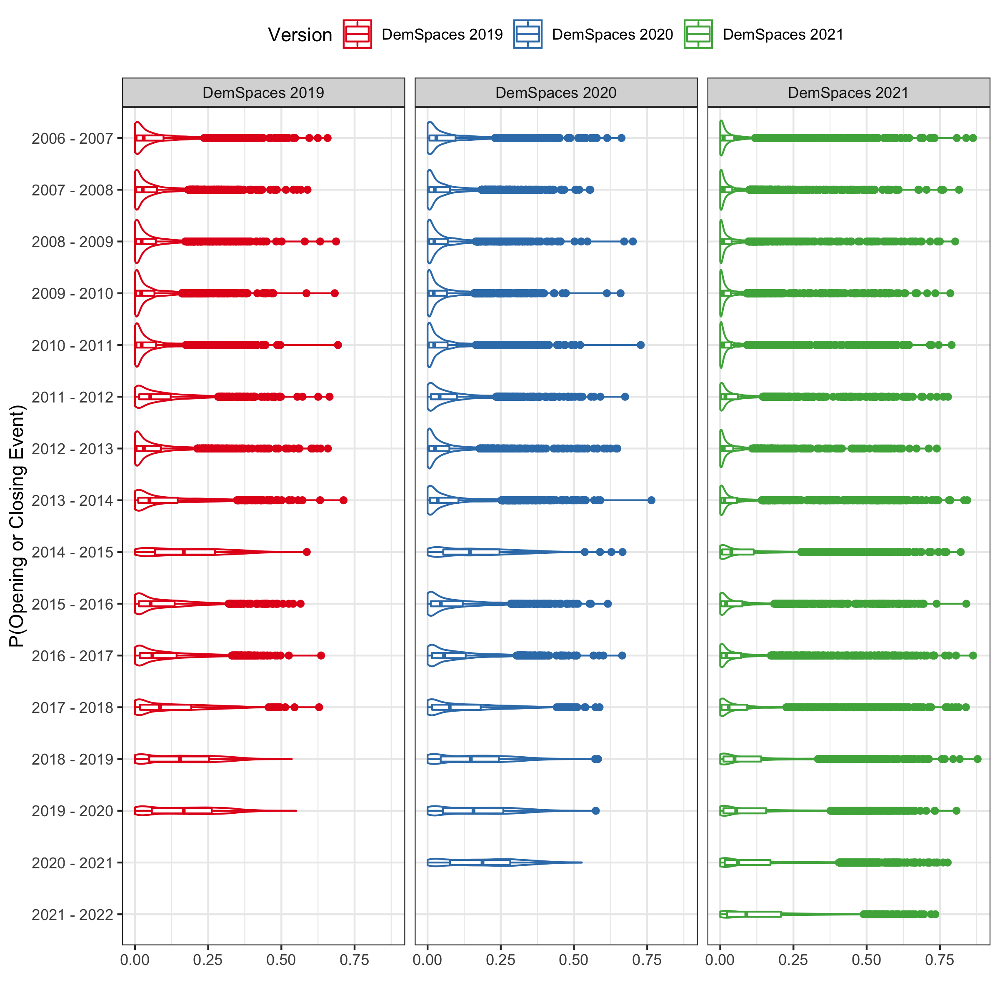
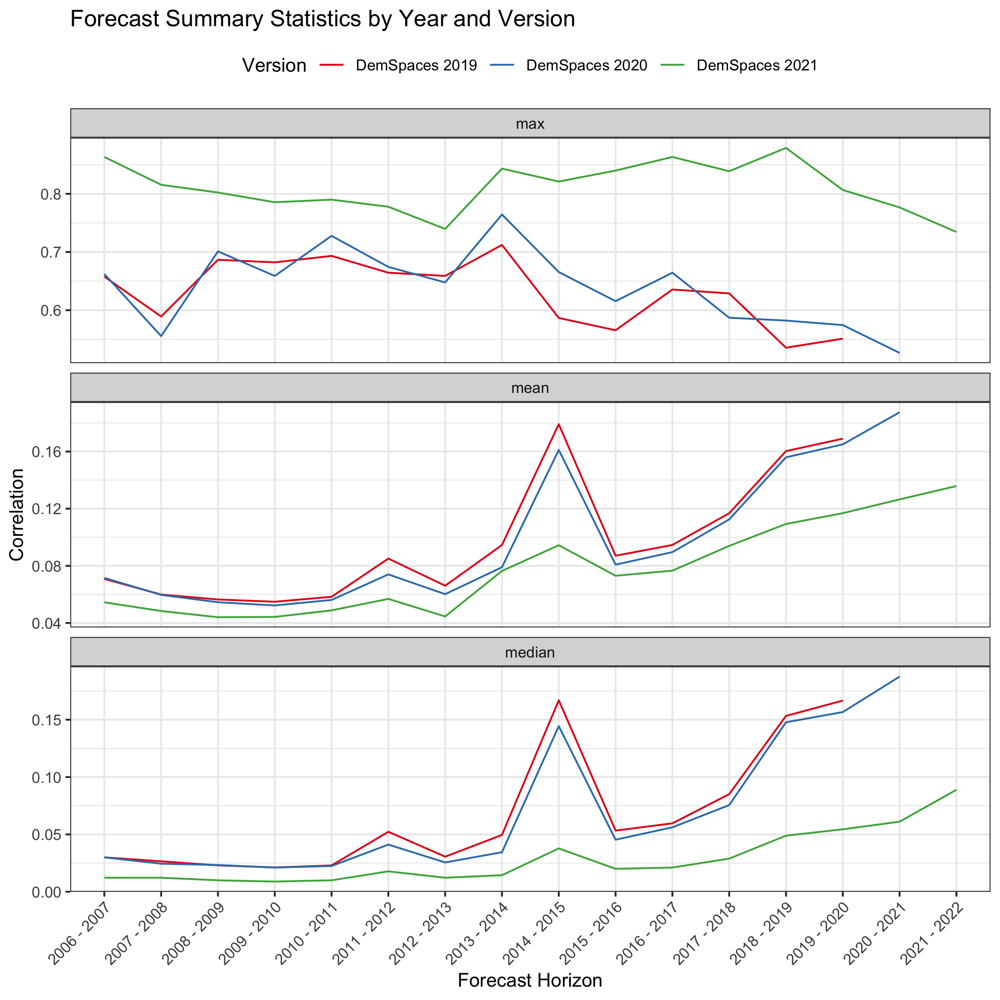
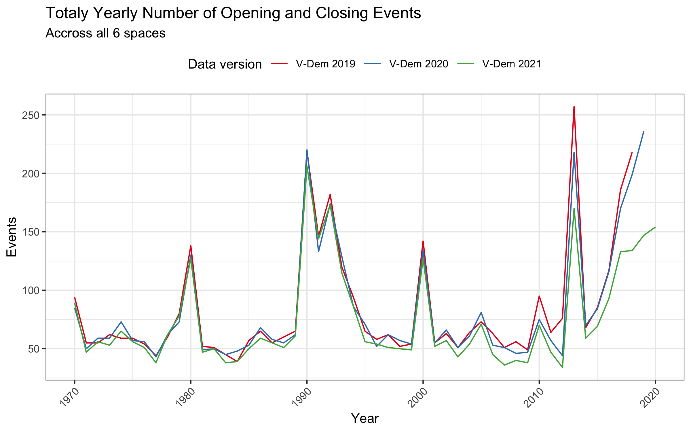
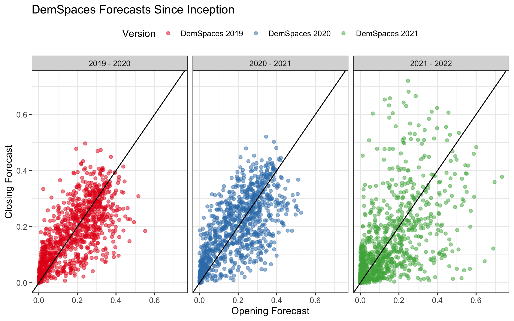
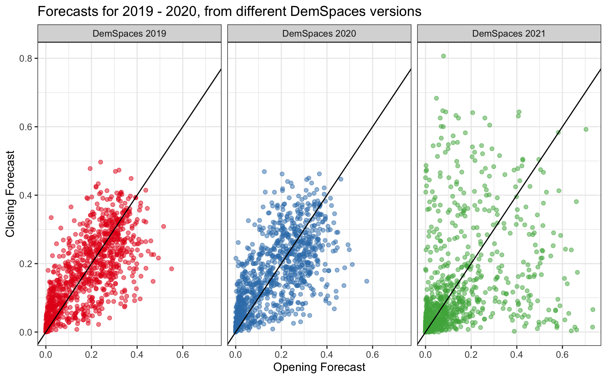
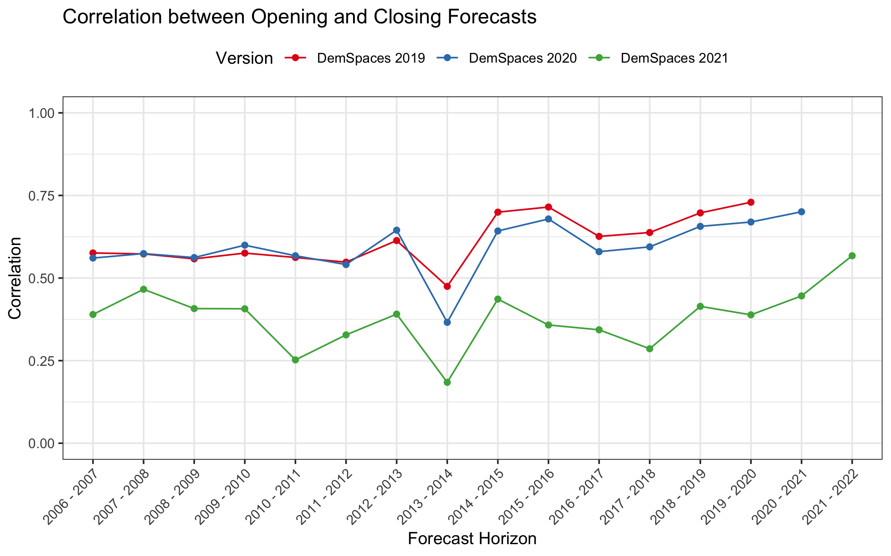

```{r setup, include=FALSE}
knitr::opts_chunk$set(echo = TRUE)

library(knitr)
```

Summary
-------

- The 2021 update included changes to the data and forecast models. As a result they should not be directly compared to the 2019 and 2020 versions (which both used the same set of predictors and models). Rather, they can be compared to the test forecasts for previous years from the 2021 DemSpaces version. The changes have overall slightly increased the test forecast accuracy of the 2021 models, and also their ability to discriminate low and high risk cases. 
- The data and model changes explain the higher max forecast values and lower correlation between Opening and Closing forecasts, compared to previous years. The models simply discriminate more between different cases than was previously the case. 
- The overall forecast distribution this year is lower than those in 2019 and 2020, i.e. lower mean and medians, and lower expected number of events. However, this is due to differences in the V-Dem data versions used in each DemSpaces version. With V-Dem 11 data we generally code slightly fewer events per year than with V-Dem 10 and 9. The discrepancy is noticeably higher for the most recent 5 years, where there are approximately 25% fewer events than with the v9 and v10 data versions. 
- However, when we compare observed events and forecasts from DemSpaces 2021 for the past several years and the forecast for the next 2 years, all with V-Dem v11 data (i.e. apples to apples), _there has been an increase in regime instability since at least 2014, with a consistently increasing number of annual opening and closing events. Based on the forecast this trend is expected to continue._

Question: The top forecasts this year are over 60%, whereas last year they were a bit over 50%. Are the forecasts generally higher this year and if so, does this reflect a real underlying increase in instability?
--------------------------------

The highest forecasts are indeed higher this year than they have been in previous years. The top row in the plot below shows the distributions of all probabilities for opening and closing events for the 3 versions of DemSpaces that have existed to date. (These are literally the set of forecasts we first had in 2019, the 2nd set we created in 2020, and now the 3rd set with the 2021 update—I’ve kept those around in an archive.) Note that these cover different forecast years. 

```{r, echo=FALSE, fig.align='center', out.width='80%'}

```

The red distribution summarizes all the 2019--2020 forecasts that were made in the initial development version of DemSpaces in 2019; the blue distribution are the forecasts for 2020-2021 that were made in the spring of 2020, and the green distribution are the current forecasts, made in the spring of 2021. While the max probabilities for the current forecasts are higher than they have been in previous versions, the distribution also has a lot more low values. I’ll get to averages in a second, but before that I want to address the question of whether these differences in forecast distributions reflect changes in the forecast model/data or indicate real world changes in stability. 

To that end the bottom row in the plot shows the forecast distributions from the 3 DemSpaces versions for the same time period (2019--2020). The same kind of pattern is evident here. The 2021 DemSpaces forecasts have more high predictions but at the same time more low predictions as well. This shows that the difference in _the shape of the distributions_ in the current (2021) forecasts, compared to previous years, is less due to changes in the state of the world but rather related to the data and model changes that were part of the 2021 update process. 

Namely, during the 2021 update process I removed a large number of predictors, including entire external data sources, in order to ease the data maintenance burdens. As a result the models were re-estimated with different inpus and thus are not directly comparable to previous years' models. More details can be found in the "2021 Update Project Summary" memo^[https://github.com/vdeminstitute/demspaces/blob/main/2021-update/project-summary.pdf], the "2021 Update and Accuracy Assessments" report^[https://github.com/vdeminstitute/demspaces/blob/main/2021-update/DemocraticSpaces2021.pdf], and the "Data/variable investigation" note^[https://github.com/vdeminstitute/demspaces/blob/main/2021-update/variable-importance.md]. One key takeaway is that test accuracy actually increased slightly with the reduced data set (because low-value predictors were removed).^[See the 2021 Update folder README: https://github.com/vdeminstitute/demspaces/tree/main/2021-update]

This does not neccessarily mean that there haven't been shifts in the overall level of global instability of regimes, and shifts in the distribution of forecasts over time (i.e. are the 2021 forecasts generally higher than previous forecasts?). For this we examine the forecast distributions for each DemSpaces version by year. The plot below shows those distributions:

```{r, echo=FALSE, fig.align='center', out.width='80%'}

```

This is quite unwieldy, so it is easier to pull some key summary statistics. The plots below show the maximum, mean, and median forecasted probabilities from each DemSpaces version for all (test) forecasts each one made.

```{r, echo=FALSE, fig.align='center', out.width='80%'}

```

Looking at the top panel for the max forecast, the DemSpaces 2021 forecasts are generally higher, again reflecting the data and model changes. There is no completely clear trend over time--maybe a slight decrease in maximum forecasts for more recent years. 

In the mean and median summaries, the 2021 DemSpaces forecasts are actually consistently lower than the previous DemSpaces versions. This seems to be because in the v11 version of the V-Dem data, we generally identify slightly fewer opening and closing events than we had previously with the v9 and v10 V-Dem version data. The plot below shows the number of annual closing and opening events by V-Dem version.^[The first iteration of DemSpaces in 2019 used V-Dem version 9 data, DemSpaces 2020 used V-Dem 10, and DemSpaces 2021 used V-Dem 11. In fact in the code on GitHub the DemSpaces versions correspond simply to the V-Dem data that was used, i.e. versions 9, 10, 11. I have used years as an alternative version label here since it seems more intuitive to note the years when a set of forecasts was made.]

```{r, echo=FALSE, fig.align='center', out.width='80%'}

```

The other pattern to note however is that both the mean and median forecasts, and the observed number of opening and closing events have been increasing roughly 2014. There was an unusual spike of instability in 2013 which consequently led to high forecasts for 2014--2015, but there has also been a steady from the post-spike "normalcy" in 2014. That trend is apparent in all DemSpaces versions and in all versions of the V-Dem data. Thus, the 2021 forecasts indeed are generally higher than those for previous years (when we compare apples to apples), because they reflect a increase in global regime instability over the past 6-7 years. 

Question: In previous DemSpaces versions, the countries in the top forecasts tended to have relatively close, and high, probabilities for both opening and closing events. This year they seem to be less close together, for example Ecuador has a 72% chance of closing, but only a 25% chance of opening. Previously we have reported correlated high forecasts in both directions as indicating "high potential volatility". Why are the forecasts clearer on the opening or closing direction this year?
------------------------------------

This is generally true, and not just for the top forecasts. Opening and closing forecasts have been more correlated in previous DemSpaces versions than they are this year. The plot below shows the opening and closing predictions for each country that was in the final, live forecast for each DemSpaces version:

```{r, echo=FALSE, fig.align='center', out.width='80%'}

```

Each point markes the opening and closing forecasts for a country (N=169) on one of the spaces (N=6). Points near the diagonal line are cases where the opening and closing forecasts were very similar to each other; points further away from the line are lopsided forecasts. We can see that the 2021 forecasts are much less correlated, with cases on the edges that have high opening forecasts but very low closing forecasts, and vice versa. 

This is again driven by the fact that the 2021 model is able to discrimiante more than previous models had. As we did with the previous question above, here are correlations for the 3 DemSpaces versions when looking at forecasts for the _same years, 2019-2020_. 

```{r, echo=FALSE, fig.align='center', out.width='80%'}

```

If the reduction in the correlation between opening and closing forecasts was driven by the data, one would expect that this wouldn't be a general pattern also in other years. Yet the 2021 version of the data and models again shows lower opening/closing correlation than the older versions. 

We can calculate the specific correlation for each of these plots to summarize how much the left two plots differ from the right. In the plot below we show these correlation values, and not just for one set of forecasts, but for all (test) forecasts from all DemSpaces versions:

```{r, echo=FALSE, fig.align='center', out.width='80%'}

```

The DemSpaces 2021 forecasts consistenly have a lower correlation between Opening and Closing forecasts than the previous two DemSpaces versions had. We can conclude that the lower correlation between Opening and Closing forecasts mainly reflects improvements in the 2021 data and models. That said, there is a slight upward trend in the correlation (in all versions) for more recent years. This may reflect the previoulys noted upward trend in instability over the past few years. 


