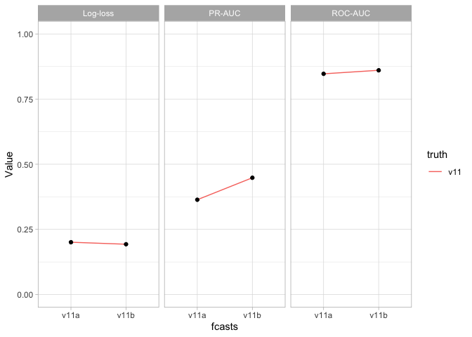

2021 Update Notes
================

Andreas Beger  
2021-03-26

*tl;dr: For the 2021 update, I eliminated a bunch of external data
sources and other variables. Instead of 481 columns, the new merged data
has 225. This did not decrease forecast performance, in fact accuracy
increased a bit.*

I made a very substantial change for the 2021 forecast update, namely
removing a large number of data sources and variables that go into the
models as predictors. The reasons were that (1) I wanted to streamline
the update process, (2) some of the data sources (EPR, Archigos) have
not been update, and (3) and prior suspicion that some of the variables
in the data were not really that helpful for accuracy.

To do this I looked at the variable importance using last year’s model.
More details and the results of that analysis are documented in
[variable-importance.md](variable-importance.md). Based on those
results, I, for example, removed the EPR, Archigos, and ACD data sources
completely.

The initial data update for 2021 did not include those changes: I
updated the V-Dem, P\&T Coups, GDP, population, and infant mortality
data, and merged them with last year’s EPR, etc. data. The resulting
dataset, with the suffix “v11a”, had the same number of columns as the
2020 “v10” dataset.

Subsequently I applied those changes and produced a second dataset with
roughly only half the columns as the first version, and this one is
“v11b”.

I ran the forecasts using both dataset versions as input, to make sure
that the removal of \~200 predictors would not affect accuracy. The
table and figure below show the accuracy of both versions. Streamlining
the dataset in fact seems to have increased performance.

``` r
# How do the forecast versions impact accuracy
acc %>%
    filter(fcasts!="v10", truth=="v11") %>% 
  pivot_wider(names_from = "Measure", values_from = "Value") %>% 
  arrange(truth, fcasts) %>%
  select(truth, fcasts, `Log-loss`, `ROC-AUC`, `PR-AUC`) %>%
  setNames(c("Forecasts", "V-Dem", "Log-loss", "AUC-ROC", "AUC-PR")) %>%
  knitr::kable(digits = 3)
```

| Forecasts | V-Dem | Log-loss | AUC-ROC | AUC-PR |
| :-------- | :---- | -------: | ------: | -----: |
| v11       | v11a  |    0.201 |   0.847 |  0.364 |
| v11       | v11b  |    0.193 |   0.861 |  0.448 |

``` r
acc %>%
  filter(fcasts!="v10", truth=="v11") %>%
  ggplot(aes(x = fcasts, y = Value)) +
  facet_wrap(~ Measure) +
  geom_line(aes(x = fcasts, group = truth,
                color = truth)) +
  geom_point() +
  scale_y_continuous(limits = c(0, 1)) +
  theme_light()
```

<!-- -->
