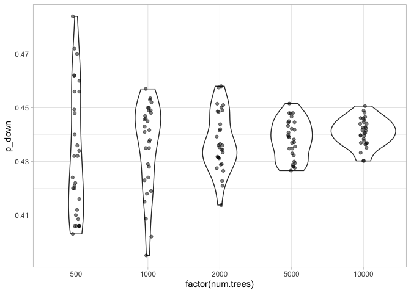
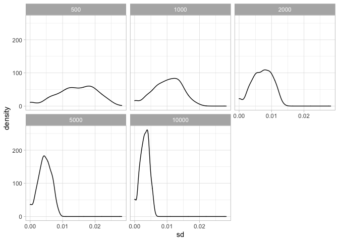
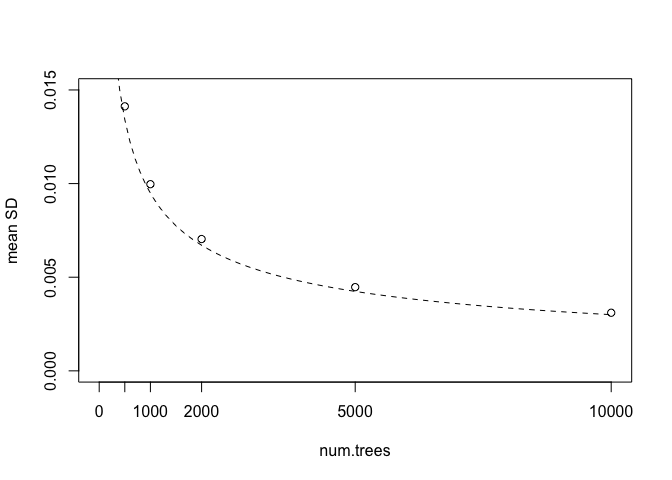

Experiments on the randomness of random forest forecasts
================

Author: Andreas Beger  
Written: 15 March 2022  
Last compiled: 16 March 2022

The random forest models used to create the democratic spaces forecasts
are, as their name suggests, not deterministic models. Running the same
model with the same input will lead to slightly different predictions
each time it is run.

How much does this random element influence the forecasts for specific
countries?

I know from experience–re-running the same models multiple times during
the yearly updates–that the aggregate accuracy when summarizing over all
countries and years is relatively stable and only changes a decimal
point here and there due to randomness. However, the country-level
forecasts likely are less stable, and more influenced by the random
element.

The main way to control this without adversely influencing accuracy is
to increase the number of trees in the model. However, this comes at the
cost of increased model training time.

This note looks into two things:

1.  How much variance is there in the country forecasts for a given
    level of trees?
2.  How does variance respond to increasing the number of trees?

To answer these questions, I ran a series of experiments for one
outcome, the Associational space (“v2xcs_ccsi” indicator). In these
experiments I ran the forecast model at several “number of trees”
settings: 500, 1000, 2000, and 10000, and for each “number of trees”
setting, re-ran the model 30 times. Thus each country in the end has 30
forecasts for a given “number of trees” setting, giving some sense of
the random variability of forecasts.

Here is a representative case illustrating the impact of growing larger
RF models, the forecasts for Bolivia closing event:

<!-- -->

As the number of trees in the model increases, the variance of the
forecasts decreases.

Here is a look across all countries, showing the distribution of the
country-level forecast standard deviations:

<!-- -->

The table below shows the average country-level standard deviation. The
“spread” column should be roughly representative of the range covered by
the risk forecasts for a country, like in that Bolivia plot above.

| num.trees | mean_sd | spread |
|----------:|--------:|-------:|
|       500 |  0.0141 | 0.0424 |
|      1000 |  0.0100 | 0.0299 |
|      2000 |  0.0070 | 0.0211 |
|      5000 |  0.0045 | 0.0134 |
|     10000 |  0.0031 | 0.0093 |

The decreases in random variability pretty much follows a inverse square
root progression:

<!-- -->

The more trees, the more stable the forecasts, but with diminishing
returns. On the other hand, more trees also mean more time to train a
model. From the tuning experiments, with mtry=20 and min.node.size=1, it
takes roughly 1 minute per 1000 trees to train a single model that
forecasts the up and down risk for one outcome.

In previous years I used 1,000 trees in the models. Using a slighly
larger number seems reasonable.
