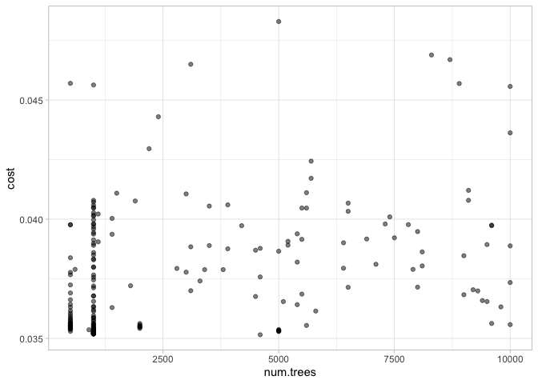
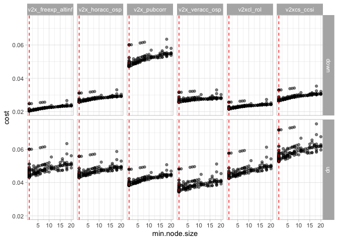
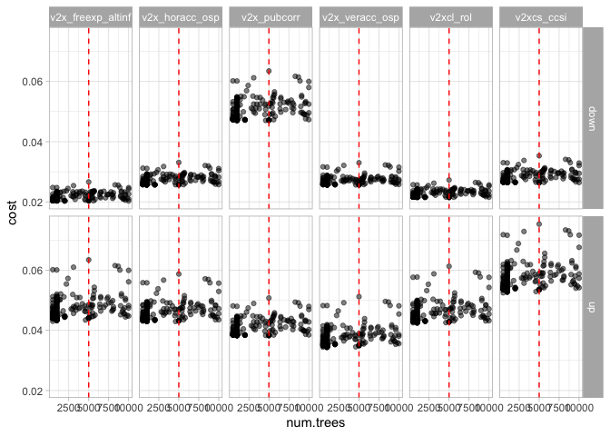
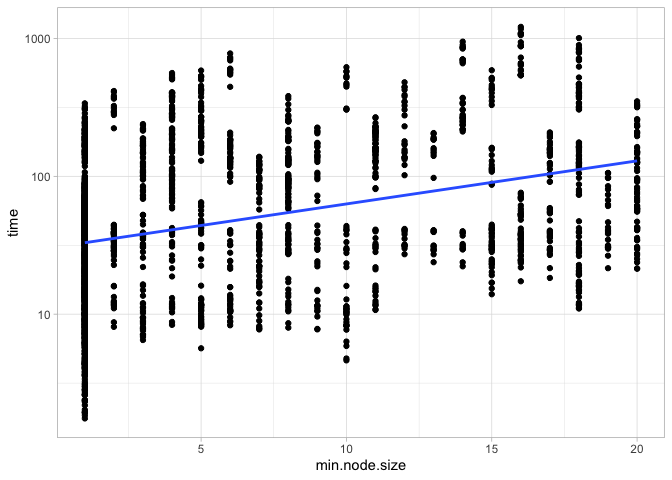
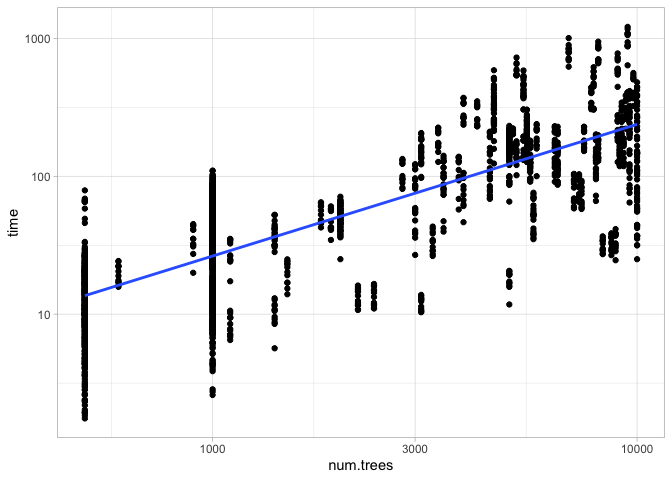

RF tuning experiments
================

Author: Andreas Beger  
Date: 17 March 2022  
Last compiled: 17 March 2022

The random forest forecasting models have a number of hyperparameters
that have to be set outside of the usual model training process.
Pre-2022 **demspaces** used fixed values for the number of trees and
minimum node size hyperparameters, while picking a outcome specific mtry
value from a set of 13 options using the random forest out-of-bag error
estimate. This setup was based on tuning experiments run during the
initial project development in 2019-2020, which showed that the optimum
mtry value varied over outcomes. Although avoiding more computationally
expensive cross-validation and tuning over multiple hyperparameters,
with 6 spaces \* 2 direction = 12 outcomes, this still led to a
multi-hour training time to run the forecast pipeline. Given the changes
in the data during the 2021 update last year, this year I ran another
tuning experiment to determine whether fixed mtry values could be used
instead.

*Note to future me: I ran `modelrunner/R/rf-tuning.R` multiple times,
both on my Mac laptop and the Windows machine. The script is setup to
save experimental runs to timestamped files, and combine any files
matching that pattern into a joint tune results file. I used Dropbox as
an intermediary to hold the results, and in the end copied the final
results file to the `2022-update/data/` folder.*

Here is the tuning experiments data:

``` r
suppressPackageStartupMessages({
  library(dplyr)
  library(ggplot2)
})

tr <- readRDS("~/Dropbox/Work/vdem/demspaces/tuning/all-results.rds")

head(tr)
```

    ## # A tibble: 6 × 11
    ##   source_file  outcome direction   row num.trees  mtry min.node.size cost   time
    ##   <chr>        <chr>   <chr>     <dbl>     <dbl> <dbl>         <dbl> <lis> <dbl>
    ## 1 rf-tune-res… v2xcl_… up            1       500    10            10 <dbl… 100. 
    ## 2 rf-tune-res… v2x_pu… down          1       500    10            10 <dbl…  63.3
    ## 3 rf-tune-res… v2x_ve… up            1       500    10            10 <dbl…  91.9
    ## 4 rf-tune-res… v2xcs_… down          1       500    10            10 <dbl…  87.4
    ## 5 rf-tune-res… v2x_fr… down          1       500    10            10 <dbl…  47.7
    ## 6 rf-tune-res… v2x_ho… down          1       500    10            10 <dbl…  83.8
    ## # … with 2 more variables: rep_n <dbl>, nodename <chr>

``` r
glimpse(tr)
```

    ## Rows: 2,220
    ## Columns: 11
    ## $ source_file   <chr> "rf-tune-results_2022-03-12_104503.rds", "rf-tune-result…
    ## $ outcome       <chr> "v2xcl_rol", "v2x_pubcorr", "v2x_veracc_osp", "v2xcs_ccs…
    ## $ direction     <chr> "up", "down", "up", "down", "down", "down", "up", "up", …
    ## $ row           <dbl> 1, 1, 1, 1, 1, 1, 1, 1, 1, 1, 1, 1, 3, 3, 5, 3, 1, 2, 5,…
    ## $ num.trees     <dbl> 500, 500, 500, 500, 500, 500, 500, 500, 500, 500, 500, 5…
    ## $ mtry          <dbl> 10, 10, 10, 10, 10, 10, 10, 10, 10, 10, 10, 10, 11, 11, …
    ## $ min.node.size <dbl> 10, 10, 10, 10, 10, 10, 10, 10, 10, 10, 10, 10, 11, 11, …
    ## $ cost          <list> <0.04833992, 0.04836110, 0.04851613, 0.04839993, 0.0485…
    ## $ time          <dbl> 100.340, 63.268, 91.861, 87.444, 47.676, 83.846, 99.377,…
    ## $ rep_n         <dbl> 10, 10, 10, 10, 10, 10, 10, 10, 10, 10, 10, 10, 10, 10, …
    ## $ nodename      <chr> "mbp-2019.local", "mbp-2019.local", "mbp-2019.local", "m…

Some details on this:

-   the “outcome” column are the indicators for the 6 spaces, and for
    each space there are separate models for the opening and closing
    directions
-   “row” is just a leftover from the hyperparameter grid construction
    and can be disregarded
-   “cost” is the accuracy measure, out-of-bag (OOB) Brier score (see
    below)

On that, from `?ranger`:

> `prediction.error`: Overall out of bag prediction error. For
> classification this is the fraction of missclassified samples, for
> probability estimation the Brier score, for regression the mean
> squared error and for survival one minus Harrell’s C-index.

This is calculated by predicting each training data case using the
decision trees that *did not* include that training case in its
bootstrap sample. It is not the same as formal cross-validation, but
easier to implement and less demanding in terms of estimation time.

-   “rep_n”: for a given outcome-direction-hyperparamter combination, I
    trained “rep_n” separate models. The idea here was to average out
    some of the randomness inherent in random forest models. We can just
    average that out now:

``` r
tr$cost <- sapply(tr$cost, mean)
```

-   “time”: how many seconds it took to train the model
-   “nodename”: the computer I ran this row on

## Aggregated analysis

The whole idea was to check whether it makes sense to use a single fixed
global mtry value instead of model specific optimizations, so let’s
start with a aggregated look. The code below averages over the “outcome”
and “direction” columns, i.e. we go from 12 models for each combination
of HP settings to 1.

``` r
aggregated <- tr |>
  group_by(num.trees, mtry, min.node.size) |>
  summarize(cost = mean(cost), .groups = "drop")
```

The results for “min.node.size” are very clear, a value of 1 is optimal:

``` r
ggplot(aggregated, aes(x = min.node.size, y = cost)) +
  geom_point(alpha = 0.5) +
  theme_light()
```

<!-- -->

That a value of 1 is optimal was apparent pretty quickly, so at some
point I went with a two-pronged strategy for the experiments: one track
with “min.node.size” = 1, and the other, original track with random
samples over a range of values for each HP. This is why there are is
clustering in the points in this and the other plots below.

For “num.trees”, the conventional wisdom is that beyond a minimum number
of trees, it doesn’t make a big difference. That seems to be the case
here too:

``` r
ggplot(aggregated, aes(x = num.trees, y = cost)) +
  geom_point(alpha = 0.5) +
  theme_light()
```

<!-- -->

The range of values I tried out here were 500 to 10,000. It seems that
even 500 is sufficient with the correct settings for “min.node.size” and
“mtry”. However, with a higher number of trees, the random element in
the forecasts for specific cases due to the inherent randomness of
random forest stabilizes, so I use a higher value. See the [RF
stability](rf-stability.md) note.

Lastly, “mtry” is more complicated.

``` r
ggplot(aggregated, aes(x = mtry, y = cost)) +
  geom_point(alpha = 0.5) +
  theme_light()
```

<!-- -->

Three observations:

-   This is harder than the other two because “mtry” improves accuracy
    over a much broader range of values.
-   However, “mtry” also has a major impact on model training time, so
    there is a tradeoff in how far down on values to go.
-   Ramping up the number of trees actually also slighly improves
    accuracy at the margin, but also at a high cost for model training
    time. This is what the cluster around “mtry”=20 shows (I random the
    same sequences of mtry values at different numbers of trees to check
    this).

In the end, I used 20 as a compromise solution.

## Disaggregated check

The hyperparameter values I settled on through this analysis and the
forecast stability concerns mentioned above, were “mtry”=20,
“num.trees”=5000, and “min.node.size”=1. Are these also ok if we look at
the disaggregated data for all 12 outcomes?

``` r
ggplot(tr, aes(x = min.node.size, y = cost)) +
  geom_point(alpha = 0.5) +
  facet_grid(direction ~ outcome) +
  theme_light() +
  geom_vline(xintercept = 1, col = "red", linetype = 2)
```

<!-- -->

``` r
ggplot(tr, aes(x = num.trees, y = cost)) +
  geom_point(alpha = 0.5) +
  facet_grid(direction ~ outcome) +
  theme_light() +
  geom_vline(xintercept = 5000, col = "red", linetype = 2)
```

<!-- -->

``` r
ggplot(tr, aes(x = mtry, y = cost)) +
  geom_point(alpha = 0.5) +
  facet_grid(direction ~ outcome) +
  theme_light() +
  geom_vline(xintercept = 20, col = "red", linetype = 2)
```

<!-- -->

For “mtry” it looks like a higher value could squeeze out a bit more
performance for the “up” direction outcomes, but given the
compuatational impact 20 still seems like a reasonable compromise.

## Computational time analysis

The y-axis in the charts now is the model training time in seconds. I
ran some of the early experiments with “rep_n” = 10, but the majority
are with “rep_n” = 5, so let’s factor that out as well.

``` r
tr$time <- tr$time / tr$rep_n

ggplot(tr, aes(x = min.node.size, y = time)) +
  geom_point() +
  geom_smooth(method = "lm", se = FALSE, formula = 'y ~ x') +
  theme_light() +
  scale_y_log10()
```

<!-- -->

``` r
# Note both axes are logged now
ggplot(tr, aes(x = num.trees, y = time)) +
  geom_point() +
  geom_smooth(method = "lm", se = FALSE, formula = 'y ~ x') +
  theme_light() +
  scale_y_log10() +
  scale_x_log10()
```

<!-- -->

``` r
ggplot(tr, aes(x = mtry, y = time)) +
  geom_point() +
  geom_smooth(method = "lm", se = FALSE, formula = 'y ~ x') +
  theme_light() +
  scale_y_log10() +
  scale_x_log10()
```

<!-- -->

“mtry” and “num.trees” in particular interact to increase training time,
so let’s move to a model. Adding “min.node.size” and “nodename” to the
model helps a bit, but just as it is, is already pretty good.

``` r
mdl <- lm(log(time) ~ log(num.trees)*log(mtry), data = tr)
summary(mdl)
```

    ## 
    ## Call:
    ## lm(formula = log(time) ~ log(num.trees) * log(mtry), data = tr)
    ## 
    ## Residuals:
    ##      Min       1Q   Median       3Q      Max 
    ## -0.84817 -0.15603  0.02033  0.15317  0.56336 
    ## 
    ## Coefficients:
    ##                           Estimate Std. Error t value Pr(>|t|)    
    ## (Intercept)              -5.540492   0.100002 -55.404   <2e-16 ***
    ## log(num.trees)            0.969440   0.012699  76.339   <2e-16 ***
    ## log(mtry)                 0.755271   0.037340  20.227   <2e-16 ***
    ## log(num.trees):log(mtry)  0.002886   0.004696   0.615    0.539    
    ## ---
    ## Signif. codes:  0 '***' 0.001 '**' 0.01 '*' 0.05 '.' 0.1 ' ' 1
    ## 
    ## Residual standard error: 0.2183 on 2216 degrees of freedom
    ## Multiple R-squared:  0.9719, Adjusted R-squared:  0.9718 
    ## F-statistic: 2.551e+04 on 3 and 2216 DF,  p-value: < 2.2e-16

Basically “mtry” and “num.trees” are the main things impacting model
training time, and both have similarly-sized impacts on training time.
