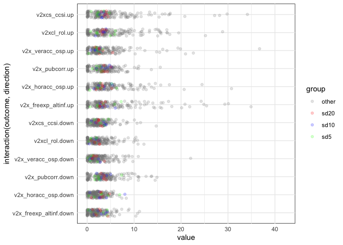

Variable importances for space indicator moving SD
================

11 March 2022

I did some mild meddling with the predictors as part of the update,
cocumented in [issue
#18](https://github.com/vdeminstitute/demspaces/issues/18). As part of
that, I tried out 5, 10, and 20 year moving standard deviations for the
6 space indicators. The basic idea was that countries where the
indicator has been unstable will continue to be unstable, increasing the
risk of either opening or closing moves.

Like in the 2021 update, I used a combination of variable importance and
changes in prediction accuracy to guide decisions.

And the decision, namely, was to add 10 year moving averages, based on
the results below. Technically the performance for all three versions
was similar, but 10 years was a convenient compromise. The accuracy
seems to generally improve a slight bit as well [scroll the relevant
commit](https://github.com/vdeminstitute/demspaces/commit/395d7c02b36b9523a7427ed9f10e9bf8ab49d44b).

The variable importance data comes from
`modelrunner/R/variable-importance.R`, run with 1,000 trees, mtry = 15,
and min.node.size = 1; permutation variable importance. I manually
copied the output file to this folder.

``` r
suppressPackageStartupMessages({
  library(dplyr)
  library(stringr)
  library(tidyr)
  library(here)
  library(ggplot2)
})

vi <- readRDS(here::here("2022-update/data/varimp2022-hist-sd.rds"))
vi$num.trees <- vi$mtry <- vi$min.node.size <- vi$time <- NULL
vi$var_imp <- lapply(vi$var_imp, tibble::enframe, name = "variable")
vi <- vi %>% tidyr::unnest(var_imp)
vi$value <- vi$value*1e3

vi %>%
  mutate(group = case_when(
    str_detect(variable, "sd20") ~ "sd20",
    str_detect(variable, "sd10") ~ "sd10",
    str_detect(variable, "sd5") ~ "sd5",
    TRUE ~ "other"
  )) %>%
  ggplot(aes(x = interaction(outcome, direction), 
             y = value)) + 
  geom_jitter(width = 0.2, alpha = 0.2, aes(color = group)) +
  scale_color_manual(values = c("other" = "gray50", "sd20" = "red", "sd10" = "blue", "sd5" = "green")) +
  coord_flip() +
  scale_y_continuous(limits = range(vi$value)) +
  theme_minimal() +
  theme(
    panel.background = element_rect(color = "black", fill = NA, size = 0.5)
  )
```

    ## Warning: Removed 1 rows containing missing values (geom_point).

<!-- -->

``` r
vi %>%
  mutate(group = case_when(
    str_detect(variable, "sd20") ~ "sd20",
    str_detect(variable, "sd10") ~ "sd10",
    str_detect(variable, "sd5") ~ "sd5",
    TRUE ~ "other"
  )) %>%
  group_by(group) %>%
  summarize(mean = mean(value),
            median = median(value),
            max = max(value),
            n_over_4.3 = sum(value > 4.3))
```

    ## # A tibble: 4 × 5
    ##   group  mean median   max n_over_4.3
    ##   <chr> <dbl>  <dbl> <dbl>      <int>
    ## 1 other  3.63   2.63 42.2         641
    ## 2 sd10   2.93   2.92  8.04          9
    ## 3 sd20   3.00   3.06  5.43          7
    ## 4 sd5    2.62   2.23  7.34         12

``` r
vi %>%
  group_by(variable) %>%
  summarize(mean = mean(value),
            max = max(value),
            n_over_1.3 = sum(value >= 4.3)) %>%
  arrange(desc(mean)) %>%
  knitr::kable("markdown", digits = 1)
```

| variable                         | mean |  max | n_over_1.3 |
|:---------------------------------|-----:|-----:|-----------:|
| lag0_v2x_diagacc                 | 13.5 | 30.1 |         12 |
| lag0_v2x_clpol                   | 11.8 | 24.3 |         12 |
| lag0_v2x_frassoc_thick           | 11.7 | 28.2 |         11 |
| v2xcs_ccsi                       | 11.6 | 42.2 |         10 |
| v2x_freexp_altinf                | 10.6 | 34.9 |         10 |
| lag0_v2x_civlib                  | 10.1 | 28.9 |         10 |
| lag0_v2x_freexp                  | 10.0 | 24.9 |         10 |
| v2x_veracc_osp                   | 10.0 | 36.7 |          8 |
| lag0_v2x_polyarchy               |  9.8 | 20.8 |         10 |
| v2xcl_rol                        |  9.4 | 25.2 |         11 |
| lag0_v2x_liberal                 |  9.3 | 15.9 |         12 |
| lag0_v2cseeorgs                  |  8.9 | 27.2 |         10 |
| lag0_v2csreprss                  |  8.6 | 34.1 |          8 |
| lag0_v2csantimv                  |  8.1 | 14.9 |         10 |
| lag0_v2x_EDcomp_thick            |  8.0 | 19.3 |          7 |
| lag0_v2merange                   |  7.9 | 29.3 |          6 |
| lag0_v2xcl_disc                  |  7.6 | 16.2 |          9 |
| v2x_horacc_osp                   |  7.3 | 24.5 |          9 |
| lag0_v2cldiscm                   |  7.0 | 15.5 |          9 |
| lag0_v2xnp_pres                  |  7.0 | 14.3 |         10 |
| lag0_v2mebias                    |  7.0 | 20.1 |          7 |
| lag0_v2cldiscw                   |  6.8 | 15.6 |          9 |
| lag0_v2mecrit                    |  6.8 | 21.9 |          8 |
| lag0_v2meharjrn                  |  6.8 |  9.4 |         12 |
| year                             |  6.7 | 17.6 |          5 |
| lag0_v2xel_frefair               |  6.6 | 22.6 |          8 |
| lag0_v2xlg_legcon                |  6.4 | 30.8 |          6 |
| lag0_v2x_clpriv                  |  6.3 | 17.6 |          7 |
| lag0_v2x_neopat                  |  6.3 | 10.9 |          8 |
| lag0_v2x_clphy                   |  6.2 | 17.1 |          8 |
| lag0_v2clfmove                   |  6.1 | 17.0 |          9 |
| lag0_v2x_rule                    |  5.9 | 14.9 |          8 |
| lag0_v2xdl_delib                 |  5.8 | 10.7 |          9 |
| lag0_v2elembaut                  |  5.8 | 11.5 |          6 |
| lag1_infmort                     |  5.7 | 11.0 |          8 |
| lag0_v2x_jucon                   |  5.7 |  9.2 |          9 |
| lag0_v2lgoppart                  |  5.6 | 15.7 |          6 |
| lag0_v2clkill                    |  5.5 | 15.0 |          7 |
| lag0_v2clacfree                  |  5.5 | 11.4 |          6 |
| lag0_v2lginvstp                  |  5.4 | 20.7 |          6 |
| lag0_v2elfrfair                  |  5.4 | 21.0 |          6 |
| lag0_v2exrescon                  |  5.4 |  9.2 |          7 |
| lag0_v2meslfcen                  |  5.3 | 14.0 |          6 |
| lag0_v2x_cspart                  |  5.3 | 10.2 |          7 |
| lag0_v2cltrnslw                  |  5.2 | 10.1 |          5 |
| lag0_v2mecorrpt                  |  5.2 | 11.0 |          6 |
| lag0_v2psoppaut                  |  5.1 | 10.4 |          7 |
| lag0_v2clacjstm                  |  5.1 | 11.3 |          6 |
| lag0_v2psbars                    |  5.1 |  8.7 |          8 |
| lag0_v2mecenefm                  |  5.0 | 10.3 |          6 |
| lag0_v2cltort                    |  5.0 | 11.6 |          6 |
| lag0_v2dlcountr                  |  4.9 |  9.3 |          4 |
| lag0_v2clrspct                   |  4.9 | 10.2 |          6 |
| lag0_v2csprtcpt                  |  4.8 |  7.7 |          7 |
| lag0_v2xcl_acjst                 |  4.7 |  8.9 |          6 |
| lag0_v2csrlgrep                  |  4.7 | 11.0 |          4 |
| lag0_v2dlengage                  |  4.7 |  9.2 |          5 |
| lag0_v2pssunpar                  |  4.6 |  9.0 |          6 |
| lag0_v2x_gencl                   |  4.6 |  8.9 |          5 |
| lag0_v2cscnsult                  |  4.6 |  8.6 |          7 |
| lag0_v2clstown                   |  4.5 | 13.3 |          4 |
| lag0_state_age                   |  4.5 |  9.3 |          6 |
| lag1_infmort_yearadj             |  4.5 |  8.7 |          6 |
| lag0_v2exthftps                  |  4.3 | 15.6 |          2 |
| lag0_v2elmulpar                  |  4.3 | 15.4 |          6 |
| v2x_pubcorr                      |  4.3 | 14.5 |          2 |
| lag0_v2dlconslt                  |  4.3 |  8.1 |          4 |
| lag1_log_gdp_pc                  |  4.3 | 10.8 |          3 |
| lag0_v2x_partip                  |  4.2 |  6.1 |          4 |
| lag0_v2lgotovst                  |  4.2 | 13.7 |          2 |
| lag0_v2x_egal                    |  4.1 |  7.6 |          5 |
| lag0_v2clacjstw                  |  4.1 |  8.8 |          4 |
| lag0_v2x_corr                    |  4.0 | 12.5 |          3 |
| lag0_v2x_gencs                   |  4.0 |  5.3 |          6 |
| lag0_v2exembez                   |  3.9 |  7.8 |          3 |
| lag0_v2x_horacc_osp_sd10         |  3.9 |  8.0 |          3 |
| lag0_v2xnp_client                |  3.9 |  8.4 |          3 |
| lag0_v2xnp_regcorr               |  3.8 |  8.6 |          2 |
| lag0_v2psparban                  |  3.8 |  6.6 |          5 |
| lag0_v2x_freexp_altinf_sd5       |  3.8 |  7.2 |          3 |
| lag0_v2ellocons                  |  3.8 | 12.3 |          3 |
| lag0_v2elintim                   |  3.7 | 10.2 |          4 |
| lag0_v2xcl_prpty                 |  3.6 |  7.3 |          3 |
| lag0_v2cldmovem                  |  3.6 | 15.7 |          2 |
| lag0_v2juhccomp                  |  3.6 |  8.9 |          2 |
| lag0_v2xeg_eqprotec              |  3.6 |  5.5 |          3 |
| lag1_log_gdp                     |  3.6 |  6.1 |          5 |
| lag0_v2x_veracc_osp_sd20         |  3.6 |  5.4 |          2 |
| lag0_v2x_ex_military             |  3.6 |  6.2 |          3 |
| lag0_v2excrptps                  |  3.5 | 13.8 |          2 |
| lag0_v2xeg_eqaccess              |  3.5 |  6.0 |          2 |
| lag0_v2x_execorr                 |  3.4 |  7.8 |          2 |
| lag0_years_since_last_pt_attempt |  3.4 |  5.0 |          5 |
| lag0_v2elaccept                  |  3.4 | 10.7 |          2 |
| lag0_v2xeg_eqdr                  |  3.4 |  5.6 |          3 |
| lag0_v2x_freexp_altinf_sd10      |  3.3 |  6.0 |          3 |
| lag0_v2xcl_dmove                 |  3.3 | 13.2 |          2 |
| lag0_v2ellocumul                 |  3.3 |  6.0 |          5 |
| lag0_v2x_horacc_osp_sd20         |  3.3 |  5.2 |          3 |
| lag0_v2pepwrsoc                  |  3.3 |  5.8 |          1 |
| lag0_v2clrelig                   |  3.2 |  9.5 |          3 |
| lag0_v2x_freexp_altinf_sd20      |  3.2 |  4.4 |          1 |
| lag0_v2clprptyw                  |  3.2 |  4.6 |          2 |
| lag0_v2x_horacc_osp_sd5          |  3.2 |  6.9 |          3 |
| lag0_v2juaccnt                   |  3.2 |  9.3 |          1 |
| lag0_v2jucomp                    |  3.1 |  5.7 |          2 |
| lag0_v2dlreason                  |  3.1 |  5.1 |          2 |
| lag0_v2xcl_rol_sd20              |  3.1 |  4.3 |          1 |
| lag0_v2juhcind                   |  3.0 |  5.2 |          1 |
| lag0_v2elembcap                  |  3.0 |  4.7 |          2 |
| lag0_v2x_veracc_osp_sd10         |  3.0 |  5.2 |          1 |
| lag0_v2elvotbuy                  |  3.0 |  5.2 |          2 |
| lag0_v2xcl_rol_sd10              |  3.0 |  4.1 |          0 |
| lag0_v2jupurge                   |  3.0 |  5.2 |          2 |
| lag0_v2xcl_rol_sd5               |  3.0 |  6.0 |          2 |
| lag0_v2clprptym                  |  2.9 |  5.9 |          2 |
| lag0_v2xcs_ccsi_sd5              |  2.9 |  5.9 |          3 |
| lag0_v2pehealth                  |  2.9 |  6.8 |          1 |
| lag0_v2jureview                  |  2.9 |  5.4 |          2 |
| lag0_v2juncind                   |  2.9 |  4.2 |          0 |
| lag0_v2jucorrdc                  |  2.9 |  6.9 |          2 |
| lag0_v2lgqstexp                  |  2.8 |  5.6 |          1 |
| lag0_v2elirreg                   |  2.8 |  5.4 |          2 |
| lag0_v2dlencmps                  |  2.8 |  7.0 |          1 |
| gwcode                           |  2.8 |  8.3 |          3 |
| lag0_v2pepwrort                  |  2.8 |  5.8 |          2 |
| lag0_v2peedueq                   |  2.8 |  4.0 |          0 |
| lag0_v2exbribe                   |  2.8 |  5.1 |          2 |
| lag0_v2lgcrrpt                   |  2.7 |  5.5 |          1 |
| lag0_v2elrgstry                  |  2.7 |  6.4 |          2 |
| lag0_v2xcs_ccsi_sd20             |  2.7 |  4.1 |          0 |
| lag0_log_pop                     |  2.7 |  5.5 |          1 |
| lag0_v2clacjust                  |  2.7 |  4.8 |          1 |
| lag0_v2xcs_ccsi_sd10             |  2.7 |  4.3 |          1 |
| lag0_v2jupoatck                  |  2.7 |  4.5 |          1 |
| lag0_v2lgcomslo                  |  2.6 |  4.1 |          0 |
| lag0_v2elpdcamp                  |  2.6 |  4.8 |          3 |
| lag0_v2lglegplo                  |  2.6 |  5.0 |          1 |
| lag0_v2psplats                   |  2.5 |  3.9 |          0 |
| lag0_v2svstterr                  |  2.5 |  4.0 |          0 |
| lag0_v2xcl_slave                 |  2.5 |  4.0 |          0 |
| lag0_v2exremhsp                  |  2.5 |  4.2 |          0 |
| lag0_v2psprlnks                  |  2.5 |  5.0 |          1 |
| lag0_v2cldmovew                  |  2.4 |  6.5 |          2 |
| lag0_v2clslavem                  |  2.4 |  4.2 |          0 |
| lag0_v2csgender                  |  2.4 |  3.7 |          0 |
| lag0_v2elpaidig                  |  2.4 |  5.6 |          1 |
| lag0_v2pepwrgen                  |  2.3 |  3.9 |          0 |
| lag0_v2csrlgcon                  |  2.3 |  3.7 |          0 |
| lag0_v2clsocgrp                  |  2.1 |  4.2 |          0 |
| lag0_v2x_pubcorr_sd20            |  2.1 |  3.7 |          0 |
| lag0_v2jupack                    |  2.1 |  3.3 |          0 |
| lag0_v2lgfunds                   |  2.1 |  3.2 |          0 |
| lag0_v2exdfpphs                  |  2.1 |  3.1 |          0 |
| lag0_v2psorgs                    |  2.0 |  4.0 |          0 |
| lag0_v2elboycot                  |  2.0 |  6.0 |          1 |
| lag0_v2pscohesv                  |  2.0 |  4.0 |          0 |
| lag0_v2clslavef                  |  2.0 |  3.0 |          0 |
| lag0_v2pscnslnl                  |  2.0 |  3.9 |          0 |
| lag0_v2elfrcamp                  |  2.0 |  3.4 |          0 |
| lag0_v2dlcommon                  |  1.9 |  3.0 |          0 |
| lag0_v2elpeace                   |  1.9 |  2.7 |          0 |
| lag0_v2eldonate                  |  1.9 |  3.8 |          0 |
| lag0_v2dlunivl                   |  1.9 |  2.5 |          0 |
| lag0_v2exdfvths                  |  1.9 |  2.9 |          0 |
| lag0_v2psprbrch                  |  1.9 |  4.9 |          1 |
| lag0_v2pepwrses                  |  1.9 |  3.4 |          0 |
| lag0_v2clrgunev                  |  1.8 |  3.7 |          0 |
| lag0_v2x_veracc_osp_sd5          |  1.8 |  3.1 |          0 |
| lag0_v2psnatpar                  |  1.8 |  3.5 |          0 |
| lag0_v2exdfcbhs                  |  1.8 |  2.4 |          0 |
| lag0_v2exdfdmhs                  |  1.8 |  2.9 |          0 |
| lag0_v2xex_elecleg               |  1.8 |  6.9 |          1 |
| lag0_v2elasmoff                  |  1.8 |  2.8 |          0 |
| lag0_v2x_pubcorr_sd10            |  1.7 |  5.0 |          1 |
| lag0_v2x_elecreg                 |  1.7 | 16.1 |          1 |
| lag0_v2exdfdshs                  |  1.7 |  3.7 |          0 |
| lag0_v2svdomaut                  |  1.7 |  4.1 |          0 |
| lag0_v2elpubfin                  |  1.6 |  2.3 |          0 |
| lag0_v2pscomprg                  |  1.6 |  2.4 |          0 |
| lag0_v2svinlaut                  |  1.6 |  3.0 |          0 |
| lag0_is_elec                     |  1.6 | 14.8 |          1 |
| lag0_v2lgsrvlo                   |  1.5 |  2.5 |          0 |
| lag0_v2jureform                  |  1.4 |  2.2 |          0 |
| lag0_v2elprescumul               |  1.4 |  3.0 |          0 |
| lag0_v2x_elecoff                 |  1.2 |  4.0 |          0 |
| lag0_v2lgbicam                   |  1.2 |  4.0 |          0 |
| lag0_v2x_pubcorr_sd5             |  1.1 |  7.3 |          1 |
| lag0_v2xlg_elecreg               |  1.1 |  9.0 |          1 |
| lag0_v2lgdsadlobin               |  1.1 |  1.9 |          0 |
| lag0_v2elprescons                |  1.0 |  1.9 |          0 |
| lag0_is_leg                      |  1.0 |  4.3 |          1 |
| lag0_v2x_ex_party                |  0.9 |  2.6 |          0 |
| lag0_v2x_ex_confidence           |  0.9 |  1.8 |          0 |
| lag0_v2expathhs                  |  0.8 |  2.1 |          0 |
| lag1_gdp_growth                  |  0.5 |  1.1 |          0 |
| lag1_gdp_pc_growth               |  0.5 |  0.9 |          0 |
| lag0_v2ex_hosw                   |  0.3 |  0.5 |          0 |
| lag0_v2xlg_leginter              |  0.3 |  2.2 |          0 |
| lag0_v2ex_hogw                   |  0.3 |  0.4 |          0 |
| lag0_v2x_ex_hereditary           |  0.2 |  0.5 |          0 |
| lag0_v2x_ex_direlect             |  0.2 |  0.4 |          0 |
| lag0_v2x_hosinter                |  0.2 |  1.1 |          0 |
| lag0_v2xex_elecreg               |  0.2 |  0.5 |          0 |
| lag0_v2ex_elechos                |  0.2 |  0.4 |          0 |
| lag0_v2elreggov                  |  0.1 |  0.3 |          0 |
| lag0_v2ex_legconhos              |  0.1 |  0.2 |          0 |
| lag0_v2exhoshog                  |  0.1 |  0.2 |          0 |
| lag0_v2ex_legconhog              |  0.1 |  0.2 |          0 |
| lag0_v2ellocgov                  |  0.1 |  0.3 |          0 |
| lag0_v2elrsthos                  |  0.1 |  0.2 |          0 |
| lag0_v2elmonref                  |  0.1 |  0.2 |          0 |
| lag0_v2elmonden                  |  0.1 |  0.2 |          0 |
| lag0_v2elrstrct                  |  0.1 |  0.1 |          0 |
| lag0_is_election_year            |  0.0 |  0.1 |          0 |
| lag0_v2x_legabort                |  0.0 |  0.2 |          0 |
| lag0_v2xel_elecparl              |  0.0 |  0.1 |          0 |
| lag0_v2xel_elecpres              |  0.0 |  0.0 |          0 |
| lag0_v2x_hosabort                |  0.0 |  0.0 |          0 |
