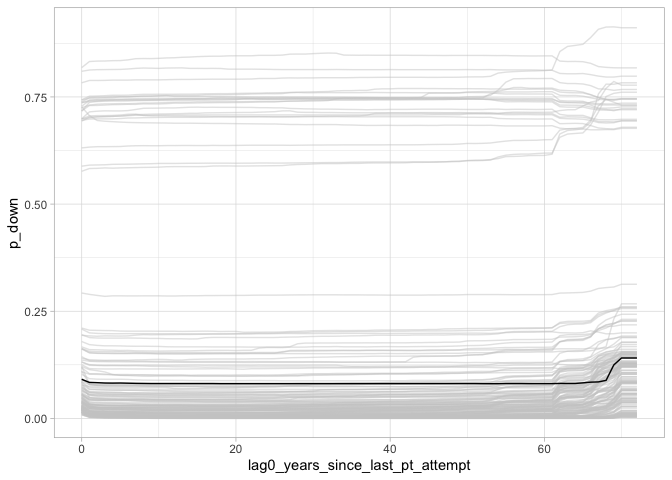

Case investigation: France associational space closing event risk
================

Author: Andreas Beger  
Date: 16 March 2022  
Last compiled: 18 March 2022

One of the cases that stands out in the new forecasts is a high risk of
a closing event in the Associational space for France. This note digs a
bit deeper in the forecasts in this space for France.

For context, here is the current sequence of forecasts for France from
2011 on:

*Table 1: Test and live forecasts produced as part of the regular
**demspaces** pipeline. Each row is created from a different model.*

| from_year | for_years   | p_up | p_same | p_down |
|----------:|:------------|-----:|-------:|-------:|
|      2011 | 2012 - 2013 | 0.00 |   1.00 |   0.00 |
|      2012 | 2013 - 2014 | 0.00 |   1.00 |   0.00 |
|      2013 | 2014 - 2015 | 0.00 |   1.00 |   0.00 |
|      2014 | 2015 - 2016 | 0.00 |   1.00 |   0.00 |
|      2015 | 2016 - 2017 | 0.00 |   1.00 |   0.00 |
|      2016 | 2017 - 2018 | 0.00 |   1.00 |   0.00 |
|      2017 | 2018 - 2019 | 0.01 |   0.98 |   0.01 |
|      2018 | 2019 - 2020 | 0.05 |   0.92 |   0.04 |
|      2019 | 2020 - 2021 | 0.03 |   0.44 |   0.55 |
|      2020 | 2021 - 2022 | 0.22 |   0.26 |   0.67 |
|      2021 | 2022 - 2023 | 0.24 |   0.31 |   0.59 |

These are forecasts created with the current, v12, version of the data.
They are created by estimating a model with data up to “from_year” - 1,
and then using the state of things in “from_year” to create the
forecast. The last row are the numbers that are in the updated (2022)
dashboard. The risk for a closing event (“p_down”) is high, at 0.59.
Why? – that’s the point of this note.

Before diggin in, a preliminary simplification. Given the way the
forecasts above are created, there are two things that could explain the
change in the high 2021 forecast compared to a lower forecast in an
earlier year: (1) changes in the values of predictors, or (2) changes in
the estimated model–since the model used to create the “from_year” =
2018 forecasts is not the same as that used for the “from_year” = 2021
forecasts. To simplify this, I’m going to focus on the forecasts that
come only from the final model used for the “from_year” = 2021
forecasts.

The sequences of forecasts from that model looks like this:

*Table 2: (Retrospective) forecasts from the current forecast model.
This is the same model that produces the “from_year” = 2021 forecasts in
Table 1.*

| from_year | v2xcs_ccsi | for_years   | p_up | p_same | p_down |
|----------:|-----------:|:------------|-----:|-------:|-------:|
|      2016 |       0.94 | 2017 - 2018 | 0.00 |   1.00 |   0.00 |
|      2017 |       0.94 | 2018 - 2019 | 0.00 |   0.91 |   0.09 |
|      2018 |       0.90 | 2019 - 2020 | 0.01 |   0.23 |   0.77 |
|      2019 |       0.91 | 2020 - 2021 | 0.01 |   0.17 |   0.83 |
|      2020 |       0.84 | 2021 - 2022 | 0.21 |   0.26 |   0.68 |
|      2021 |       0.84 | 2022 - 2023 | 0.22 |   0.32 |   0.59 |

They are different from the first table above. Actually the model for
this table has identical inputs to the two models used to create the
“from_year” 2020 and 2021 rows in Table 1, but even those rows are
slighly different. This is due to small random fluctuations inherent in
random forest models, see the [RF
Stability](https://github.com/vdeminstitute/demspaces/blob/main/2022-update/rf-stability.md)
note for more details. This explains the small differences for the last
two rows.

The forecasts in the other rows differ more substantially between the
two tables. In the recreated forecasts, the down risk actually starts
increasing from 2017 to 2018 already. This is because the models used to
create the respective forecasts in the two tables start diverging from
this point and prior.

*Side track: specifically, this is because of the down change from 2019
to 2020. In the forecasts in the first table above, the model used to
create the “from_year” = 2018 forecasts would have used data through to,
including, 2017. At that point the outcome variable looking would have
looked ahead to 2018-2019. Thus that model didn’t know yet about the
2019 to 2020 drop. On the other hand, the model I’m using in this note
would have been able to take advantage of completely observed outcomes
up to 2021, thus including the drop. And, both the “from_year” = 2018
and 2019 forecasts are higher because both of the 2-year ahead windows
for those two rows covered the 2019 to 2020 drop.*

The rest of the note uses the model that created the forecasts in the
dashboard, and whose (retrospective) forecasts are shown in the second
table above.

## Historical “what if?”: France 2017 vs France 2018

Since the critical year for the forecast risk increase seems to have
been the initial increase in 2018, one way we can try to explain the
still high 2021 forecast is by comparing France in 2018 to France in
2017, when the risk was low. The same model was used to calculate both
forecasts, so the only difference are the predictor values that were
used to calculate the risks.

As a simple way to examine the impact of changes in the predictors on
the risk forecast, I took the 2017 predictor values for France, flipped
*one* predictor value *at a time* to it’s 2018 value, and recorded the
change in the risk forecast. For example, instead of the “v2xcs_ccsi”
value for 2017 of 0.939, I substituted the 2018 value of 0.898, kept all
other predictor values at their 2017 values, and then calculated a
hypothetical alternative prediction. And so on for all other predictors.

Here are the 10 predictors associated with the largest change in risk:

| Predictor                        | 2017 Value | 2018 Value | 2017 Risk | ‘What if’ Risk | Risk Change |
|:---------------------------------|-----------:|-----------:|----------:|---------------:|------------:|
| lag0_v2csantimv                  |      -1.07 |      -0.31 |      0.09 |           0.19 |        0.10 |
| lag0_v2xcs_ccsi_sd10             |       0.00 |       0.01 |      0.09 |           0.18 |        0.08 |
| lag0_v2pepwrort                  |       2.35 |       2.74 |      0.09 |           0.16 |        0.07 |
| lag0_state_age                   |     202.00 |     203.00 |      0.09 |           0.13 |        0.04 |
| lag0_years_since_last_pt_attempt |      68.00 |      69.00 |      0.09 |           0.12 |        0.03 |
| lag0_v2x_gencs                   |       0.92 |       0.93 |      0.09 |           0.12 |        0.02 |
| lag0_v2csreprss                  |       2.99 |       1.76 |      0.09 |           0.11 |        0.02 |
| lag0_v2merange                   |       1.78 |       1.38 |      0.09 |           0.10 |        0.01 |
| lag0_v2lgqstexp                  |       1.69 |       1.03 |      0.09 |           0.10 |        0.01 |
| lag0_v2cscnsult                  |       1.93 |       1.43 |      0.09 |           0.10 |        0.01 |

Collectively, these 10 predictors account for 2/3rds of the overall
change (increase) in risk that comes out of this hypothetical “what if”
experiment.

One word of caution: random forests are not linear model, so this kind
of experimentation should be taken with a grain of salt. Not only is any
given *x*, *y* relationship likely not linear, but one cannot even
assume that marginal risk calculations like this are appropriate since
random forests are also capable of producing complex interactive
relationships.[1]

These univariate changes are thus not an exhaustive look at why the risk
changes. That said, the sum of univariate changes above is 0.62, which
is close to the total risk change from 2017 to 2018, namely 0.77 - 0.09
= 0.68. This is somewhat reassuring.

Moving on, some of the predictor changes match what one might expect.
For example, the “lag0_v2xcs_ccsi_sd10” predictor is a 10-year moving
standard deviation of the Associational space indicator. The idea here
was simply that in countries where an indicator has fluctuated more in
the recent past, it is more likely to still fluctuate in the future as
well. The value has incrased for 2018, and the risk goes up a bit.
Similarly, “v2csreprss”, civil society organization repression, has
moved towards the less democratic end of the scale for 2018, and it
makes sense that closing risk would as a result increase (this is coded
so that values towards 0 indicate more repression).

Other changes in that table make less sense though. The
“lag0_years_since_last_pt_attempt” predictor is the number of years
since the last coup attempt in a country, or alternatively years since
independence or 1950 for countries that have not had a coup attempt
since 1950. France is in the group of countries which have not, and thus
has a maximal value of 68 in 2017. These are stable countries, yet
increasing the value to 69 leads the model to increase the risk. How
does that make sense?

### Focus on “year since last coup attempt”

Why does increasing the time since last coup attempt increase the risk?
To presage what I’ll try to demonstrate below, the answer seems to be
that the model is using it as a proxy to identify countries that
historically have been stable (no coup attempts), but which since around
2010 have experienced a pronounced increase in Associational closing
events.

How this works comes down to how the variable is coded for countries
without any coup attempt in recent history. The coup data reach back to
1950, and there are several dozen countries, including France, with no
coup attempts at all since that time. In those cases, the variable
counts the number of years since 1950 (or independence for some states
that came after). Very high values on this variable essentially identify
Western democracies as well as a smaller number of other countries. I
suspect that this variable, and the other with counter-intuitive impacts
in the table above, become proxies in the model for otherwise stable
wealthy democracies that are similar to countries like Poland and
Hungary that have recently experienced backsliding, or which have
decreases in some measures due to Covid-19 related measures.

To start, here is the evolution of the calculated risk for France 2017,
keeping all predictors at their actual values except for “years since
last coup attempt”, which varies following the *x*-axis.

<!-- -->

The red dot marks the actual 2017 value, 68. The variable has no impact
on the risk until it reaches 69 or more, when the risk increases. One
would have thought that the closing risk is higher following a coup
attempt, when the value for this variable is towards 0 (the coup attempt
year), and decreasing over time. Instead it is the opposite.

Lest one think this is peculiar to the risk calculations for France
2017, here are the paths for the other 2017 countries (aka individual
conditional expectation (ICE) plot):

<!-- -->

In many, but not all, countries, the calculated risk increases at higher
values of the years since coup attempt counter. Note also that for many
countries, although not France 2017, there is already a smaller increase
in risk when going from 61 to 62 years.

The pattern is the same if we look at the 2021 data slice:

<!-- -->

I’ve marked the actual 2021 values in this plot as well. Note how there
is an unusualy number of countries all the way on the right. These are
countries with no coup attempt since 1950. In fact, the distribution of
this variable is quite lopsided:

<!-- -->

There are 39 countries with no coup attempt since 1950, and a smaller
number of other countries with no coup attempts that gained indepence
after 1950.

USA, Canada, Mexico, Nicaragua, Costa Rica, UK, Ireland, Netherlands,
Belgium, Luxembourg, France, Switzerland, Germany, Poland, Austria,
Hungary, Italy, Albania, Bulgaria, Romania, Finland, Sweden, Norway,
Denmark, Iceland, South Africa, Israel, Saudi Arabia, China, Mongolia,
Taiwan, North Korea, Japan, India, Bhutan, Sri Lanka, Nepal, Australia,
New Zealand

Because only these countries will be definition have the maximal value
of “years since last coup attempt”, tracking the high end of this
variable essentially just becomes a way to identify this set of
countries. Why does the model think they should have a higher risk?

Here is the rate at which these countries have experienced Associational
closing events:

<!-- -->

It has increased dramatically since around 2010. If we look at the
second previous plot above, the right-most *x*-coordinates are 72 for
the year 2021. Working backwards, the value of 60 thus corresponds to
the year 2009. The first increase in the ICE curves in the plot, just
after 60, thus matches the steep increase in closing event rates for the
“no coup attempt” countries after around 2010.

## Cross-sectional “what if”: why does France 2021 have a higher forecast than other countries in 2021?

------------------------------------------------------------------------

[1] E.g. decision trees and random forests can represent XOR
relationships, which are both non-linear and interactive.
