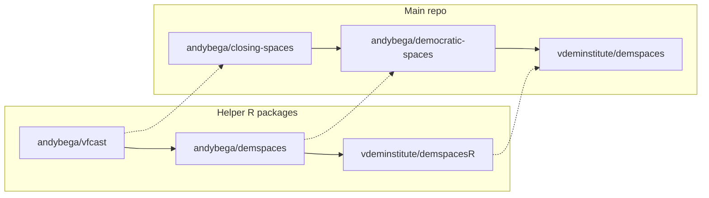

Development notes
=================

Internal notes on the project developmet history.

There were a lot of repos involved in this project.^[I think some of them were initially created by Rick, which is why we had some duplication. Plus then in 2021 moving them over to V-Dem.] Trying to sketch a history here. This diagram shows all involved repos (some of them are private):

Basically from very early on, in 2019, there were two tracks of repos:

1. The main development repo with the forecast pipeline.
2. A helper R package to abstract away the complicated modeling functions for handling a dozen outcomes.

During the spring 2022 update I also added a {demspaces} R package in the `vdeminstitute/demspaces` repo. 

Anyways:

- [`andybega/closing-spaces`](https://github.com/andybega/closing-spaces) (private): development repo with all the ugly bits
- [`andybega/democratic-spaces`](https://github.com/andybega/democratic-spaces): a cleaned-up subset of the development repo for reproducibility
- [`vdeminstitute/demspaces`](https://github.com/vdeminstitute/demspaces): V-Dem version of the main repo
- [`andybega/vfcast`](https://github.com/andybega/vfcast): initial helper R package
- [`andybega/demspaces`](https://github.com/andybega/demspaces): complete companion R package with helper functions
- [`vdeminstitute/demspacesR`](https://github.com/vdeminstitute/demspacesR): V-Dem version of the R package

The V-Dem repos were created during the 2021 V-Dem v11 update, when I copied over the existing code to new corresponding V-Dem-owned repos.^[I.e. I did not transfer repo ownership on GitHub, creating instead new repos without the original development git history.] 

