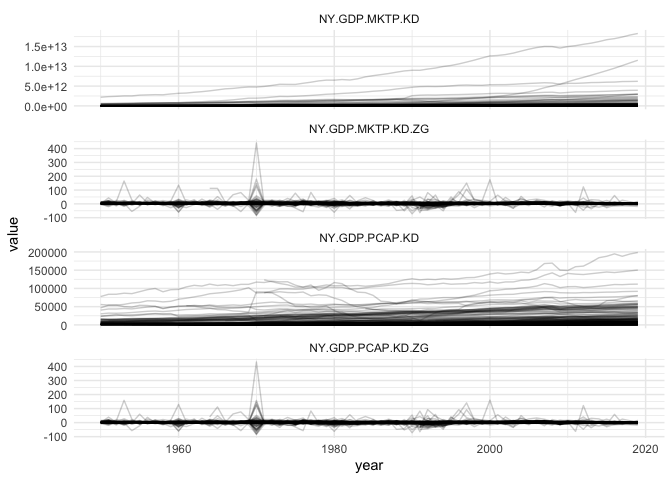

Combined GDP data
================

*Last updated on: 2021-03-03*

GDP data from 1950 on, mostly based on WDI, with some gaps filled with
KSG’s extended GDP data and data from the UN.

Four step imputation procedure:

1.  Acquire the WDI data
2.  Where WDI is missing, drop in UN GDP figures, scaled by a linear
    model.
3.  Where WDI is missing, drop in KSG figures, scaled by a log-linear
    country-varying scaling model.
4.  Model-based extrapolation: use Kalman-smoothing to forward
    extrapolate missing GDP values (most notably Taiwan and several
    countries missing current year GDP values) and backward extrapolate
    GDP growth in first year of existences of a country.

## Overview

``` r
library(dplyr)
```

    ## 
    ## Attaching package: 'dplyr'

    ## The following objects are masked from 'package:stats':
    ## 
    ##     filter, lag

    ## The following objects are masked from 'package:base':
    ## 
    ##     intersect, setdiff, setequal, union

``` r
library(ggplot2)
library(yaml)
library(tidyr)

gdp <- read.csv("output/gdp.csv")
str(gdp)
```

    ## 'data.frame':    11203 obs. of  6 variables:
    ##  $ gwcode           : int  2 20 40 41 42 70 90 91 92 93 ...
    ##  $ year             : int  1950 1950 1950 1950 1950 1950 1950 1950 1950 1950 ...
    ##  $ NY.GDP.MKTP.KD   : num  2.19e+12 1.88e+11 1.40e+10 4.35e+09 2.07e+09 ...
    ##  $ NY.GDP.MKTP.KD.ZG: num  3.861 3.943 0.898 2.594 0 ...
    ##  $ NY.GDP.PCAP.KD   : num  13763 13662 2362 1351 876 ...
    ##  $ NY.GDP.PCAP.KD.ZG: num  0 -0.0249 0.2154 2.2589 0 ...

``` r
head(gdp)
```

    ##   gwcode year NY.GDP.MKTP.KD NY.GDP.MKTP.KD.ZG NY.GDP.PCAP.KD NY.GDP.PCAP.KD.ZG
    ## 1      2 1950   2.185560e+12         3.8613432     13762.6286        0.00000000
    ## 2     20 1950   1.876165e+11         3.9426035     13661.7252       -0.02488635
    ## 3     40 1950   1.398397e+10         0.8975736      2362.1563        0.21536428
    ## 4     41 1950   4.350234e+09         2.5940058      1350.5851        2.25887880
    ## 5     42 1950   2.071179e+09         0.0000000       875.7626        0.00000000
    ## 6     70 1950   7.856671e+10         6.5279005      2811.4763        3.27139731

``` r
stats <- yaml::read_yaml("output/gdp-signature.yml")
stats
```

    ## $Class
    ## [1] "tbl_df, tbl, data.frame"
    ## 
    ## $Size_in_mem
    ## [1] "0.8 Mb"
    ## 
    ## $N_countries
    ## [1] 204
    ## 
    ## $Years
    ## [1] "1950 - 2019"
    ## 
    ## $N_columns
    ## [1] 6
    ## 
    ## $Columns
    ## [1] "gwcode, year, NY.GDP.MKTP.KD, NY.GDP.MKTP.KD.ZG, NY.GDP.PCAP.KD, NY.GDP.PCAP.KD.ZG"
    ## 
    ## $N_rows
    ## [1] 11203
    ## 
    ## $N_complete_rows
    ## [1] 11175

``` r
gdp %>%
  pivot_longer(-one_of("gwcode", "year")) %>%
  ggplot(., aes(x = year, y = value, group = gwcode)) +
  facet_wrap(~ name, ncol = 1, scales = "free_y") +
  geom_line(alpha = .2) +
  theme_minimal()
```

    ## Warning: Removed 53 row(s) containing missing values (geom_path).

<!-- -->
