GDP imputation
================
Andreas Beger, Predictive Heuristics
2021-03-03

  - [WDI GDP data](#wdi-gdp-data)
  - [KSG expanded GDP](#ksg-expanded-gdp)
  - [UN GDP data](#un-gdp-data)
  - [Combine data](#combine-data)
  - [Overlap between UN and WDI](#overlap-between-un-and-wdi)
  - [Overlap between KSG expanded and
    WDI](#overlap-between-ksg-expanded-and-wdi)
  - [Joint model of UN and KSG predicting
    WDI](#joint-model-of-un-and-ksg-predicting-wdi)
  - [Conclusion](#conclusion)
  - [Check GDP per capita](#check-gdp-per-capita)
  - [Done, record summary stats and
    save](#done-record-summary-stats-and-save)

*Last updated on: 2021-03-03*

For updating the data, all items requiring attention are marked with
“UPDATE:”.

UPDATE: This script uses `population.csv` as an input for calculating
GDP per capita. Drop in an updated version from `population/` if needed.

The WDI GDP data, cached in the input folder, also need to be updated.
Delete `input/wdigdp.csv` for that to happen automatically (or see the
UPDATE: below).

The other inputs (KSG and UN GDP) only concern historical data so they
should not need to be updated.

## WDI GDP data

Relevant WDI indicators:

    "NY.GDP.PCAP.PP.KD.ZG"
    "NY.GDP.PCAP.PP.KD"
    "NY.GDP.PCAP.KD.ZG"
    "NY.GDP.PCAP.KD"
    "NY.GDP.MKTP.PP.CD"  # GDP per capita (constant 2011 international $)
    "NY.GDP.MKTP.PP.KD"  # GDP per capita (constant 2020 US$)
    "NY.GDP.MKTP.KD"     # GDP (constant 2010 US$)
    "NY.GDP.MKTP.KD.ZG"  # GDP growth
    "SP.POP.TOTL"

UPDATE: delete `input/wdigdp.csv` and run the chunk below to re-download
and cache the latest WDI GDP data.

``` r
if (!file.exists("input/wdigdp.csv")) {
  wdi1 <- WDI(country = "all", start = 1960, end = 2020,
              indicator = c("NY.GDP.MKTP.PP.KD"))
  wdi2 <- WDI(country = "all", start = 1960, end = 2020,
              indicator = c("NY.GDP.MKTP.PP.CD"))
  wdi3 <- WDI(country = "all", start = 1960, end = 2020,
              indicator = c("NY.GDP.MKTP.KD"))
  wdigdp <- Reduce(left_join, list(wdi1, wdi2, wdi3))
  write.csv(wdigdp, file = "input/wdigdp.csv", row.names = FALSE)
}

wdigdp <- read.csv("input/wdigdp.csv")
```

``` r
wdi <- gdp_wdi_add_gwcode(wdigdp)

plot_missing(wdi, "NY.GDP.MKTP.KD", "gwcode", time = "year", 
             statelist = "GW") +
  ggtitle("NY.GDP.MKTP.KD")
```

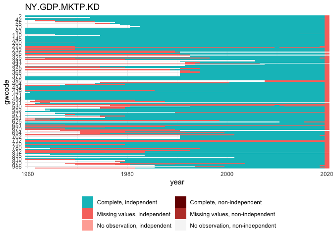<!-- -->

``` r
plot_missing(wdi, "NY.GDP.MKTP.PP.KD", "gwcode",  time =  "year", 
             statelist = "GW") +
  ggtitle("NY.GDP.MKTP.PP.KD")
```

<!-- -->

``` r
plot_missing(wdi, "NY.GDP.MKTP.PP.CD", "gwcode",  time =  "year", 
             statelist = "GW") +
  ggtitle("NY.GDP.MKTP.PP.CD")
```

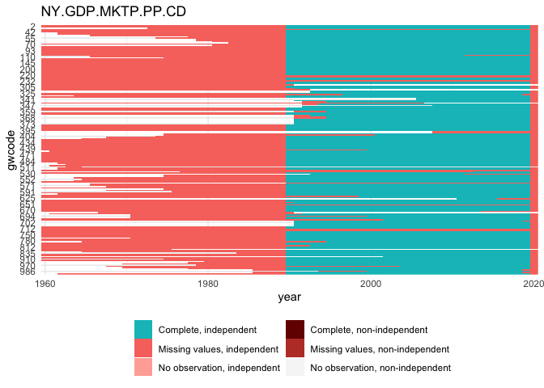<!-- -->

## KSG expanded GDP

``` r
ksggdp <- read_delim("input/expgdpv6.0/gdpv6.txt", delim = "\t") %>%
  rename(gwcode = statenum) %>%
  select(-stateid)
```

    ## 
    ## ── Column specification ────────────────────────────────────────────────────────
    ## cols(
    ##   statenum = col_double(),
    ##   stateid = col_character(),
    ##   year = col_double(),
    ##   pop = col_double(),
    ##   realgdp = col_double(),
    ##   rgdppc = col_double(),
    ##   cgdppc = col_double(),
    ##   origin = col_double()
    ## )

``` r
plot_missing(ksggdp, "realgdp", "gwcode", time = "year", statelist = "GW")
```

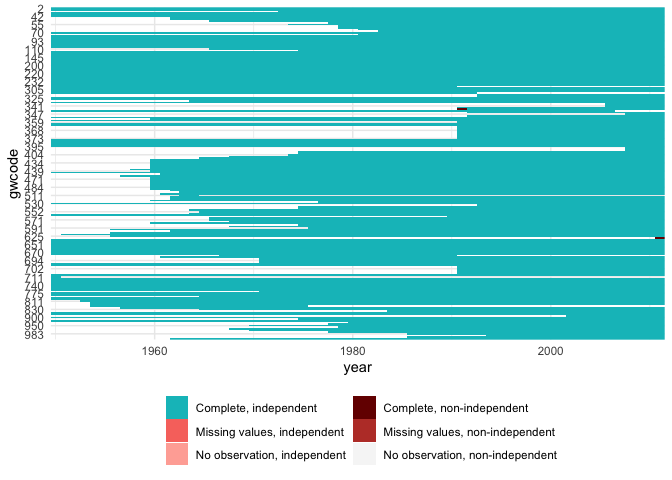<!-- -->

## UN GDP data

``` r
ungdp <- read_csv("input/UNgdpData.csv") %>%
  select(country_name, country_id, year, gdp_2010USD) 
```

    ## 
    ## ── Column specification ────────────────────────────────────────────────────────
    ## cols(
    ##   country_name = col_character(),
    ##   country_id = col_double(),
    ##   year = col_double(),
    ##   gdp_2010USD = col_double(),
    ##   gdp_2010USD_log = col_double(),
    ##   gdp_2010USD_lagged = col_double(),
    ##   gdp_2010USD_log_lagged = col_double()
    ## )

``` r
ungdp <- gdp_un_add_gwcode(ungdp)  
plot_missing(ungdp, "gdp_2010USD", "gwcode", time = "year", statelist = "GW")
```

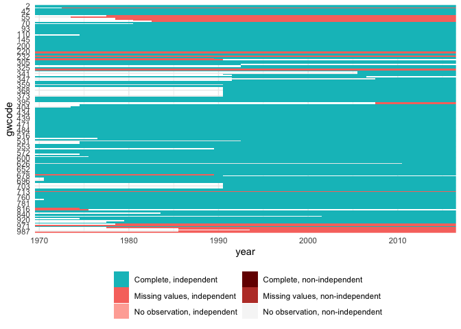<!-- -->

## Combine data

``` r
joint <- wdi %>%
  full_join(., ksggdp, by = c("gwcode", "year")) %>%
  select(-pop, -rgdppc, -cgdppc) %>%
  mutate(realgdp = realgdp*1e6) %>%
  full_join(., ungdp, by = c("gwcode", "year")) 
  

# Example countries to look at below
countries <- unique(c(
  c(2, 200, 220, 260, 290, 315, 740, 710),
  sample(unique(joint$gwcode), 4)))
```

## Overlap between UN and WDI

The UN GDP data is almost completely correlated with WDI GDP.

``` r
# the UN GDP is almost completely correlated with WDI GDP
sum(complete.cases(joint[, c("gdp_2010USD", "NY.GDP.MKTP.KD")]))
```

    ## [1] 6682

``` r
cor(joint$gdp_2010USD, joint$NY.GDP.MKTP.KD, use = "complete.obs")
```

    ## [1] 0.9999075

``` r
plot(log10(joint$gdp_2010USD), log10(joint$NY.GDP.MKTP.KD))
```

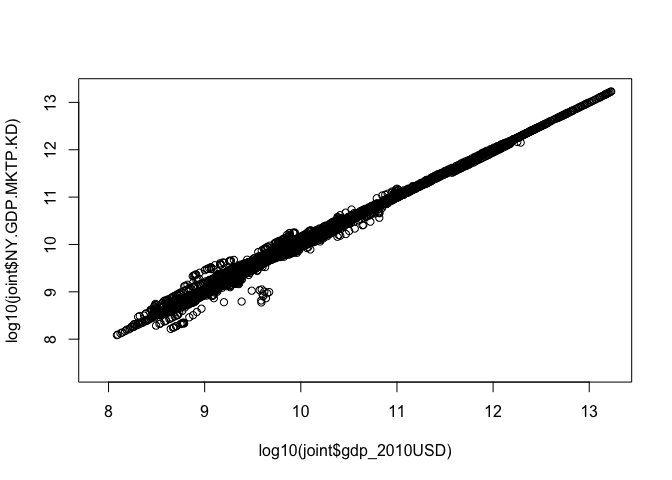<!-- -->

Does it add any non-missing values? Yes, about 800 or so.

``` r
# does it add any non-missing values?
joint %>%
  mutate(un_gdp_missing = is.na(gdp_2010USD),
         wdi_gdp_missing = is.na(NY.GDP.MKTP.KD)) %>%
  group_by(un_gdp_missing, wdi_gdp_missing) %>%
  summarize(n = n())
```

    ## `summarise()` has grouped output by 'un_gdp_missing'. You can override using the `.groups` argument.

    ## # A tibble: 4 x 3
    ## # Groups:   un_gdp_missing [2]
    ##   un_gdp_missing wdi_gdp_missing     n
    ##   <lgl>          <lgl>           <int>
    ## 1 FALSE          FALSE            6682
    ## 2 FALSE          TRUE              827
    ## 3 TRUE           FALSE            1986
    ## 4 TRUE           TRUE             1905

For which countries? Somalia, Syria, …

``` r
# which countries?
adds <- joint %>% 
  filter(is.na(NY.GDP.MKTP.KD) & !is.na(gdp_2010USD)) %>%
  group_by(gwcode) %>%
  summarize(adds = n())
head(arrange(adds, desc(adds)))
```

    ## # A tibble: 6 x 2
    ##   gwcode  adds
    ##    <dbl> <int>
    ## 1    520    47
    ## 2    652    47
    ## 3    731    47
    ## 4    522    39
    ## 5    345    37
    ## 6    700    32

``` r
# look at some examples of those
set.seed(1343)
countries2 <- unique(c(c(290, 345), 
                       sample(adds$gwcode, 8)))

mdl <- lm(NY.GDP.MKTP.KD ~ -1 + gdp_2010USD, data = joint)
joint <- joint %>%
  mutate(gdp_2010USD.rescaled = predict(mdl, newdata = joint))
joint %>%
  gather(var, value, -gwcode, -year, -origin, -realgdp, -NY.GDP.MKTP.PP.KD, -gdp_2010USD) %>%
  filter(gwcode %in% countries2) %>%
  ggplot(aes(x = year, y = value, colour = var, group = interaction(gwcode, var))) +
  geom_line(alpha = .5) +
  facet_wrap(~ gwcode, scales = "free_y")
```

    ## Warning: attributes are not identical across measure variables;
    ## they will be dropped

    ## Warning: Removed 953 row(s) containing missing values (geom_path).

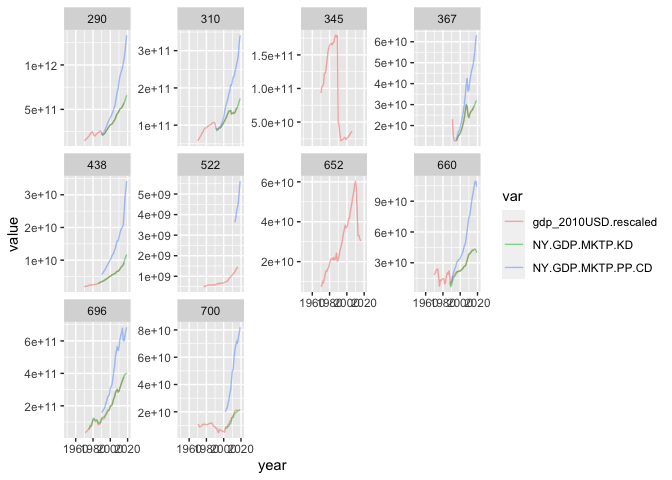<!-- -->

``` r
joint %>%
  gather(var, value, -gwcode, -year, -origin, -NY.GDP.MKTP.PP.KD, -gdp_2010USD) %>%
  filter(gwcode %in% countries) %>%
  ggplot(aes(x = year, y = value, colour = var, group = interaction(gwcode, var))) +
  geom_line(alpha = .5) +
  facet_wrap(~ gwcode, scales = "free_y")
```

    ## Warning: attributes are not identical across measure variables;
    ## they will be dropped

    ## Warning: Removed 1206 row(s) containing missing values (geom_path).

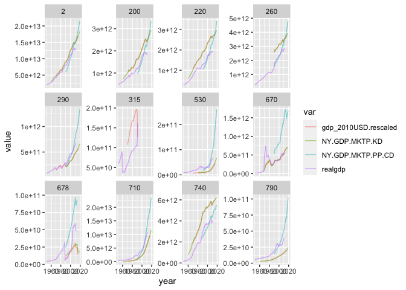<!-- -->

Rescaled UN GDP matches WDI very well, it seems. Adjusted R^2 is
basically 1 and so is the coefficient.

## Overlap between KSG expanded and WDI

``` r
sum(complete.cases(joint[, c("realgdp", "NY.GDP.MKTP.PP.KD")]))
```

    ## [1] 3780

``` r
cor(joint$realgdp, joint$NY.GDP.MKTP.PP.KD, use = "complete.obs")
```

    ## [1] 0.9932913

``` r
sum(complete.cases(joint[, c("realgdp", "NY.GDP.MKTP.KD")]))
```

    ## [1] 7187

``` r
cor(joint$realgdp, joint$NY.GDP.MKTP.KD, use = "complete.obs")
```

    ## [1] 0.9598988

Plain linear rescaling doesn’t work well.

``` r
# Plain linear rescaling; doesn't work well
mdl <- lm(NY.GDP.MKTP.KD ~ -1 + realgdp, data = joint)
summary(mdl)
```

    ## 
    ## Call:
    ## lm(formula = NY.GDP.MKTP.KD ~ -1 + realgdp, data = joint)
    ## 
    ## Residuals:
    ##        Min         1Q     Median         3Q        Max 
    ## -4.665e+12 -1.086e+10 -1.612e+09  9.187e+08  1.681e+12 
    ## 
    ## Coefficients:
    ##         Estimate Std. Error t value Pr(>|t|)    
    ## realgdp 1.045011   0.003482   300.1   <2e-16 ***
    ## ---
    ## Signif. codes:  0 '***' 0.001 '**' 0.01 '*' 0.05 '.' 0.1 ' ' 1
    ## 
    ## Residual standard error: 2.61e+11 on 7186 degrees of freedom
    ##   (4213 observations deleted due to missingness)
    ## Multiple R-squared:  0.9261, Adjusted R-squared:  0.9261 
    ## F-statistic: 9.007e+04 on 1 and 7186 DF,  p-value: < 2.2e-16

``` r
joint <- joint %>%
  mutate(realgdp.rescaled = predict(mdl, newdata = joint))
joint %>%
  gather(var, value, -gwcode, -year, -origin, -NY.GDP.MKTP.PP.KD, -starts_with("gdp_2010")) %>%
  filter(gwcode %in% countries) %>%
  ggplot(aes(x = year, y = value, colour = var, group = interaction(gwcode, var))) +
  geom_line(alpha = .5) +
  facet_wrap(~ gwcode, scales = "free_y")
```

    ## Warning: attributes are not identical across measure variables;
    ## they will be dropped

    ## Warning: Removed 981 row(s) containing missing values (geom_path).

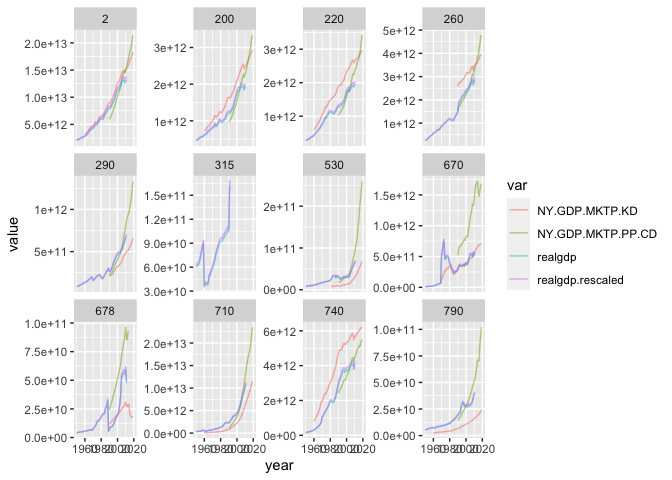<!-- -->

``` r
plot(log10(joint$realgdp), log10(joint$NY.GDP.MKTP.KD))
```

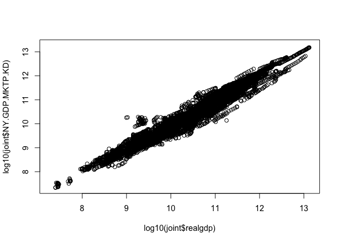<!-- -->

``` r
plot(log10(joint$realgdp.rescaled), log10(joint$NY.GDP.MKTP.KD))
```

<!-- -->

Try log model, also doesn’t work super well.

``` r
# Try log log model; also doesn't work well
mdl <- lm(log(NY.GDP.MKTP.KD) ~ -1 + log(realgdp), data = joint)
summary(mdl)
```

    ## 
    ## Call:
    ## lm(formula = log(NY.GDP.MKTP.KD) ~ -1 + log(realgdp), data = joint)
    ## 
    ## Residuals:
    ##      Min       1Q   Median       3Q      Max 
    ## -2.36460 -0.32602 -0.01405  0.35826  3.06128 
    ## 
    ## Coefficients:
    ##              Estimate Std. Error t value Pr(>|t|)    
    ## log(realgdp) 0.992004   0.000261    3801   <2e-16 ***
    ## ---
    ## Signif. codes:  0 '***' 0.001 '**' 0.01 '*' 0.05 '.' 0.1 ' ' 1
    ## 
    ## Residual standard error: 0.5307 on 7186 degrees of freedom
    ##   (4213 observations deleted due to missingness)
    ## Multiple R-squared:  0.9995, Adjusted R-squared:  0.9995 
    ## F-statistic: 1.444e+07 on 1 and 7186 DF,  p-value: < 2.2e-16

``` r
joint <- joint %>%
  mutate(realgdp.rescaled2 = exp(predict(mdl, newdata = joint)))
joint %>%
  gather(var, value, -gwcode, -year, -origin, -NY.GDP.MKTP.PP.KD, -starts_with("gdp_2010")) %>%
  filter(gwcode %in% countries) %>%
  ggplot(aes(x = year, y = value, colour = var, group = interaction(gwcode, var))) +
  geom_line() +
  facet_wrap(~ gwcode, scales = "free_y")
```

    ## Warning: attributes are not identical across measure variables;
    ## they will be dropped

    ## Warning: Removed 1080 row(s) containing missing values (geom_path).

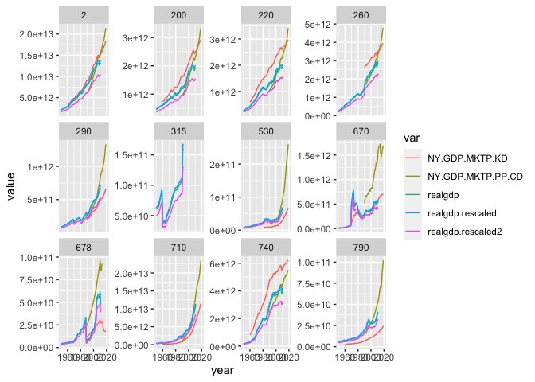<!-- -->

``` r
plot(log10(joint$realgdp), log10(joint$NY.GDP.MKTP.KD))
abline(a = 0, b = 1)
```

<!-- -->

``` r
plot(log10(joint$realgdp.rescaled2), log10(joint$NY.GDP.MKTP.KD))
abline(a = 0, b = 1)
```

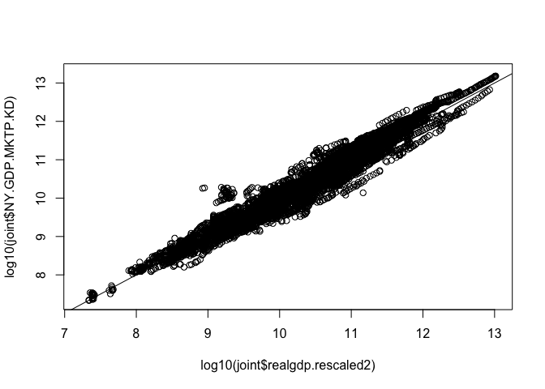<!-- -->

Try scaling by country:

``` r
# try country-varying scaling factors; this works fairly well
library("lme4")
mdl <- lmer(log(NY.GDP.MKTP.KD) ~ -1 + log(realgdp) + (log(realgdp)|gwcode), data = joint)
```

    ## Warning in checkConv(attr(opt, "derivs"), opt$par, ctrl = control$checkConv, :
    ## Model failed to converge with max|grad| = 0.00210299 (tol = 0.002, component 1)

``` r
joint <- joint %>%
  mutate(realgdp.rescaled3 = exp(predict(mdl, newdata = joint, allow.new.levels = TRUE)))
joint %>%
  gather(var, value, -gwcode, -year, -origin, -realgdp.rescaled, -realgdp.rescaled2,
         -starts_with("gdp_2010"), -NY.GDP.MKTP.PP.KD) %>%
  filter(gwcode %in% countries) %>%
  ggplot(aes(x = year, y = value, colour = var, group = interaction(gwcode, var))) +
  geom_line() +
  facet_wrap(~ gwcode, scales = "free_y")
```

    ## Warning: attributes are not identical across measure variables;
    ## they will be dropped

    ## Warning: Removed 981 row(s) containing missing values (geom_path).

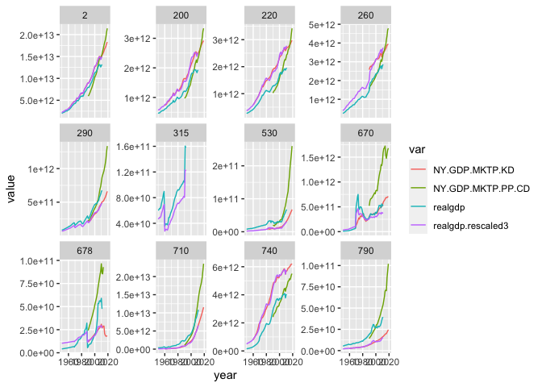<!-- -->

``` r
plot(log10(joint$realgdp), log10(joint$NY.GDP.MKTP.KD))
abline(a = 0, b = 1)
```

<!-- -->

``` r
plot(log10(joint$realgdp.rescaled3), log10(joint$NY.GDP.MKTP.KD))
abline(a = 0, b = 1)
```

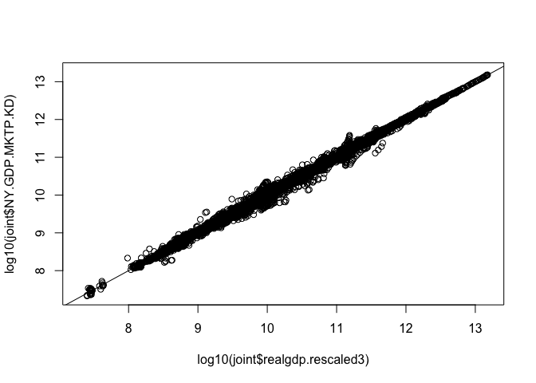<!-- -->

## Joint model of UN and KSG predicting WDI

``` r
mdl_combo <- lmer(log(NY.GDP.MKTP.KD) ~ -1 + log(gdp_2010USD) + log(realgdp) + (log(realgdp)|gwcode), data = joint)
```

    ## Warning in checkConv(attr(opt, "derivs"), opt$par, ctrl = control$checkConv, :
    ## Model failed to converge with max|grad| = 0.00588529 (tol = 0.002, component 1)

``` r
joint <- joint %>%
  mutate(NY.GDP.MKTP.KD.hat = exp(predict(mdl_combo, newdata = joint, allow.new.levels = TRUE)))
joint %>%
  gather(var, value, -gwcode, -year, -origin, -realgdp, -realgdp.rescaled, -realgdp.rescaled2, -realgdp.rescaled3,
         -starts_with("gdp_2010"), -NY.GDP.MKTP.PP.KD) %>%
  filter(gwcode %in% countries) %>%
  ggplot(aes(x = year, y = value, colour = var, group = interaction(gwcode, var))) +
  geom_line() +
  facet_wrap(~ gwcode, scales = "free_y")
```

    ## Warning: attributes are not identical across measure variables;
    ## they will be dropped

    ## Warning: Removed 1162 row(s) containing missing values (geom_path).

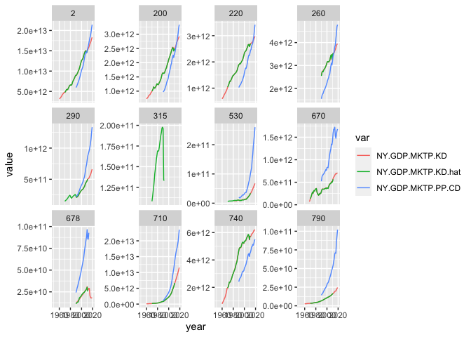<!-- -->

``` r
joint %>%
  gather(var, value, -gwcode, -year, -origin, -realgdp, -realgdp.rescaled, -realgdp.rescaled2, -realgdp.rescaled3,
         -starts_with("gdp_2010"), -NY.GDP.MKTP.PP.KD) %>%
  filter(gwcode %in% countries2) %>%
  ggplot(aes(x = year, y = value, colour = var, group = interaction(gwcode, var))) +
  geom_line() +
  facet_wrap(~ gwcode, scales = "free_y")
```

    ## Warning: attributes are not identical across measure variables;
    ## they will be dropped

    ## Warning: Removed 998 row(s) containing missing values (geom_path).

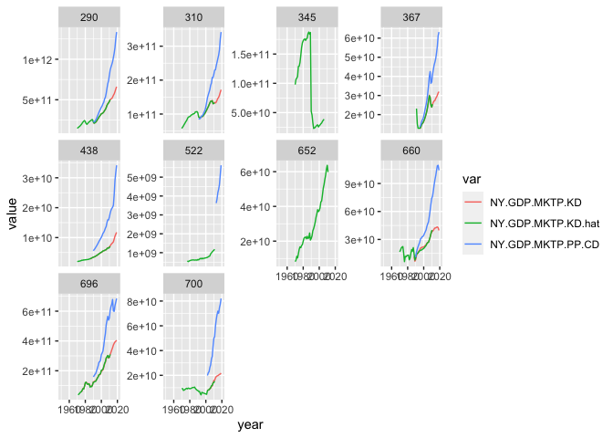<!-- -->

This works well, but cannot predict when either KSG or UN is missing, so
not useful in practice for filling in WDI gaps.

## Conclusion

Four step imputation procedure:

1.  Acquire the WDI data
2.  Where WDI is missing, drop in UN GDP figures, scaled by a linear
    model.
3.  Where WDI is missing, drop in KSG figures, scaled by a log-linear
    country-varying scaling model.
4.  Model-based extrapolation: use Kalman-smoothing to forward
    extrapolate missing GDP values (most notably Taiwan and several
    countries missing current year GDP values) and backward extrapolate
    GDP growth in first year of existences of a country.

Check leftover missing values before impute:

``` r
joint <- gdp_get_yearly(impute = FALSE)
```

    ## Year(s)  2020 are complete missing, droping

    ## Warning in checkConv(attr(opt, "derivs"), opt$par, ctrl = control$checkConv, :
    ## Model failed to converge with max|grad| = 0.00210299 (tol = 0.002, component 1)

``` r
plot_missing(joint, "NY.GDP.MKTP.KD", "gwcode", time = "year", statelist = "GW")
```

<!-- -->

``` r
still_missing <- joint %>% 
  filter(is.na(NY.GDP.MKTP.KD)) %>% 
  group_by(gwcode) %>%
  summarize(n = n(),
            years = paste0(range(year), collapse = " - ")) %>%
  arrange(desc(n))
still_missing
```

    ## # A tibble: 18 x 3
    ##    gwcode     n years      
    ##     <dbl> <int> <chr>      
    ##  1    223     8 2012 - 2019
    ##  2    396     8 2012 - 2019
    ##  3    397     8 2012 - 2019
    ##  4    713     8 2012 - 2019
    ##  5    101     3 2017 - 2019
    ##  6    520     3 2017 - 2019
    ##  7    522     3 2017 - 2019
    ##  8    531     3 2017 - 2019
    ##  9    565     3 2017 - 2019
    ## 10    626     3 2017 - 2019
    ## 11    652     3 2017 - 2019
    ## 12    731     3 2017 - 2019
    ## 13     40     1 2019 - 2019
    ## 14    221     1 2019 - 2019
    ## 15    331     1 2019 - 2019
    ## 16    701     1 2019 - 2019
    ## 17    983     1 2019 - 2019
    ## 18    987     1 2019 - 2019

Use Kalman smoothing to extrapolate the leftover trailing missing
values, and backwards extrapolate first year missing GDP growth.

``` r
joint <- gdp_get_yearly(impute = TRUE)
```

    ## Year(s)  2020 are complete missing, droping

    ## Warning in checkConv(attr(opt, "derivs"), opt$par, ctrl = control$checkConv, :
    ## Model failed to converge with max|grad| = 0.00210299 (tol = 0.002, component 1)

    ## Warning in stats::StructTS(data, ...): possible convergence problem: 'optim'
    ## gave code = 52 and message 'ERROR: ABNORMAL_TERMINATION_IN_LNSRCH'
    
    ## Warning in stats::StructTS(data, ...): possible convergence problem: 'optim'
    ## gave code = 52 and message 'ERROR: ABNORMAL_TERMINATION_IN_LNSRCH'

``` r
plot_missing(joint, "NY.GDP.MKTP.KD", "gwcode", time = "year", statelist = "GW")
```

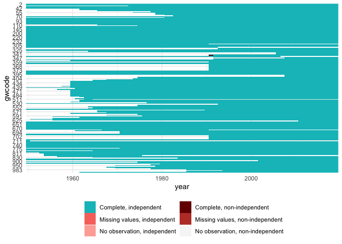<!-- -->

## Check GDP per capita

This uses “population.csv” from the population module.

At least one of the combined GDP values–Qatar in 1971–is clunky in that
there is a big discrepancy. This gives Qatar 1971 an inordinarily high
GDP per capita value. Solved by backward imputing GDP instead of taking
KSG value.

``` r
check <- joint[joint$gwcode==694, ]
par(mfrow = c(2, 2))
for (vn in setdiff(names(check), c("gwcode", "year"))) {
  plot(check$year, check[[vn]], type = "l", main = vn, xlab = NA, ylab = NA)
}
```

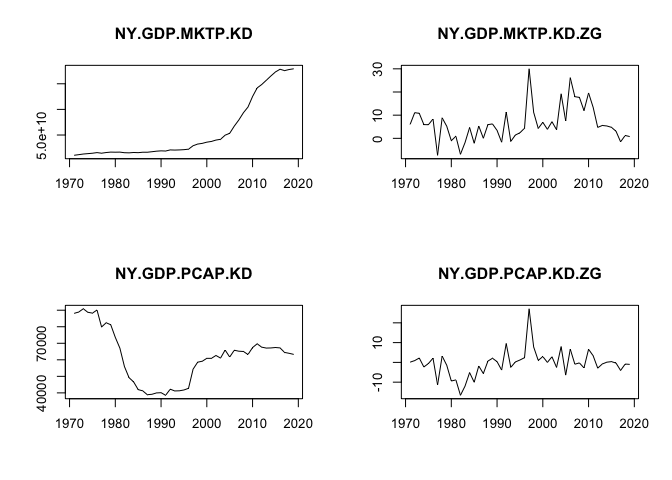<!-- -->

I guess this is fine. (Qatar did really have these crazy high growth
periods, checked the 2001 on data.)

## Done, record summary stats and save

``` r
# Keep a summary of the data so changes in the future are easier to track on 
# git
df <- joint
stats <- list(
  Class           = paste0(class(df), collapse = ", "),
  Size_in_mem     = format(utils::object.size(df), "Mb"),
  N_countries     = length(unique(df$gwcode)),
  Years           = paste0(range(df$year, na.rm = TRUE), collapse = " - "),
  N_columns       = ncol(df),
  Columns         = paste0(colnames(df), collapse = ", "),
  N_rows          = nrow(df),
  N_complete_rows = sum(stats::complete.cases(df))
)
yaml::write_yaml(stats, "output/gdp-signature.yml")
stats
```

    ## $Class
    ## [1] "tbl_df, tbl, data.frame"
    ## 
    ## $Size_in_mem
    ## [1] "0.8 Mb"
    ## 
    ## $N_countries
    ## [1] 204
    ## 
    ## $Years
    ## [1] "1950 - 2019"
    ## 
    ## $N_columns
    ## [1] 6
    ## 
    ## $Columns
    ## [1] "gwcode, year, NY.GDP.MKTP.KD, NY.GDP.MKTP.KD.ZG, NY.GDP.PCAP.KD, NY.GDP.PCAP.KD.ZG"
    ## 
    ## $N_rows
    ## [1] 11203
    ## 
    ## $N_complete_rows
    ## [1] 11175

``` r
write_csv(joint, file = "output/gdp.csv")
```
