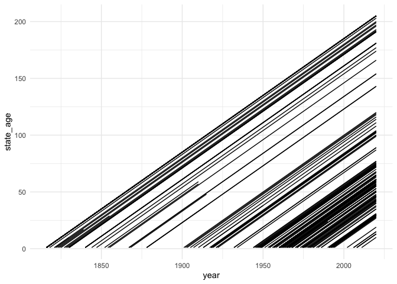

G\&W states
================

*Last updated on: 2021-03-02*

G\&W states list, and derived indicators like state age.

``` r
library(states)
library(yaml)
library(lubridate)
```

    ## 
    ## Attaching package: 'lubridate'

    ## The following objects are masked from 'package:base':
    ## 
    ##     date, intersect, setdiff, union

``` r
library(dplyr)
```

    ## 
    ## Attaching package: 'dplyr'

    ## The following objects are masked from 'package:stats':
    ## 
    ##     filter, lag

    ## The following objects are masked from 'package:base':
    ## 
    ##     intersect, setdiff, setequal, union

``` r
library(ggplot2)

data("gwstates")

to_year <- year(Sys.Date()) - 1
to_year
```

    ## [1] 2020

``` r
out <- state_panel(lubridate::year(min(gwstates$start)), to_year, 
                   partial = "any")

# to prevent drop of on other year, also need to put end date for gwstates to 
# end of year
# need to reset max date in gwstates otherwise missing values post 2012
gwstates$end[gwstates$end==max(gwstates$end)] <- as.Date(sprintf("%s-12-31", to_year))

# duplicate GW codes for states that lost independence and regained
# do a full join and then subset
gw_cy <- full_join(out, gwstates, by = c("gwcode")) %>%
  dplyr::filter(year >= lubridate::year(start) &
                  year <= lubridate::year(end)) 
stopifnot(all(duplicated(gw_cy[, c("gwcode", "year")])==FALSE))

gw_cy$state_age <- gw_cy$year - lubridate::year(gw_cy$start) + 1

plot_missing(gw_cy, colnames(gw_cy), "gwcode", "year", "year", "GW")
```

<!-- -->

``` r
gw_cy <- dplyr::select(gw_cy, gwcode, year, state_age)

gw_cy %>%
  mutate(id = id_date_sequence(year)) %>%
  ggplot(aes(x = year, y = state_age, group = interaction(gwcode, id))) +
  geom_line() +
  theme_minimal()
```

<!-- -->

``` r
write.csv(gw_cy, file = "output/gwstate-age.csv", row.names = FALSE)
```
