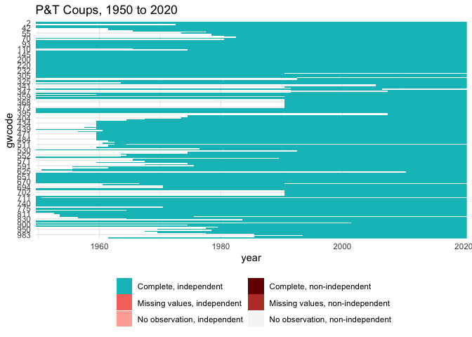

P&T Coups
================

Coup data-derived indicators for 1816 to the present.

## Usage

``` r
suppressPackageStartupMessages({
  library("dplyr")
  library("readr")
  library("states")
  library("ggplot2")
})

coups <- read_csv("output/ptcoups.csv")
```

    ## 
    ## ── Column specification ────────────────────────────────────────────────────────
    ## cols(
    ##   .default = col_double()
    ## )
    ## ℹ Use `spec()` for the full column specifications.

``` r
attr(coups, "spec") <- NULL

head(coups)
```

    ## # A tibble: 6 x 20
    ##   gwcode  year pt_attempt pt_attempt_num pt_coup_num pt_coup pt_failed_num
    ##    <dbl> <dbl>      <dbl>          <dbl>       <dbl>   <dbl>         <dbl>
    ## 1      2  1950          0              0           0       0             0
    ## 2      2  1951          0              0           0       0             0
    ## 3      2  1952          0              0           0       0             0
    ## 4      2  1953          0              0           0       0             0
    ## 5      2  1954          0              0           0       0             0
    ## 6      2  1955          0              0           0       0             0
    ## # … with 13 more variables: pt_failed <dbl>, pt_coup_total <dbl>,
    ## #   pt_failed_total <dbl>, pt_attempt_total <dbl>, pt_coup_num5yrs <dbl>,
    ## #   pt_failed_num5yrs <dbl>, pt_attempt_num5yrs <dbl>, pt_coup_num10yrs <dbl>,
    ## #   pt_failed_num10yrs <dbl>, pt_attempt_num10yrs <dbl>,
    ## #   years_since_last_pt_coup <dbl>, years_since_last_pt_failed <dbl>,
    ## #   years_since_last_pt_attempt <dbl>

``` r
str(coups)
```

    ## spec_tbl_df [11,399 × 20] (S3: spec_tbl_df/tbl_df/tbl/data.frame)
    ##  $ gwcode                     : num [1:11399] 2 2 2 2 2 2 2 2 2 2 ...
    ##  $ year                       : num [1:11399] 1950 1951 1952 1953 1954 ...
    ##  $ pt_attempt                 : num [1:11399] 0 0 0 0 0 0 0 0 0 0 ...
    ##  $ pt_attempt_num             : num [1:11399] 0 0 0 0 0 0 0 0 0 0 ...
    ##  $ pt_coup_num                : num [1:11399] 0 0 0 0 0 0 0 0 0 0 ...
    ##  $ pt_coup                    : num [1:11399] 0 0 0 0 0 0 0 0 0 0 ...
    ##  $ pt_failed_num              : num [1:11399] 0 0 0 0 0 0 0 0 0 0 ...
    ##  $ pt_failed                  : num [1:11399] 0 0 0 0 0 0 0 0 0 0 ...
    ##  $ pt_coup_total              : num [1:11399] 0 0 0 0 0 0 0 0 0 0 ...
    ##  $ pt_failed_total            : num [1:11399] 0 0 0 0 0 0 0 0 0 0 ...
    ##  $ pt_attempt_total           : num [1:11399] 0 0 0 0 0 0 0 0 0 0 ...
    ##  $ pt_coup_num5yrs            : num [1:11399] 0 0 0 0 0 0 0 0 0 0 ...
    ##  $ pt_failed_num5yrs          : num [1:11399] 0 0 0 0 0 0 0 0 0 0 ...
    ##  $ pt_attempt_num5yrs         : num [1:11399] 0 0 0 0 0 0 0 0 0 0 ...
    ##  $ pt_coup_num10yrs           : num [1:11399] 0 0 0 0 0 0 0 0 0 0 ...
    ##  $ pt_failed_num10yrs         : num [1:11399] 0 0 0 0 0 0 0 0 0 0 ...
    ##  $ pt_attempt_num10yrs        : num [1:11399] 0 0 0 0 0 0 0 0 0 0 ...
    ##  $ years_since_last_pt_coup   : num [1:11399] 1 2 3 4 5 6 7 8 9 10 ...
    ##  $ years_since_last_pt_failed : num [1:11399] 1 2 3 4 5 6 7 8 9 10 ...
    ##  $ years_since_last_pt_attempt: num [1:11399] 1 2 3 4 5 6 7 8 9 10 ...

``` r
range(coups$year)
```

    ## [1] 1950 2020

``` r
plot_missing(coups, colnames(coups)[3:10], "gwcode", "year", "year", "GW") +
  ggtitle(sprintf("P&T Coups, %s to %s", min(coups$year), max(coups$year)))
```

<!-- -->
