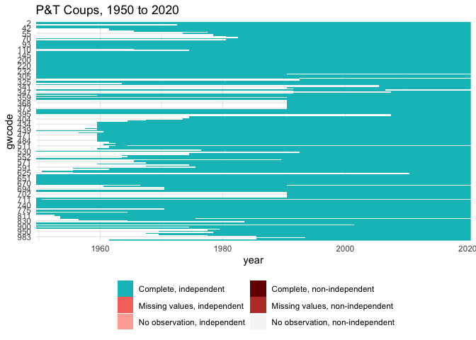

P&T Coups
================

## Update raw coup data

``` r
pt_url <- "http://www.uky.edu/~clthyn2/coup_data/powell_thyne_coups_final.txt"

coups_raw <- read_tsv(pt_url, col_types = cols(
  country = col_character(),
  ccode = col_integer(),
  year = col_integer(),
  month = col_integer(),
  day = col_integer(),
  coup = col_integer(),
  version = col_character()
))

write_csv(coups_raw, "input/ptcoups.csv")
```

## Graft to CY

``` r
cy <- states::state_panel(min(coups_raw$year), max(coups_raw$year), useGW = TRUE,
                          partial = "any")

stopifnot(all(coups_raw$ccode %in% cy$gwcode))

coups <- coups_raw %>%
  mutate(label = ifelse(coup==1, "pt_failed", "pt_coup")) %>%
  mutate(coup = 1) %>%
  tidyr::spread(label, coup, fill = 0) 

# Some countries had more than 1 coup/attempt in 1 year, collapse those
coups <- coups %>%
  dplyr::group_by(ccode, year) %>%
  dplyr::summarize(pt_attempt = max(pt_coup, pt_failed),
                   pt_attempt_num = sum(pt_coup, pt_failed),
                   pt_coup_num = sum(pt_coup), 
                   pt_coup = as.integer(pt_coup_num > 0),
                   pt_failed_num = sum(pt_failed),
                   pt_failed = as.integer(pt_failed_num > 0))
```

    ## `summarise()` has grouped output by 'ccode'. You can override using the `.groups` argument.

``` r
stopifnot(
  sum(coups$pt_coup_num)==sum(coups_raw$coup==2),
  sum(coups$pt_failed_num)==sum(coups_raw$coup==1)
)

# P&T not in CY
nomatch <- anti_join(coups, cy, by = c("ccode" = "gwcode", "year"))

if (nrow(nomatch > 0)) {
  cat("Some P&T coups are not in G&W state list")
  print(nomatch[, c("ccode", "year", "pt_coup", "pt_failed")])
  cat("625 Sudan 1955 is prior to independence in 1956")
}
```

    ## Some P&T coups are not in G&W state list# A tibble: 1 x 4
    ## # Groups:   ccode [1]
    ##   ccode  year pt_coup pt_failed
    ##   <int> <int>   <int>     <int>
    ## 1   625  1955       0         1
    ## 625 Sudan 1955 is prior to independence in 1956

``` r
cy <- left_join(cy, coups, by = c("gwcode" = "ccode", "year"))
cy <- cy %>%
  replace_na(list(pt_coup = 0, pt_coup_num = 0, 
                  pt_failed = 0, pt_failed_num = 0,
                  pt_attempt = 0, pt_attempt_num = 0))
coups <- cy

# Cumulative counts of coups/attempts
coups <- coups %>%
  arrange(gwcode, year) %>%
  group_by(gwcode) %>%
  dplyr::mutate(
    # Total number of coups so far
    pt_coup_total      = cumsum(pt_coup_num),  
    pt_failed_total    = cumsum(pt_failed_num),
    pt_attempt_total   = cumsum(pt_coup_num),  
    # #past 5 years
    pt_coup_num5yrs    = zoo::rollapplyr(pt_coup_num, sum, partial = TRUE, 
                                         width = 5),
    pt_failed_num5yrs  = zoo::rollapplyr(pt_failed_num, sum, partial = TRUE, 
                                         width = 5),
    pt_attempt_num5yrs = zoo::rollapplyr(pt_attempt_num,  sum, partial = TRUE,
                                         width = 5),
    # #past 10 years
    pt_coup_num10yrs   = zoo::rollapplyr(pt_coup_num, sum, partial = TRUE,
                                         width = 10),
    pt_failed_num10yrs = zoo::rollapplyr(pt_failed_num, sum, partial = TRUE, 
                                         width = 10),
    pt_attempt_num10yrs = zoo::rollapplyr(pt_attempt_num, sum, partial = TRUE, 
                                          width = 10)
  )

coups[is.na(coups)] <- 0

# Time since last coup
.duration_counter <- function(x, type = "event") {
  # At the end of this period, how much time has it been since last event,
  # including any this period?
  if (any(is.na(x))) stop("Missing values in x")
  duration <- vector("integer", length = length(x))
  for (i in seq_along(duration)) {
    if (i==1) { duration[i] <- 1 - x[i]; next }
    if (x[i]==0) {
      duration[i] <- duration[i-1] + 1
    } else {
      duration[i] <- 0
    }
  }
  duration
}

coups <- coups %>%
  group_by(gwcode) %>%
  arrange(gwcode, year) %>%
  mutate(years_since_last_pt_coup    = .duration_counter(pt_coup),
         years_since_last_pt_failed  = .duration_counter(pt_failed),
         years_since_last_pt_attempt = .duration_counter(pt_attempt)) %>%
  ungroup()
  

# Missingness plot
coups <- as.data.frame(coups)
plot_missing(coups, colnames(coups)[3:10], "gwcode", "year", "year", "GW") +
  ggtitle(sprintf("P&T Coups, %s to %s", min(coups$year), max(coups$year)))
```

<!-- -->

``` r
# Save output
write.csv(coups, file = "output/ptcoups.csv", row.names = FALSE)
```
