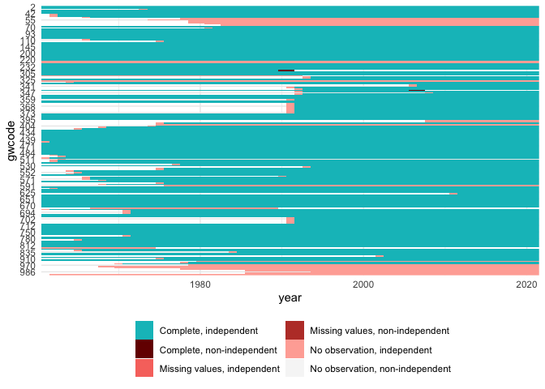
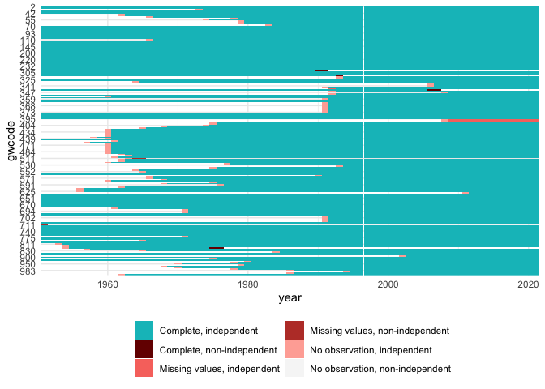

Combine data
================

- [NOTES FOR DATA UPDATES](#notes-for-data-updates)
- [Pieces](#pieces)
  - [Master statelist](#master-statelist)
  - [V-Dem DVs](#v-dem-dvs)
  - [V-Dem IVs](#v-dem-ivs)
  - [State age](#state-age)
  - [Population](#population)
  - [Infant mortality](#infant-mortality)
  - [GDP](#gdp)
  - [P&T Coups](#pt-coups)
- [Summarize and write final output](#summarize-and-write-final-output)
  - [Record missing cases](#record-missing-cases)
  - [Missing values by column](#missing-values-by-column)
- [Done, save](#done-save)

## NOTES FOR DATA UPDATES

END_YEAR denotes the last year data have been observed. I.e. usually it
should be the year prior to the current year. It should come
automatically from the config file.

Data after this year will be discarded. E.g. to forecast 2020-2021 we
don’t want to use data after 2019 since it likely won’t be
available/incomplete at the time we are making the 2020-2021 forecasts.
Conversely, if the data end early, e.g. in 2017, they will be lagged
additionally so that they reach and cover the target year.

Note also that the DV data are in a 2-year lead. So the data point for
“dv_v2x_veracc_osp_down_next2” in 2019 refers to vertical accountability
decreases in 2020-2021.

Several of the data sources below are imputed in some fashion after
merging. E.g. if a data set has to be lagged 1 year to obtain values for
the desired data end year, values for the first of independence for
several states will become missing. When data are updated, these
source-specific lags may change. Thus what cases are missing will
change, and what does or does not get imputed will change. Check the
output of all chunks below for new changes in missing case sets!

``` r
# The options should be automatically updated from the config file. 
devtools::load_all(here::here("demspaces.dev"))
```

    ## ℹ Loading demspaces.dev
    ## Registered S3 method overwritten by 'quantmod':
    ##   method            from
    ##   as.zoo.data.frame zoo 
    ## 
    ## ---- demspaces.dev
    ## Using version: 'v14'
    ## ----

``` r
END_YEAR <- get_option("data_end_year")

# For development I've also used sub-versions like 'v11a', ...
VERSION  <- get_option("demspaces.version")
print(VERSION)
```

    ## [1] "v14"

## Pieces

### Master statelist

``` r
cy <- read_csv("../output/country_year_set_1968_on.csv") %>%
  dplyr::filter(year > 1969, year <= END_YEAR)
```

    ## Rows: 8796 Columns: 5
    ## ── Column specification ────────────────────────────────────────────────────────
    ## Delimiter: ","
    ## chr (2): country_name, country_text_id
    ## dbl (3): gwcode, year, country_id
    ## 
    ## ℹ Use `spec()` to retrieve the full column specification for this data.
    ## ℹ Specify the column types or set `show_col_types = FALSE` to quiet this message.

``` r
cy_names <- cy
cy <- cy[, c("gwcode", "year")]
```

For spatial lagging, we cannot have overlapping geometries. For example
in 1990 we cannot have both re-unified Germany from the end of the year,
and then also separate West Germany and East Germany at the beginning of
the year. Check against state panel to remove cases like this if needed.

``` r
master <- state_panel(1970, END_YEAR, partial = "last", by = "year")
overlap <- compare(master, cy)
report(overlap)
```

    ## 9787 total rows
    ## 9784 rows in df1
    ## 8528 rows in df2
    ## 
    ## 8525 rows match and have no missing values
    ## 2-1970, 2-1971, 2-1972, 2-1973, 2-1974, 2-1975, 2-1976, 2-1977, 2-1978, 2-1979, and 8515 more
    ## 
    ## 1259 rows in df1 (no missing values) but not df2
    ## 31-1973, 31-1974, 31-1975, 31-1976, 31-1977, 31-1978, 31-1979, 31-1980, 31-1981, 31-1982, and 1249 more
    ## 
    ## 3 rows not in df1 but in df2 (no missing values)
    ## 265-1990, 680-1990, 817-1975

``` r
drop <- anti_join(cy, master)
```

    ## Joining with `by = join_by(gwcode, year)`

``` r
drop$drop <- TRUE
cy <- left_join(cy, drop) %>%
  mutate(drop = ifelse(is.na(drop), FALSE, drop))
```

    ## Joining with `by = join_by(gwcode, year)`

``` r
cy <- cy[!cy$drop, ]
cy$drop <- NULL
```

``` r
plotmiss(cy)
```

    ## Warning: No shared levels found between `names(values)` of the manual scale and the
    ## data's fill values.
    ## No shared levels found between `names(values)` of the manual scale and the
    ## data's fill values.

<!-- -->

### V-Dem DVs

These are the indicators from which the outcome variables are derived.

``` r
dv <- read_csv("../output/dv_data_1968_on.csv") %>%
  select(-country_name, -country_id, -country_text_id) %>%
  dplyr::filter(complete.cases(.)) %>%
  arrange(gwcode, year)
```

    ## Rows: 8796 Columns: 11
    ## ── Column specification ────────────────────────────────────────────────────────
    ## Delimiter: ","
    ## chr (2): country_name, country_text_id
    ## dbl (9): gwcode, year, country_id, v2x_veracc_osp, v2xcs_ccsi, v2xcl_rol, v2...
    ## 
    ## ℹ Use `spec()` to retrieve the full column specification for this data.
    ## ℹ Specify the column types or set `show_col_types = FALSE` to quiet this message.

``` r
range(dv$year)
```

    ## [1] 1968 2023

``` r
dv_data <- read_rds("../output/dv-data.rds")
cy <- left_join(cy, dv_data, by = c("gwcode", "year"))
```

For outcome variable *x*, this code creates the following additional
columns:

- `[x]`: the raw outcome variable
- `[x]_diff_y2y`: the year to year change
- `dv_[x]_...`: versions starting with “dv\_” should not be used as IVs
  - `dv_[x]_change`: character vector of the current year change (up,
    same, down)
  - `dv_[x]_[up, down]_next2`: 0/1 indicator, is there a up/down change
    in the next 2 years?

``` r
plotmiss(cy)
```

    ## Warning: No shared levels found between `names(values)` of the manual scale and the
    ## data's fill values.
    ## No shared levels found between `names(values)` of the manual scale and the
    ## data's fill values.

<!-- -->

The missing are because the “next2” variables are missing for the last 2
years of available data since we don’t have the 2 years of future
outcomes yet.

### V-Dem IVs

``` r
vdem_dat <- read_csv("../output/vdem_data_1968_on.csv") %>%
  select(-country_name, -country_id, -country_text_id) %>%
  dplyr::filter(complete.cases(.)) %>%
  arrange(gwcode, year)
```

    ## Rows: 8796 Columns: 195
    ## ── Column specification ────────────────────────────────────────────────────────
    ## Delimiter: ","
    ## chr   (2): country_name, country_text_id
    ## dbl (193): gwcode, year, country_id, is_leg, is_elec, is_election_year, v2x_...
    ## 
    ## ℹ Use `spec()` to retrieve the full column specification for this data.
    ## ℹ Specify the column types or set `show_col_types = FALSE` to quiet this message.

``` r
# take out zero-variance vars
sds <- sapply(vdem_dat, sd)
zv_vars <- names(sds[sds==0])
vdem_dat <- vdem_dat %>% select(-one_of(zv_vars))

names(vdem_dat) <- stringr::str_replace(names(vdem_dat), "^lagged\\_", "")

# check no DVs are here
if (any(setdiff(names(vdem_dat), c("gwcode", "year")) %in% names(dv))) {
  stop("Some DV variables are in V-Dem IV set, staaap")
}

vdem_dat <- vdem_dat %>%
  dplyr::filter(year <= END_YEAR)
vdem_lag <- END_YEAR - max(vdem_dat$year)
vdem_dat <- vdem_dat %>%
  mutate(year = year + vdem_lag) %>%
  setNames(c(names(.)[1:2], paste0("lag", vdem_lag, "_", names(.)[-c(1:2)])))

vdem_lag
```

    ## [1] 0

``` r
str(vdem_dat)
```

    ## tibble [8,795 × 192] (S3: tbl_df/tbl/data.frame)
    ##  $ gwcode                     : num [1:8795] 2 2 2 2 2 2 2 2 2 2 ...
    ##  $ year                       : num [1:8795] 1968 1969 1970 1971 1972 ...
    ##  $ lag0_is_leg                : num [1:8795] 1 1 1 1 1 1 1 1 1 1 ...
    ##  $ lag0_is_elec               : num [1:8795] 1 1 1 1 1 1 1 1 1 1 ...
    ##  $ lag0_is_election_year      : num [1:8795] 1 1 1 1 1 1 1 1 1 1 ...
    ##  $ lag0_v2x_polyarchy         : num [1:8795] 0.707 0.697 0.72 0.725 0.736 0.758 0.764 0.79 0.797 0.828 ...
    ##  $ lag0_v2x_liberal           : num [1:8795] 0.865 0.893 0.909 0.914 0.915 0.933 0.934 0.936 0.936 0.935 ...
    ##  $ lag0_v2xdl_delib           : num [1:8795] 0.905 0.905 0.907 0.907 0.907 0.903 0.903 0.937 0.953 0.961 ...
    ##  $ lag0_v2x_jucon             : num [1:8795] 0.896 0.929 0.941 0.941 0.941 0.941 0.947 0.947 0.946 0.946 ...
    ##  $ lag0_v2x_frassoc_thick     : num [1:8795] 0.856 0.857 0.872 0.875 0.874 0.886 0.887 0.888 0.888 0.928 ...
    ##  $ lag0_v2xel_frefair         : num [1:8795] 0.744 0.716 0.747 0.777 0.777 0.776 0.777 0.817 0.823 0.855 ...
    ##  $ lag0_v2x_elecoff           : num [1:8795] 1 1 1 1 1 1 1 1 1 1 ...
    ##  $ lag0_v2xlg_legcon          : num [1:8795] 0.894 0.894 0.9 0.9 0.9 0.947 0.947 0.947 0.944 0.939 ...
    ##  $ lag0_v2x_partip            : num [1:8795] 0.634 0.634 0.646 0.646 0.646 0.648 0.648 0.65 0.654 0.654 ...
    ##  $ lag0_v2x_cspart            : num [1:8795] 0.904 0.904 0.94 0.94 0.94 0.947 0.947 0.952 0.965 0.965 ...
    ##  $ lag0_v2x_egal              : num [1:8795] 0.609 0.665 0.744 0.747 0.747 0.748 0.748 0.752 0.756 0.752 ...
    ##  $ lag0_v2xeg_eqprotec        : num [1:8795] 0.671 0.832 0.856 0.856 0.856 0.856 0.856 0.856 0.856 0.856 ...
    ##  $ lag0_v2xeg_eqaccess        : num [1:8795] 0.606 0.616 0.76 0.76 0.76 0.762 0.762 0.759 0.759 0.759 ...
    ##  $ lag0_v2xeg_eqdr            : num [1:8795] 0.558 0.588 0.652 0.65 0.65 0.661 0.661 0.661 0.676 0.676 ...
    ##  $ lag0_v2x_diagacc           : num [1:8795] 1.24 1.3 1.45 1.4 1.45 ...
    ##  $ lag0_v2xex_elecleg         : num [1:8795] 1 1 1 1 1 1 1 1 1 1 ...
    ##  $ lag0_v2x_civlib            : num [1:8795] 0.84 0.863 0.887 0.887 0.894 0.901 0.904 0.907 0.915 0.919 ...
    ##  $ lag0_v2x_clphy             : num [1:8795] 0.864 0.878 0.889 0.889 0.903 0.903 0.903 0.903 0.903 0.903 ...
    ##  $ lag0_v2x_clpol             : num [1:8795] 0.903 0.912 0.925 0.909 0.921 0.94 0.947 0.949 0.958 0.964 ...
    ##  $ lag0_v2x_clpriv            : num [1:8795] 0.768 0.818 0.857 0.878 0.878 0.878 0.878 0.89 0.901 0.907 ...
    ##  $ lag0_v2x_corr              : num [1:8795] 0.056 0.065 0.073 0.075 0.075 0.075 0.075 0.058 0.058 0.058 ...
    ##  $ lag0_v2x_EDcomp_thick      : num [1:8795] 0.766 0.752 0.77 0.789 0.788 0.797 0.798 0.824 0.826 0.863 ...
    ##  $ lag0_v2x_elecreg           : num [1:8795] 1 1 1 1 1 1 1 1 1 1 ...
    ##  $ lag0_v2x_freexp            : num [1:8795] 0.894 0.914 0.923 0.883 0.911 0.937 0.951 0.954 0.968 0.96 ...
    ##  $ lag0_v2x_gencl             : num [1:8795] 0.705 0.781 0.814 0.833 0.833 0.833 0.833 0.86 0.891 0.891 ...
    ##  $ lag0_v2x_gencs             : num [1:8795] 0.468 0.466 0.589 0.604 0.598 0.618 0.657 0.701 0.701 0.701 ...
    ##  $ lag0_v2x_hosabort          : num [1:8795] 0 0 0 0 0 0 0 0 0 0 ...
    ##  $ lag0_v2x_hosinter          : num [1:8795] 0 0 0 0 0 0 0 0 0 0 ...
    ##  $ lag0_v2x_rule              : num [1:8795] 0.94 0.949 0.95 0.951 0.951 0.952 0.955 0.968 0.969 0.969 ...
    ##  $ lag0_v2xcl_acjst           : num [1:8795] 0.812 0.913 0.943 0.943 0.949 0.949 0.949 0.949 0.949 0.949 ...
    ##  $ lag0_v2xcl_disc            : num [1:8795] 0.819 0.892 0.892 0.901 0.901 0.901 0.945 0.955 0.955 0.955 ...
    ##  $ lag0_v2xcl_dmove           : num [1:8795] 0.679 0.79 0.848 0.848 0.848 0.848 0.848 0.891 0.891 0.891 ...
    ##  $ lag0_v2xcl_prpty           : num [1:8795] 0.59 0.666 0.695 0.757 0.757 0.757 0.757 0.757 0.836 0.836 ...
    ##  $ lag0_v2xcl_slave           : num [1:8795] 0.77 0.77 0.77 0.82 0.82 0.82 0.82 0.82 0.82 0.82 ...
    ##  $ lag0_v2xel_elecparl        : num [1:8795] 1 0 1 0 1 0 1 0 1 0 ...
    ##  $ lag0_v2xel_elecpres        : num [1:8795] 1 0 0 0 1 0 0 0 1 0 ...
    ##  $ lag0_v2xex_elecreg         : num [1:8795] 1 1 1 1 1 1 1 1 1 1 ...
    ##  $ lag0_v2xlg_elecreg         : num [1:8795] 1 1 1 1 1 1 1 1 1 1 ...
    ##  $ lag0_v2ex_legconhog        : num [1:8795] 0 0 0 0 0 0 0 0 0 0 ...
    ##  $ lag0_v2ex_legconhos        : num [1:8795] 0 0 0 0 0 0 1 1 1 0 ...
    ##  $ lag0_v2x_ex_confidence     : num [1:8795] 0 0 0 0 0 0 0 0 0 0 ...
    ##  $ lag0_v2x_ex_direlect       : num [1:8795] 1 1 1 1 1 1 1 0 0 1 ...
    ##  $ lag0_v2x_ex_hereditary     : num [1:8795] 0 0 0 0 0 0 0 0 0 0 ...
    ##  $ lag0_v2x_ex_military       : num [1:8795] 0 0 0 0 0 0 0 0 0 0 ...
    ##  $ lag0_v2x_ex_party          : num [1:8795] 0.05 0.05 0.05 0.05 0.05 0.05 0.05 0.05 0.05 0.05 ...
    ##  $ lag0_v2x_execorr           : num [1:8795] 0.027 0.046 0.089 0.089 0.089 0.089 0.089 0.024 0.024 0.024 ...
    ##  $ lag0_v2x_legabort          : num [1:8795] 0 0 0 0 0 0 0 0 0 0 ...
    ##  $ lag0_v2xlg_leginter        : num [1:8795] 0 0 0 0 0 0 0 0 0 0 ...
    ##  $ lag0_v2x_neopat            : num [1:8795] 0.098 0.091 0.089 0.088 0.088 0.077 0.074 0.056 0.054 0.056 ...
    ##  $ lag0_v2xnp_client          : num [1:8795] 0.272 0.277 0.267 0.227 0.227 0.227 0.226 0.222 0.219 0.205 ...
    ##  $ lag0_v2xnp_pres            : num [1:8795] 0.107 0.083 0.066 0.066 0.066 0.058 0.056 0.047 0.047 0.049 ...
    ##  $ lag0_v2xnp_regcorr         : num [1:8795] 0.036 0.052 0.084 0.084 0.084 0.084 0.084 0.037 0.037 0.037 ...
    ##  $ lag0_v2elvotbuy            : num [1:8795] 0.253 0.253 1.048 1.048 1.056 ...
    ##  $ lag0_v2elfrcamp            : num [1:8795] 0.587 0.587 0.594 0.594 0.6 0.6 0.665 0.665 0.64 0.64 ...
    ##  $ lag0_v2elpdcamp            : num [1:8795] 1.77 1.77 1.78 1.78 1.77 ...
    ##  $ lag0_v2elpaidig            : num [1:8795] 2.17 2.17 2.18 2.18 2.19 ...
    ##  $ lag0_v2elmonref            : num [1:8795] 0 0 0 0 0 0 0 0 0 0 ...
    ##  $ lag0_v2elmonden            : num [1:8795] 0 0 0 0 0 0 0 0 0 0 ...
    ##  $ lag0_v2elrgstry            : num [1:8795] 0.181 0.181 0.408 0.408 0.403 0.403 0.41 0.41 0.414 0.414 ...
    ##  $ lag0_v2elirreg             : num [1:8795] 0.888 0.888 0.885 0.885 0.871 ...
    ##  $ lag0_v2elintim             : num [1:8795] 1.09 1.09 1.23 1.23 1.37 ...
    ##  $ lag0_v2elpeace             : num [1:8795] 0.443 0.443 1.163 1.163 1.215 ...
    ##  $ lag0_v2elfrfair            : num [1:8795] 0.957 0.957 0.967 0.967 0.783 ...
    ##  $ lag0_v2elmulpar            : num [1:8795] 1.54 1.54 1.56 1.56 1.55 ...
    ##  $ lag0_v2elboycot            : num [1:8795] 1.3 1.3 1.33 1.33 1.33 ...
    ##  $ lag0_v2elaccept            : num [1:8795] 1.44 1.44 1.45 1.45 1.43 ...
    ##  $ lag0_v2elasmoff            : num [1:8795] 0.527 0.527 0.509 0.509 0.519 0.519 0.554 0.554 0.55 0.55 ...
    ##  $ lag0_v2eldonate            : num [1:8795] 2.15 2.15 2.39 2.44 2.44 ...
    ##  $ lag0_v2elpubfin            : num [1:8795] -2.13 -2.13 -2.13 -1.32 -1.32 ...
    ##  $ lag0_v2ellocumul           : num [1:8795] 35 35 36 36 37 37 38 38 39 39 ...
    ##  $ lag0_v2elprescons          : num [1:8795] 18 18 18 18 19 19 19 19 20 20 ...
    ##  $ lag0_v2elprescumul         : num [1:8795] 18 18 18 18 19 19 19 19 20 20 ...
    ##  $ lag0_v2elembaut            : num [1:8795] 1.14 1.14 1.67 1.67 1.67 ...
    ##  $ lag0_v2elembcap            : num [1:8795] 0.585 0.585 0.585 0.585 0.585 0.585 0.585 0.804 0.804 0.804 ...
    ##  $ lag0_v2elreggov            : num [1:8795] 1 1 1 1 1 1 1 1 1 1 ...
    ##  $ lag0_v2ellocgov            : num [1:8795] 1 1 1 1 1 1 1 1 1 1 ...
    ##  $ lag0_v2ellocons            : num [1:8795] 35 35 36 36 37 37 38 38 39 39 ...
    ##  $ lag0_v2elrsthos            : num [1:8795] 1 1 1 1 1 1 1 1 1 1 ...
    ##  $ lag0_v2elrstrct            : num [1:8795] 1 1 1 1 1 1 1 1 1 1 ...
    ##  $ lag0_v2psparban            : num [1:8795] 0.932 0.932 0.932 0.932 0.932 ...
    ##  $ lag0_v2psbars              : num [1:8795] 1.87 1.87 1.87 1.87 1.87 ...
    ##  $ lag0_v2psoppaut            : num [1:8795] 3.2 3.2 3.2 3.2 3.2 ...
    ##  $ lag0_v2psorgs              : num [1:8795] 1.78 1.78 1.78 1.78 1.78 ...
    ##  $ lag0_v2psprbrch            : num [1:8795] 2.08 2.08 2.08 2.08 2.08 ...
    ##  $ lag0_v2psprlnks            : num [1:8795] 1.26 1.26 1.26 1.26 1.26 ...
    ##  $ lag0_v2psplats             : num [1:8795] 3.27 3.27 3.27 3.27 3.27 ...
    ##  $ lag0_v2pscnslnl            : num [1:8795] 3.25 3.25 3.76 3.76 3.76 ...
    ##  $ lag0_v2pscohesv            : num [1:8795] -0.213 -0.213 -0.213 -0.213 -0.213 -0.213 -0.213 -0.213 -0.213 -0.213 ...
    ##  $ lag0_v2pscomprg            : num [1:8795] 1.26 1.26 1.26 1.26 1.26 ...
    ##  $ lag0_v2psnatpar            : num [1:8795] 2.517 0.094 -0.017 -0.017 -0.017 ...
    ##  $ lag0_v2pssunpar            : num [1:8795] 1.31 1.31 1.31 1.31 1.31 ...
    ##  $ lag0_v2exremhsp            : num [1:8795] -0.553 -0.553 -0.553 -0.553 -0.553 -0.553 -0.553 -0.553 -0.553 -0.553 ...
    ##  $ lag0_v2exdfdshs            : num [1:8795] -3.34 -3.34 -3.34 -3.34 -3.34 ...
    ##  $ lag0_v2exdfcbhs            : num [1:8795] -0.247 -0.247 -0.247 -0.247 -0.247 -0.247 -0.247 -0.247 -0.247 -0.247 ...
    ##   [list output truncated]

``` r
plotmiss(vdem_dat)
```

    ## Warning: No shared levels found between `names(values)` of the manual scale and the
    ## data's fill values.
    ## No shared levels found between `names(values)` of the manual scale and the
    ## data's fill values.

<!-- -->

There are a couple of new missing country-years from tails (GDR, South
Vietnam); fill those in with carry forward.

``` r
cy <- left_join(cy, vdem_dat, by = c("gwcode", "year")) %>%
  arrange(gwcode, year) %>%
  tidyr::fill(one_of(names(vdem_dat)), .direction = "down")
```

### State age

``` r
age_dat <- read_csv("../input/gwstate-age.csv") %>%
  dplyr::filter(year <= END_YEAR) 
```

    ## Rows: 20849 Columns: 3
    ## ── Column specification ────────────────────────────────────────────────────────
    ## Delimiter: ","
    ## dbl (3): gwcode, year, state_age
    ## 
    ## ℹ Use `spec()` to retrieve the full column specification for this data.
    ## ℹ Specify the column types or set `show_col_types = FALSE` to quiet this message.

``` r
age_lag <- END_YEAR - max(age_dat$year)
age_dat <- age_dat %>%
  mutate(year = year + age_lag) %>%
  setNames(c(names(.)[1:2], paste0("lag", age_lag, "_", names(.)[-c(1:2)])))

age_lag
```

    ## [1] 0

``` r
str(age_dat)
```

    ## tibble [20,455 × 3] (S3: tbl_df/tbl/data.frame)
    ##  $ gwcode        : num [1:20455] 2 2 2 2 2 2 2 2 2 2 ...
    ##  $ year          : num [1:20455] 1816 1817 1818 1819 1820 ...
    ##  $ lag0_state_age: num [1:20455] 1 2 3 4 5 6 7 8 9 10 ...

``` r
plotmiss(age_dat)
```

    ## Warning: No shared levels found between `names(values)` of the manual scale and the
    ## data's fill values.
    ## No shared levels found between `names(values)` of the manual scale and the
    ## data's fill values.

<!-- -->

All states in their last year of existence. Add 1 to previous state age.

``` r
cy <- left_join(cy, age_dat, by = c("gwcode", "year")) %>%
  arrange(gwcode, year) %>%
  group_by(gwcode) %>%
  mutate(lag0_state_age = case_when(
    is.na(lag0_state_age) ~ tail(lag(lag0_state_age, 1), 1) + 1L,
    TRUE ~ lag0_state_age
  )) %>%
  ungroup()
```

### Population

``` r
pop_dat <- read_csv("../input/population.csv") %>%
  dplyr::filter(year <= END_YEAR) %>%
  mutate(log_pop = log(pop),
         pop = NULL)
```

    ## Rows: 20849 Columns: 3
    ## ── Column specification ────────────────────────────────────────────────────────
    ## Delimiter: ","
    ## dbl (3): gwcode, year, pop
    ## 
    ## ℹ Use `spec()` to retrieve the full column specification for this data.
    ## ℹ Specify the column types or set `show_col_types = FALSE` to quiet this message.

``` r
pop_lag <- END_YEAR - max(pop_dat$year)
pop_dat$year <- pop_dat$year + pop_lag
colnames(pop_dat) <- prefix_lag(colnames(pop_dat), pop_lag)

pop_lag
```

    ## [1] 0

``` r
str(pop_dat)
```

    ## tibble [20,455 × 3] (S3: tbl_df/tbl/data.frame)
    ##  $ gwcode      : num [1:20455] 2 2 2 2 2 2 2 2 2 2 ...
    ##  $ year        : num [1:20455] 1816 1817 1818 1819 1820 ...
    ##  $ lag0_log_pop: num [1:20455] 9.07 9.09 9.12 9.15 9.17 ...

``` r
plotmiss(pop_dat)
```

    ## Warning: No shared levels found between `names(values)` of the manual scale and the
    ## data's fill values.
    ## No shared levels found between `names(values)` of the manual scale and the
    ## data's fill values.

<!-- -->

Check missing cases.

``` r
cy_temp <- left_join(cy, pop_dat, by = c("gwcode", "year"))
tbl <- dplyr::filter(cy_temp, is.na(lag0_log_pop)) %>% 
  select(gwcode, year, lag0_log_pop)
tbl
```

    ## # A tibble: 0 × 3
    ## # ℹ 3 variables: gwcode <dbl>, year <dbl>, lag0_log_pop <dbl>

No missing cases.

``` r
if (nrow(tbl) > 0) {
  stop("Something has changed")
}

cy <- left_join(cy, pop_dat, by = c("gwcode", "year")) %>%
  arrange(gwcode, year) %>%
  tidyr::fill(contains("_pop"), .direction = "down")
```

``` r
plotmiss(pop_dat)
```

    ## Warning: No shared levels found between `names(values)` of the manual scale and the
    ## data's fill values.
    ## No shared levels found between `names(values)` of the manual scale and the
    ## data's fill values.

<!-- -->

### Infant mortality

``` r
infmort <- read_csv("../input/wdi-infmort.csv") %>%
  dplyr::filter(year <= END_YEAR) %>%
  select(gwcode, year, infmort, infmort_yearadj)
```

    ## Rows: 10006 Columns: 5
    ## ── Column specification ────────────────────────────────────────────────────────
    ## Delimiter: ","
    ## dbl (4): gwcode, year, infmort, infmort_yearadj
    ## lgl (1): infmort_imputed
    ## 
    ## ℹ Use `spec()` to retrieve the full column specification for this data.
    ## ℹ Specify the column types or set `show_col_types = FALSE` to quiet this message.

``` r
infmort_lag <- END_YEAR - max(infmort$year)
infmort$year <- infmort$year + infmort_lag
colnames(infmort) <- prefix_lag(colnames(infmort), infmort_lag)

infmort_lag
```

    ## [1] 0

``` r
str(infmort)
```

    ## tibble [10,006 × 4] (S3: tbl_df/tbl/data.frame)
    ##  $ gwcode              : num [1:10006] 2 2 2 2 2 2 2 2 2 2 ...
    ##  $ year                : num [1:10006] 1960 1961 1962 1963 1964 ...
    ##  $ lag0_infmort        : num [1:10006] 25.9 25.5 25 24.4 23.9 23.4 22.7 22.1 21.4 20.7 ...
    ##  $ lag0_infmort_yearadj: num [1:10006] -1.19 -1.2 -1.22 -1.21 -1.2 ...

Check missing cases.

``` r
cy_temp <- left_join(cy, infmort, by = c("gwcode", "year"))
cy_temp %>%
  select(gwcode, year, contains("infmort")) %>%
  summarize_missing()
```

    ## # A tibble: 3 × 3
    ##   gwcode years           n
    ##    <dbl> <chr>       <int>
    ## 1    315 1970 - 1992    23
    ## 2    680 1970 - 1989    20
    ## 3    817 1970 - 1974     5

``` r
plotmiss(infmort)
```

    ## Warning: No shared levels found between `names(values)` of the manual scale and the
    ## data's fill values.
    ## No shared levels found between `names(values)` of the manual scale and the
    ## data's fill values.

<!-- -->

``` r
cy <- left_join(cy, infmort, by = c("gwcode", "year")) %>%
  arrange(gwcode, year) %>%
  tidyr::fill(contains("_infmort"), .direction = "up")
```

### GDP

``` r
gdp_dat <- read_csv("../input/gdp.csv") %>%
  dplyr::filter(year <= END_YEAR) %>%
  dplyr::rename(gdp = NY.GDP.MKTP.KD,
                gdp_growth = NY.GDP.MKTP.KD.ZG,
                gdp_pc = NY.GDP.PCAP.KD,
                gdp_pc_growth = NY.GDP.PCAP.KD.ZG) %>%
  mutate(log_gdp = log(gdp),
         gdp = NULL,
         log_gdp_pc = log(gdp_pc),
         gdp_pc = NULL)
```

    ## Rows: 12188 Columns: 6
    ## ── Column specification ────────────────────────────────────────────────────────
    ## Delimiter: ","
    ## dbl (6): gwcode, year, NY.GDP.MKTP.KD, NY.GDP.MKTP.KD.ZG, NY.GDP.PCAP.KD, NY...
    ## 
    ## ℹ Use `spec()` to retrieve the full column specification for this data.
    ## ℹ Specify the column types or set `show_col_types = FALSE` to quiet this message.

``` r
gdp_lag <- END_YEAR - max(gdp_dat$year)
gdp_dat$year <- gdp_dat$year + gdp_lag
colnames(gdp_dat) <- prefix_lag(colnames(gdp_dat), gdp_lag)

gdp_lag
```

    ## [1] 0

``` r
str(gdp_dat)
```

    ## tibble [11,991 × 6] (S3: tbl_df/tbl/data.frame)
    ##  $ gwcode            : num [1:11991] 2 20 40 41 42 70 90 91 92 93 ...
    ##  $ year              : num [1:11991] 1950 1950 1950 1950 1950 1950 1950 1950 1950 1950 ...
    ##  $ lag0_gdp_growth   : num [1:11991] 3.84 3.92 0.9 2.81 0 ...
    ##  $ lag0_gdp_pc_growth: num [1:11991] 0 1.518 0.299 2.312 0 ...
    ##  $ lag0_log_gdp      : num [1:11991] 28.5 25.9 23.5 22.3 21.5 ...
    ##  $ lag0_log_gdp_pc   : num [1:11991] 9.63 9.43 7.94 7.35 6.8 ...

``` r
plotmiss(gdp_dat)
```

    ## Warning: No shared levels found between `names(values)` of the manual scale and the
    ## data's fill values.
    ## No shared levels found between `names(values)` of the manual scale and the
    ## data's fill values.

<!-- -->

Missing some first years due to lagging; fill them with first observed
value.

``` r
cy <- left_join(cy, gdp_dat, by = c("gwcode", "year")) %>%
  arrange(gwcode, year) %>%
  tidyr::fill(contains("_gdp"), .direction = "up")
```

### P&T Coups

``` r
coup_dat <- read_csv("../input/ptcoups.csv") %>%
  dplyr::filter(year <= END_YEAR) %>%
  select(gwcode, year, years_since_last_pt_attempt)
```

    ## Rows: 12384 Columns: 20
    ## ── Column specification ────────────────────────────────────────────────────────
    ## Delimiter: ","
    ## dbl (20): gwcode, year, pt_attempt, pt_attempt_num, pt_coup_num, pt_coup, pt...
    ## 
    ## ℹ Use `spec()` to retrieve the full column specification for this data.
    ## ℹ Specify the column types or set `show_col_types = FALSE` to quiet this message.

``` r
coup_lag <- END_YEAR - max(coup_dat$year)
coup_dat <- coup_dat %>%
  mutate(year = year + coup_lag) %>%
  setNames(c(names(.)[1:2], paste0("lag", coup_lag, "_", names(.)[-c(1:2)])))

coup_lag
```

    ## [1] 0

``` r
str(coup_dat)
```

    ## tibble [11,990 × 3] (S3: tbl_df/tbl/data.frame)
    ##  $ gwcode                          : num [1:11990] 2 2 2 2 2 2 2 2 2 2 ...
    ##  $ year                            : num [1:11990] 1950 1951 1952 1953 1954 ...
    ##  $ lag0_years_since_last_pt_attempt: num [1:11990] 1 2 3 4 5 6 7 8 9 10 ...

``` r
plotmiss(coup_dat)
```

    ## Warning: No shared levels found between `names(values)` of the manual scale and the
    ## data's fill values.
    ## No shared levels found between `names(values)` of the manual scale and the
    ## data's fill values.

<!-- -->

Missing some first years due to lagging; fill them with first observed
value.

``` r
cy_temp <- left_join(cy, coup_dat, by = c("gwcode", "year")) 
tbl <- dplyr::filter(cy_temp, is.na(lag0_years_since_last_pt_attempt)) %>% select(gwcode, year)
tbl
```

    ## # A tibble: 0 × 2
    ## # ℹ 2 variables: gwcode <dbl>, year <dbl>

No missing cases.

``` r
if (nrow(tbl) > 0) {
  stop("Something has changed")
}

cy <- left_join(cy, coup_dat, by = c("gwcode", "year")) %>%
  arrange(gwcode, year) 
```

## Summarize and write final output

``` r
str(cy)
```

    ## tibble [8,525 × 243] (S3: tbl_df/tbl/data.frame)
    ##  $ gwcode                          : num [1:8525] 2 2 2 2 2 2 2 2 2 2 ...
    ##  $ year                            : num [1:8525] 1970 1971 1972 1973 1974 ...
    ##  $ v2x_veracc_osp                  : num [1:8525] 0.861 0.862 0.859 0.86 0.867 0.886 0.901 0.902 0.903 0.903 ...
    ##  $ dv_v2x_veracc_osp_change        : chr [1:8525] "same" "same" "same" "same" ...
    ##  $ dv_v2x_veracc_osp_up_next2      : int [1:8525] 0 0 0 0 0 0 0 0 0 0 ...
    ##  $ dv_v2x_veracc_osp_down_next2    : int [1:8525] 0 0 0 0 0 0 0 0 0 0 ...
    ##  $ v2xcs_ccsi                      : num [1:8525] 0.916 0.916 0.916 0.916 0.916 0.916 0.916 0.916 0.916 0.916 ...
    ##  $ dv_v2xcs_ccsi_change            : chr [1:8525] "same" "same" "same" "same" ...
    ##  $ dv_v2xcs_ccsi_up_next2          : int [1:8525] 0 0 0 0 0 0 0 0 0 0 ...
    ##  $ dv_v2xcs_ccsi_down_next2        : int [1:8525] 0 0 0 0 0 0 0 0 0 0 ...
    ##  $ v2xcl_rol                       : num [1:8525] 0.907 0.921 0.923 0.926 0.931 0.936 0.938 0.941 0.942 0.944 ...
    ##  $ dv_v2xcl_rol_change             : chr [1:8525] "up" "same" "same" "same" ...
    ##  $ dv_v2xcl_rol_up_next2           : int [1:8525] 0 0 0 0 0 0 0 0 0 0 ...
    ##  $ dv_v2xcl_rol_down_next2         : int [1:8525] 0 0 0 0 0 0 0 0 0 0 ...
    ##  $ v2x_freexp_altinf               : num [1:8525] 0.899 0.869 0.896 0.925 0.935 0.938 0.951 0.943 0.952 0.952 ...
    ##  $ dv_v2x_freexp_altinf_change     : chr [1:8525] "same" "same" "up" "up" ...
    ##  $ dv_v2x_freexp_altinf_up_next2   : int [1:8525] 1 1 1 0 0 0 0 0 0 0 ...
    ##  $ dv_v2x_freexp_altinf_down_next2 : int [1:8525] 0 0 0 0 0 0 0 0 0 0 ...
    ##  $ v2x_horacc_osp                  : num [1:8525] 0.921 0.923 0.922 0.958 0.959 0.961 0.96 0.954 0.956 0.954 ...
    ##  $ dv_v2x_horacc_osp_change        : chr [1:8525] "same" "same" "same" "same" ...
    ##  $ dv_v2x_horacc_osp_up_next2      : int [1:8525] 0 0 0 0 0 0 0 0 0 0 ...
    ##  $ dv_v2x_horacc_osp_down_next2    : int [1:8525] 0 0 0 0 0 0 0 0 0 0 ...
    ##  $ v2x_pubcorr                     : num [1:8525] 0.961 0.948 0.948 0.948 0.948 0.948 0.948 0.948 0.948 0.948 ...
    ##  $ dv_v2x_pubcorr_change           : chr [1:8525] "same" "same" "same" "same" ...
    ##  $ dv_v2x_pubcorr_up_next2         : int [1:8525] 0 0 0 0 0 0 0 0 0 0 ...
    ##  $ dv_v2x_pubcorr_down_next2       : int [1:8525] 0 0 0 0 0 0 0 0 0 0 ...
    ##  $ v2x_veracc_osp_squared          : num [1:8525] 0.741 0.743 0.738 0.74 0.752 ...
    ##  $ v2xcs_ccsi_squared              : num [1:8525] 0.839 0.839 0.839 0.839 0.839 ...
    ##  $ v2xcl_rol_squared               : num [1:8525] 0.823 0.848 0.852 0.857 0.867 ...
    ##  $ v2x_freexp_altinf_squared       : num [1:8525] 0.808 0.755 0.803 0.856 0.874 ...
    ##  $ v2x_horacc_osp_squared          : num [1:8525] 0.848 0.852 0.85 0.918 0.92 ...
    ##  $ v2x_pubcorr_squared             : num [1:8525] 0.924 0.899 0.899 0.899 0.899 ...
    ##  $ no_up_v2x_veracc_osp            : int [1:8525] 0 0 0 0 0 0 0 0 0 0 ...
    ##  $ no_down_v2x_veracc_osp          : int [1:8525] 0 0 0 0 0 0 0 0 0 0 ...
    ##  $ no_up_v2xcs_ccsi                : int [1:8525] 0 0 0 0 0 0 0 0 0 0 ...
    ##  $ no_down_v2xcs_ccsi              : int [1:8525] 0 0 0 0 0 0 0 0 0 0 ...
    ##  $ no_up_v2xcl_rol                 : int [1:8525] 0 0 0 0 0 0 0 0 0 0 ...
    ##  $ no_down_v2xcl_rol               : int [1:8525] 0 0 0 0 0 0 0 0 0 0 ...
    ##  $ no_up_v2x_freexp_altinf         : int [1:8525] 0 0 0 0 0 0 1 0 1 1 ...
    ##  $ no_down_v2x_freexp_altinf       : int [1:8525] 0 0 0 0 0 0 0 0 0 0 ...
    ##  $ no_up_v2x_horacc_osp            : int [1:8525] 0 0 0 1 1 1 1 1 1 1 ...
    ##  $ no_down_v2x_horacc_osp          : int [1:8525] 0 0 0 0 0 0 0 0 0 0 ...
    ##  $ no_up_v2x_pubcorr               : int [1:8525] 0 0 0 0 0 0 0 0 0 0 ...
    ##  $ no_down_v2x_pubcorr             : int [1:8525] 0 0 0 0 0 0 0 0 0 0 ...
    ##  $ lag0_is_leg                     : num [1:8525] 1 1 1 1 1 1 1 1 1 1 ...
    ##  $ lag0_is_elec                    : num [1:8525] 1 1 1 1 1 1 1 1 1 1 ...
    ##  $ lag0_is_election_year           : num [1:8525] 1 1 1 1 1 1 1 1 1 1 ...
    ##  $ lag0_v2x_polyarchy              : num [1:8525] 0.72 0.725 0.736 0.758 0.764 0.79 0.797 0.828 0.835 0.838 ...
    ##  $ lag0_v2x_liberal                : num [1:8525] 0.909 0.914 0.915 0.933 0.934 0.936 0.936 0.935 0.935 0.936 ...
    ##  $ lag0_v2xdl_delib                : num [1:8525] 0.907 0.907 0.907 0.903 0.903 0.937 0.953 0.961 0.963 0.963 ...
    ##  $ lag0_v2x_jucon                  : num [1:8525] 0.941 0.941 0.941 0.941 0.947 0.947 0.946 0.946 0.946 0.946 ...
    ##  $ lag0_v2x_frassoc_thick          : num [1:8525] 0.872 0.875 0.874 0.886 0.887 0.888 0.888 0.928 0.928 0.929 ...
    ##  $ lag0_v2xel_frefair              : num [1:8525] 0.747 0.777 0.777 0.776 0.777 0.817 0.823 0.855 0.855 0.856 ...
    ##  $ lag0_v2x_elecoff                : num [1:8525] 1 1 1 1 1 1 1 1 1 1 ...
    ##  $ lag0_v2xlg_legcon               : num [1:8525] 0.9 0.9 0.9 0.947 0.947 0.947 0.944 0.939 0.939 0.939 ...
    ##  $ lag0_v2x_partip                 : num [1:8525] 0.646 0.646 0.646 0.648 0.648 0.65 0.654 0.654 0.654 0.654 ...
    ##  $ lag0_v2x_cspart                 : num [1:8525] 0.94 0.94 0.94 0.947 0.947 0.952 0.965 0.965 0.965 0.965 ...
    ##  $ lag0_v2x_egal                   : num [1:8525] 0.744 0.747 0.747 0.748 0.748 0.752 0.756 0.752 0.752 0.752 ...
    ##  $ lag0_v2xeg_eqprotec             : num [1:8525] 0.856 0.856 0.856 0.856 0.856 0.856 0.856 0.856 0.856 0.856 ...
    ##  $ lag0_v2xeg_eqaccess             : num [1:8525] 0.76 0.76 0.76 0.762 0.762 0.759 0.759 0.759 0.759 0.759 ...
    ##  $ lag0_v2xeg_eqdr                 : num [1:8525] 0.652 0.65 0.65 0.661 0.661 0.661 0.676 0.676 0.676 0.676 ...
    ##  $ lag0_v2x_diagacc                : num [1:8525] 1.45 1.4 1.45 1.51 1.57 ...
    ##  $ lag0_v2xex_elecleg              : num [1:8525] 1 1 1 1 1 1 1 1 1 1 ...
    ##  $ lag0_v2x_civlib                 : num [1:8525] 0.887 0.887 0.894 0.901 0.904 0.907 0.915 0.919 0.923 0.924 ...
    ##  $ lag0_v2x_clphy                  : num [1:8525] 0.889 0.889 0.903 0.903 0.903 0.903 0.903 0.903 0.903 0.903 ...
    ##  $ lag0_v2x_clpol                  : num [1:8525] 0.925 0.909 0.921 0.94 0.947 0.949 0.958 0.964 0.968 0.968 ...
    ##  $ lag0_v2x_clpriv                 : num [1:8525] 0.857 0.878 0.878 0.878 0.878 0.89 0.901 0.907 0.909 0.918 ...
    ##  $ lag0_v2x_corr                   : num [1:8525] 0.073 0.075 0.075 0.075 0.075 0.058 0.058 0.058 0.058 0.058 ...
    ##  $ lag0_v2x_EDcomp_thick           : num [1:8525] 0.77 0.789 0.788 0.797 0.798 0.824 0.826 0.863 0.863 0.866 ...
    ##  $ lag0_v2x_elecreg                : num [1:8525] 1 1 1 1 1 1 1 1 1 1 ...
    ##  $ lag0_v2x_freexp                 : num [1:8525] 0.923 0.883 0.911 0.937 0.951 0.954 0.968 0.96 0.97 0.97 ...
    ##  $ lag0_v2x_gencl                  : num [1:8525] 0.814 0.833 0.833 0.833 0.833 0.86 0.891 0.891 0.891 0.909 ...
    ##  $ lag0_v2x_gencs                  : num [1:8525] 0.589 0.604 0.598 0.618 0.657 0.701 0.701 0.701 0.701 0.701 ...
    ##  $ lag0_v2x_hosabort               : num [1:8525] 0 0 0 0 0 0 0 0 0 0 ...
    ##  $ lag0_v2x_hosinter               : num [1:8525] 0 0 0 0 0 0 0 0 0 0 ...
    ##  $ lag0_v2x_rule                   : num [1:8525] 0.95 0.951 0.951 0.952 0.955 0.968 0.969 0.969 0.969 0.969 ...
    ##  $ lag0_v2xcl_acjst                : num [1:8525] 0.943 0.943 0.949 0.949 0.949 0.949 0.949 0.949 0.949 0.949 ...
    ##  $ lag0_v2xcl_disc                 : num [1:8525] 0.892 0.901 0.901 0.901 0.945 0.955 0.955 0.955 0.955 0.955 ...
    ##  $ lag0_v2xcl_dmove                : num [1:8525] 0.848 0.848 0.848 0.848 0.848 0.891 0.891 0.891 0.891 0.891 ...
    ##  $ lag0_v2xcl_prpty                : num [1:8525] 0.695 0.757 0.757 0.757 0.757 0.757 0.836 0.836 0.854 0.887 ...
    ##  $ lag0_v2xcl_slave                : num [1:8525] 0.77 0.82 0.82 0.82 0.82 0.82 0.82 0.82 0.82 0.82 ...
    ##  $ lag0_v2xel_elecparl             : num [1:8525] 1 0 1 0 1 0 1 0 1 0 ...
    ##  $ lag0_v2xel_elecpres             : num [1:8525] 0 0 1 0 0 0 1 0 0 0 ...
    ##  $ lag0_v2xex_elecreg              : num [1:8525] 1 1 1 1 1 1 1 1 1 1 ...
    ##  $ lag0_v2xlg_elecreg              : num [1:8525] 1 1 1 1 1 1 1 1 1 1 ...
    ##  $ lag0_v2ex_legconhog             : num [1:8525] 0 0 0 0 0 0 0 0 0 0 ...
    ##  $ lag0_v2ex_legconhos             : num [1:8525] 0 0 0 0 1 1 1 0 0 0 ...
    ##  $ lag0_v2x_ex_confidence          : num [1:8525] 0 0 0 0 0 0 0 0 0 0.333 ...
    ##  $ lag0_v2x_ex_direlect            : num [1:8525] 1 1 1 1 1 0 0 1 1 1 ...
    ##  $ lag0_v2x_ex_hereditary          : num [1:8525] 0 0 0 0 0 0 0 0 0 0 ...
    ##  $ lag0_v2x_ex_military            : num [1:8525] 0 0 0 0 0 0 0 0 0 0 ...
    ##  $ lag0_v2x_ex_party               : num [1:8525] 0.05 0.05 0.05 0.05 0.05 0.05 0.05 0.05 0.05 0.05 ...
    ##  $ lag0_v2x_execorr                : num [1:8525] 0.089 0.089 0.089 0.089 0.089 0.024 0.024 0.024 0.024 0.024 ...
    ##  $ lag0_v2x_legabort               : num [1:8525] 0 0 0 0 0 0 0 0 0 0 ...
    ##  $ lag0_v2xlg_leginter             : num [1:8525] 0 0 0 0 0 0 0 0 0 0 ...
    ##  $ lag0_v2x_neopat                 : num [1:8525] 0.089 0.088 0.088 0.077 0.074 0.056 0.054 0.056 0.056 0.056 ...
    ##  $ lag0_v2xnp_client               : num [1:8525] 0.267 0.227 0.227 0.227 0.226 0.222 0.219 0.205 0.205 0.208 ...
    ##  $ lag0_v2xnp_pres                 : num [1:8525] 0.066 0.066 0.066 0.058 0.056 0.047 0.047 0.049 0.049 0.049 ...
    ##  $ lag0_v2xnp_regcorr              : num [1:8525] 0.084 0.084 0.084 0.084 0.084 0.037 0.037 0.037 0.037 0.037 ...
    ##   [list output truncated]

``` r
range(cy$year)
```

    ## [1] 1970 2023

``` r
length(unique(cy$gwcode))
```

    ## [1] 174

``` r
length(unique(cy$gwcode[cy$year==max(cy$year)]))
```

    ## [1] 169

Countries covered

``` r
coverage <- cy %>%
  pull(gwcode) %>%
  country_names(., shorten = TRUE) %>%
  unique() %>%
  sort() 

# write to file so changes are easier to see
write_csv(data.frame(country = coverage), "../output/country-coverage.csv")

coverage %>%
  paste0(collapse = "; ") %>%
  strwrap()
```

    ##  [1] "Afghanistan; Albania; Algeria; Angola; Argentina; Armenia; Australia;"  
    ##  [2] "Austria; Azerbaijan; Bangladesh; Barbados; Belarus; Belgium; Benin;"    
    ##  [3] "Bhutan; Bolivia; Bosnia-Herzegovina; Botswana; Brazil; Bulgaria;"       
    ##  [4] "Burkina Faso; Burundi; Cambodia; Cameroon; Canada; Cape Verde; CAR;"    
    ##  [5] "Chad; Chile; China; Colombia; Comoros; Congo; Costa Rica; Cote"         
    ##  [6] "D'Ivoire; Croatia; Cuba; Cyprus; Czech Republic; Czechoslovakia;"       
    ##  [7] "Denmark; Djibouti; Dominican Republic; DR Congo; East Timor; Ecuador;"  
    ##  [8] "Egypt; El Salvador; Equatorial Guinea; Eritrea; Estonia; Ethiopia;"     
    ##  [9] "Fiji; Finland; France; Gabon; Gambia; Georgia; German Democratic"       
    ## [10] "Republic; Germany; Ghana; Greece; Guatemala; Guinea; Guinea-Bissau;"    
    ## [11] "Guyana; Haiti; Honduras; Hungary; Iceland; India; Indonesia; Iran;"     
    ## [12] "Iraq; Ireland; Israel; Italy; Jamaica; Japan; Jordan; Kazakhstan;"      
    ## [13] "Kenya; Kosovo; Kuwait; Kyrgyzstan; Laos; Latvia; Lebanon; Lesotho;"     
    ## [14] "Liberia; Libya; Lithuania; Luxembourg; Madagascar; Malawi; Malaysia;"   
    ## [15] "Maldives; Mali; Mauritania; Mauritius; Mexico; Moldova; Mongolia;"      
    ## [16] "Montenegro; Morocco; Mozambique; Myanmar; Namibia; Nepal; Netherlands;" 
    ## [17] "New Zealand; Nicaragua; Niger; Nigeria; North Korea; North Macedonia;"  
    ## [18] "Norway; Oman; Pakistan; Panama; Papua New Guinea; Paraguay; Peru;"      
    ## [19] "Philippines; Poland; Portugal; Qatar; Romania; Russia; Rwanda; Saudi"   
    ## [20] "Arabia; Senegal; Serbia; Sierra Leone; Singapore; Slovakia; Slovenia;"  
    ## [21] "Solomon Islands; Somalia; South Africa; South Korea; South Sudan; South"
    ## [22] "Vietnam; South Yemen; Spain; Sri Lanka; Sudan; Surinam; Swaziland;"     
    ## [23] "Sweden; Switzerland; Syria; Taiwan; Tajikistan; Tanzania; Thailand;"    
    ## [24] "Togo; Trinidad and Tobago; Tunisia; Turkey; Turkmenistan; Uganda; UK;"  
    ## [25] "Ukraine; United Arab Emirates; Uruguay; USA; Uzbekistan; Venezuela;"    
    ## [26] "Vietnam; Yemen; Yugoslavia; Zambia; Zimbabwe"

Countries not covered

``` r
data("gwstates")
gwstates %>% 
  dplyr::filter(start < "1970-01-01", end > "2023-01-01") %>%
  mutate(country_name = country_names(gwcode, shorten = TRUE)) %>%
  select(gwcode, country_name) %>%
  anti_join(cy, by = c("gwcode")) %>%
  pull(country_name) %>%
  unique() %>%
  sort() %>%
  paste0(collapse = "; ")
```

    ## [1] "Andorra; Liechtenstein; Malta; Monaco; Nauru; Samoa/Western Samoa; San Marino"

Keep track of variables as well (for git).

``` r
vars <- data.frame(Variables = names(cy))

# write to file so changes are easier to see
write_csv(vars, "../output/variables-in-dataset.csv")
```

General summary stats

``` r
data_signature <- function(df) {
  out <- list()
  out$Class <- paste(class(df), collapse = ", ")
  out$Size_in_mem <- format(utils::object.size(df), "Mb")
  out$N_countries <- length(unique(df$gwcode))
  out$Years <- paste0(range(df$year, na.rm = TRUE), collapse = " - ")
  out$N_columns <- ncol(df)
  out$N_rows <- nrow(df)
  out$N_complete_rows <- sum(stats::complete.cases(df))
  out$Countries <- length(unique(df$gwcode))
  out$Missing <- lapply(df, function(x) sum(is.na(x)))
  out$Col_types <- lapply(df, function(x) typeof(x))
  out
}
sig <- data_signature(cy)

# Write both versioned and clean file name so that:
# - easy to see changes on git with clean file name
# - concise historical record with versioned file name
write_yaml(sig, sprintf("../output/states-%s-signature.yml",
                        VERSION))
write_yaml(sig, "../output/states-signature.yml")

# copy version to archive as well
write_yaml(sig, here::here(
  "archive/data",
  sprintf("states-%s-signature.yml", VERSION)
))
```

### Record missing cases

``` r
plotmiss(cy)
```

    ## Warning: No shared levels found between `names(values)` of the manual scale and the
    ## data's fill values.
    ## No shared levels found between `names(values)` of the manual scale and the
    ## data's fill values.

<!-- -->

Write all incomplete cases to a CSV so changes introduced by something
in one of the input datasets is easier to notice:

``` r
format_years <- function(x) {
  if (length(x) > 1) {
    return(paste(range(x), collapse = " - "))
  }
  as.character(x)
}

incomplete_cases <- cy %>%
  gather(var, value, -gwcode, -year) %>%
  dplyr::filter(is.na(value)) %>%
  # disregard missing DV values for last 2 years
  dplyr::filter(!(substr(var, 1, 3)=="dv_" & year %in% (max(year) + c(-1, 0)))) %>%
  group_by(gwcode, year, var) %>%
  summarize() %>%
  # summarize which vars are missing
  group_by(gwcode, year) %>%
  summarize(missing_values_in = paste0(var, collapse = ", ")) 
```

    ## `summarise()` has grouped output by 'gwcode', 'year'. You can override using
    ## the `.groups` argument.
    ## `summarise()` has grouped output by 'gwcode'. You can override using the
    ## `.groups` argument.

``` r
# if there are no missing cases, stop; otherwise 
# add in year sequences ID so we can collapse adjacent years with same 
# missing var
if (nrow(incomplete_cases) > 0) {
  incomplete_cases <- incomplete_cases %>%
    group_by(gwcode) %>%
    arrange(year) %>%
    mutate(yr_id = id_date_sequence(year)) %>%
    group_by(gwcode, yr_id, missing_values_in) %>%
    summarize(year = format_years(year)) %>%
    # clean up
    ungroup() %>%
    select(gwcode, year, missing_values_in) %>%
    arrange(year, gwcode)
}

write_csv(incomplete_cases, "../output/incomplete-cases.csv")
```

### Missing values by column

``` r
sapply(cy, function(x) sum(is.na(x))) %>%
  as.list() %>%
  tibble::enframe(name = "Variable", value = "Missing") %>%
  unnest(Missing) %>%
  dplyr::filter(Missing > 0) %>%
  knitr::kable()
```

| Variable                        | Missing |
|:--------------------------------|--------:|
| dv_v2x_veracc_osp_up_next2      |     338 |
| dv_v2x_veracc_osp_down_next2    |     338 |
| dv_v2xcs_ccsi_up_next2          |     338 |
| dv_v2xcs_ccsi_down_next2        |     338 |
| dv_v2xcl_rol_up_next2           |     338 |
| dv_v2xcl_rol_down_next2         |     338 |
| dv_v2x_freexp_altinf_up_next2   |     338 |
| dv_v2x_freexp_altinf_down_next2 |     338 |
| dv_v2x_horacc_osp_up_next2      |     338 |
| dv_v2x_horacc_osp_down_next2    |     338 |
| dv_v2x_pubcorr_up_next2         |     338 |
| dv_v2x_pubcorr_down_next2       |     338 |

## Done, save

``` r
fn <- sprintf("../output/states-%s.rds", VERSION)
cat("Saving data as %s", basename(fn))
```

    ## Saving data as %s states-v14.rds

``` r
write_rds(cy, fn)

# copy version to archive as well
write_rds(cy, here::here("archive/data", basename(fn)))
```
