Data/variable investigation
================

25 February 2021, Andreas Beger

For the forecast update done in early 2021, I investigated whether all
variables and external data sources are really needed in the forecasting
models. To do that I looked at variable importance scores from the
random forest models, using the old data that was created at the update
in spring 2020. This note describes the results.

------------------------------------------------------------------------

Are all data sources and variables that were included in the 2020
version needed?

To investigate this, I ran random forest models using the 2020 data
version (v2) that ranges from 1970 to 2019. The corresponding code is in
`modelrunner/R/variable-importance.R`. Variable importances were
computed using the permutation method (in R, see `?ranger::ranger`). I
used average variable importances both for specific variables but also
for entire groups of variables, to assess whether to keep or drop
variables and/or data sources.

The goal is twofold:

1.  Reduce the number of external data sources that have to be updated.
    This will make future updates quicker and easier.
2.  By reducing the number of variables that go into the forecasting
    models, this will also decrease the time needed to run the full set
    of models. The 2020 forecasts took 12 hours to run on a Digital
    Ocean server.

Summary of changes:

-   The 2020 data involved 464 features from 8 data sources (ACD,
    Archigos, EPR, G&W statelist, P&T Coups, V-Dem, WDI (which has some
    other sources for missing pop/GDP as well)).
-   The new 2021 data will retain 3 external data sources in addition to
    V-Dem, with a total of \~230 columns. changes will drop 3 of the 7
    data sources, and 230 of 464 columns.

Changes:

-   Retain P&T coups, but keep only the indicator for years since last
    P&T Coup attempt (drop 17 others)
-   Retain the GW state age indicator (SL prefix), but only raw or
    logged, not both (drop 1 column)
-   Retain the WDI and related indicators for infant mortality,
    population, and GDP
    -   Drop 2 growth variables (drop 2 columns)
    -   Drop the raw pop variable and keep only logged pop (drop 1
        column)
-   In the V-Dem variables:
    -   Drop the year to year change transformations (VD-diff below; 181
        columns)
-   Drop ACD as a data source: variables are not important for
    prediction (drop 15 columns)
-   Drop Archigos: not very important (drop 5 columns)
-   Drop EPR: also not very important, and utility likely to decrease
    since most recent data cover to 2017 only (drop 8 columns)

## Overview of variable importance data

I have multiplied the raw variable importance values by 1,000 to make
comparisons easier. The resulting value range is a bit under 0 to 18.28.

Here are the number of variables by group:

    ## # A tibble: 11 x 2
    ##    group          n
    ##  * <chr>      <int>
    ##  1 ACD           15
    ##  2 Archigos       5
    ##  3 EPR            8
    ##  4 P&T Coups     18
    ##  5 SL             4
    ##  6 VD-diff      181
    ##  7 VD-v2        134
    ##  8 VD-v2x        50
    ##  9 VD-y           6
    ## 10 VD-y-trans    36
    ## 11 WDI            7

-   ACD: Armed Conflict Dataset
-   Archigos: state leader data
-   EPR: Ethnic Power Relations
-   P&T Coups: Powell & Thyne coups
-   SL: statelist indicators (gwcode, year, state time since
    independence)
-   VD-y: V-Dem outcome variables (N=6)
-   VD-y-trans: transformations of the outcome vars (y2y diff, MA5,
    MA10, squared)
-   VD-v2x: V-Dem variables that include “v2x”
-   VD-v2: Other V-Dem variables
-   VD-diff: year to year change in the VD-v2x and VD-v2 variable groups
-   WDI: World Development Indicators

The next plot is a histogram of variable importance values:

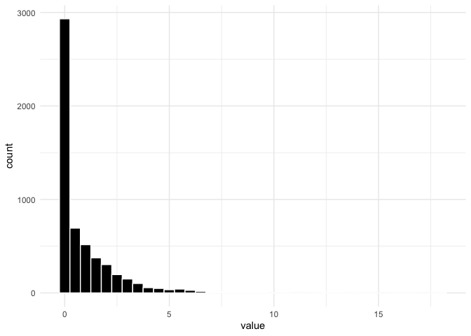<!-- -->

And basic summary stats:

    ##     Min.  1st Qu.   Median     Mean  3rd Qu.     Max. 
    ## -0.03172  0.04262  0.20910  0.96202  1.29064 18.24742

Note that the top quintile is around 1.3 or higher. I’m going to use
this for comparison in tables below.

We have 12 outcomes (6 spaces x 2 directions). Here are the variable
importance values for each variable, by group:

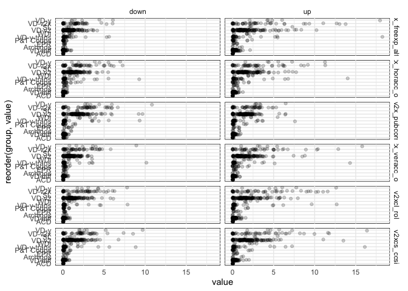<!-- -->

Variable groups on the x-axis are ordered by average VI value. Groups on
the bottom have lower averages and are less useful. Basically the points
to the right are what we need to keep.

Next I’m going to focus on specific variable groups and go through the
reasons I decided to keep or drop variables (or the complete data
group/source).

## ACD

The ACD data are regularly updated, but it doesn’t seem that they are
informative for predicting changes in the democratic space variables.

The plot below shows the variable importance values for all outcomes and
directions. The x-scale has the same range as the ones in the plot
above.

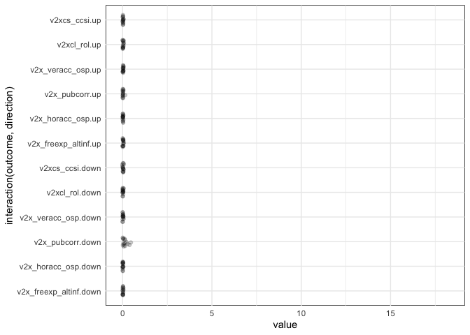<!-- -->

Easy to see that they just don’t seem to matter for prediction.

Drop the whole data source.

## EPR

The EPR data were last updated in November 2019, with data through 2017.
We now ideally would have data through 2020.

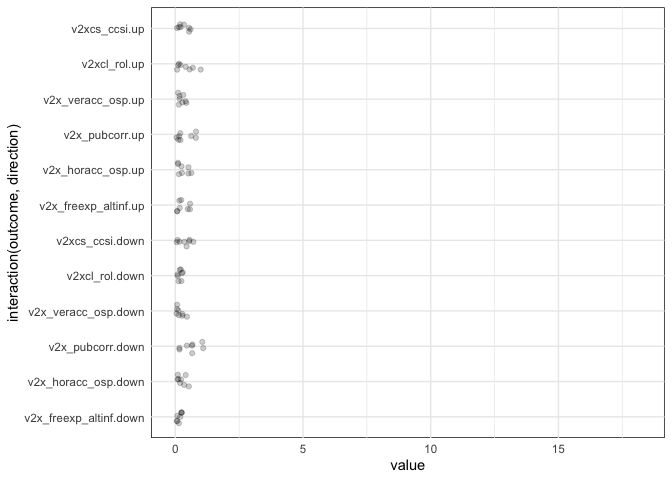<!-- -->

The variable importances are slightly higher than with ACD, but none
reach the top quintile:

| variable                           | mean | max | n\_over\_1.3 |
|:-----------------------------------|-----:|----:|-------------:|
| lag2\_epr\_excluded\_group\_pop    |  0.5 | 1.0 |            0 |
| lag2\_epr\_inpower\_groups\_pop    |  0.5 | 0.8 |            0 |
| lag2\_epr\_elf                     |  0.5 | 1.1 |            0 |
| lag2\_epr\_groups                  |  0.3 | 1.1 |            0 |
| lag2\_epr\_excluded\_groups\_count |  0.3 | 0.7 |            0 |
| lag2\_epr\_inpower\_groups\_count  |  0.2 | 0.5 |            0 |
| lag2\_epr\_regaut\_group\_pop      |  0.1 | 0.2 |            0 |
| lag2\_epr\_regaut\_groups\_count   |  0.1 | 0.2 |            0 |

Data are quite stale as they haven’t been updated recently, and they do
not have high VI values; drop the whole data source.

## Archigos

Variables related to the leader/head of a state.

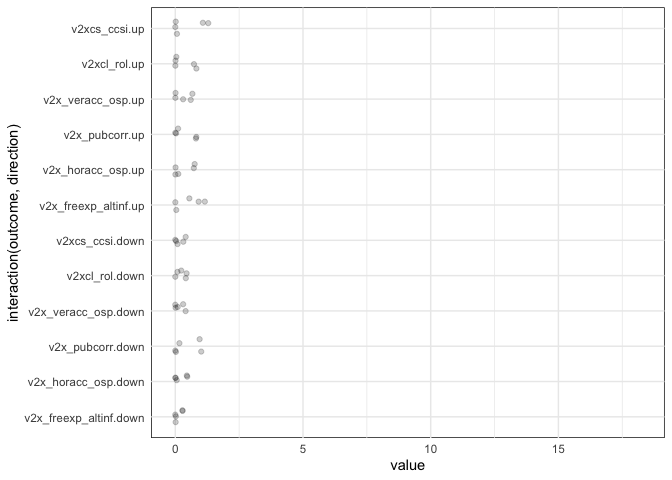<!-- -->

| variable                 | mean | max | n\_over\_1.3 |
|:-------------------------|-----:|----:|-------------:|
| lag1\_ldr\_yr\_in\_power |  0.7 | 1.2 |            0 |
| lag1\_ldr\_age           |  0.7 | 1.3 |            0 |
| lag1\_ldr\_irr\_entry    |  0.1 | 0.6 |            0 |
| lag1\_ldr\_male          |  0.0 | 0.1 |            0 |
| lag1\_ldr\_imputed       |  0.0 | 0.0 |            0 |

Don’t seem to be very important; drop.

## P&T Coups

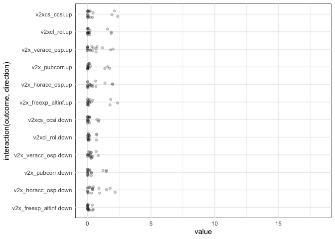<!-- -->

| variable                              | mean | max | n\_over\_1.3 |
|:--------------------------------------|-----:|----:|-------------:|
| lag0\_years\_since\_last\_pt\_attempt |  1.6 | 2.4 |            8 |
| lag0\_years\_since\_last\_pt\_coup    |  1.4 | 2.1 |            8 |
| lag0\_years\_since\_last\_pt\_failed  |  1.2 | 1.9 |            6 |
| lag0\_pt\_attempt\_total              |  0.3 | 0.8 |            0 |
| lag0\_pt\_coup\_total                 |  0.3 | 0.7 |            0 |
| lag0\_pt\_attempt\_num10yrs           |  0.3 | 1.0 |            0 |
| lag0\_pt\_failed\_total               |  0.3 | 0.5 |            0 |
| lag0\_pt\_coup\_num10yrs              |  0.2 | 0.7 |            0 |
| lag0\_pt\_attempt\_num5yrs            |  0.2 | 0.9 |            0 |
| lag0\_pt\_failed\_num10yrs            |  0.1 | 0.4 |            0 |
| lag0\_pt\_coup\_num5yrs               |  0.1 | 0.4 |            0 |
| lag0\_pt\_failed\_num5yrs             |  0.1 | 0.4 |            0 |
| lag0\_pt\_coup                        |  0.0 | 0.3 |            0 |
| lag0\_pt\_coup\_num                   |  0.0 | 0.3 |            0 |
| lag0\_pt\_attempt                     |  0.0 | 0.1 |            0 |
| lag0\_pt\_attempt\_num                |  0.0 | 0.1 |            0 |
| lag0\_pt\_failed\_num                 |  0.0 | 0.1 |            0 |
| lag0\_pt\_failed                      |  0.0 | 0.0 |            0 |

Only the “years\_since\_last\_…” features seem to be important.

Correlations in the 3 “years\_since\_last” measures:

|             | pt\_coup | pt\_failed | pt\_attempt |
|:------------|---------:|-----------:|------------:|
| pt\_coup    |     1.00 |       0.78 |        0.90 |
| pt\_failed  |     0.78 |       1.00 |        0.91 |
| pt\_attempt |     0.90 |       0.91 |        1.00 |

Since “years\_since\_last\_pt\_coup\_attempt” is highly correlated with
the other 2, just keep that one.

## WDI

<!-- -->

Ok, a couple seem to be high VI.

| variable              | mean | max | n\_over\_1.3 |
|:----------------------|-----:|----:|-------------:|
| lag2\_infmort         |  2.6 | 5.5 |           11 |
| lag2\_log\_gdp\_pc    |  2.0 | 3.9 |           10 |
| lag2\_log\_gdp        |  1.7 | 2.6 |            8 |
| lag0\_pop             |  1.3 | 2.1 |            7 |
| lag0\_log\_pop        |  1.3 | 2.1 |            7 |
| lag2\_gdp\_growth     |  0.2 | 0.4 |            0 |
| lag2\_gdp\_pc\_growth |  0.2 | 0.4 |            0 |

Infmort, GDP, and pop.

|                 | infmort | gdp\_growth | gdp\_pc\_growth | log\_gdp | log\_gdp\_pc |   pop | log\_pop |
|:----------------|--------:|------------:|----------------:|---------:|-------------:|------:|---------:|
| infmort         |    1.00 |        0.02 |           -0.04 |    -0.57 |        -0.72 | -0.03 |    -0.07 |
| gdp\_growth     |    0.02 |        1.00 |            0.97 |     0.00 |         0.00 |  0.04 |     0.01 |
| gdp\_pc\_growth |   -0.04 |        0.97 |            1.00 |     0.05 |         0.04 |  0.05 |     0.02 |
| log\_gdp        |   -0.57 |        0.00 |            0.05 |     1.00 |         0.67 |  0.35 |     0.70 |
| log\_gdp\_pc    |   -0.72 |        0.00 |            0.04 |     0.67 |         1.00 | -0.06 |    -0.05 |
| pop             |   -0.03 |        0.04 |            0.05 |     0.35 |        -0.06 |  1.00 |     0.52 |
| log\_pop        |   -0.07 |        0.01 |            0.02 |     0.70 |        -0.05 |  0.52 |     1.00 |

The 2 growth variables are not useful; also, drop raw pop and just keep
logged pop. Although they are not very highly correlated, I’d rather
keep the logged version.

## SL

Things derived from the G&W state list and basic data structure (country
codes and years).

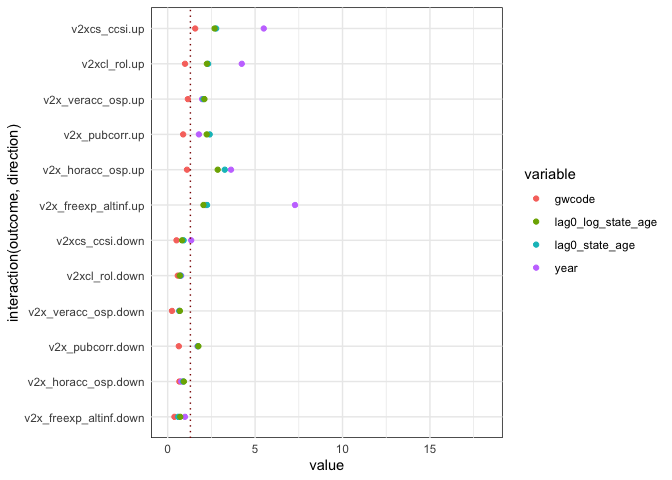<!-- -->

| variable              | mean | max | n\_over\_1.3 |
|:----------------------|-----:|----:|-------------:|
| year                  |  2.6 | 7.3 |            8 |
| lag0\_state\_age      |  1.7 | 3.3 |            7 |
| lag0\_log\_state\_age |  1.6 | 2.9 |            7 |
| gwcode                |  0.9 | 2.2 |            2 |

Mildly informative and low-cost to keep (they are in the data anyways).
Keep either state age or log state age but not both.

On to V-Dem groups of indicators.

## VD-y

These are the 12 outcome indicators. They are used, unlagged, in each
model, when forecasting next year’s outcome value.

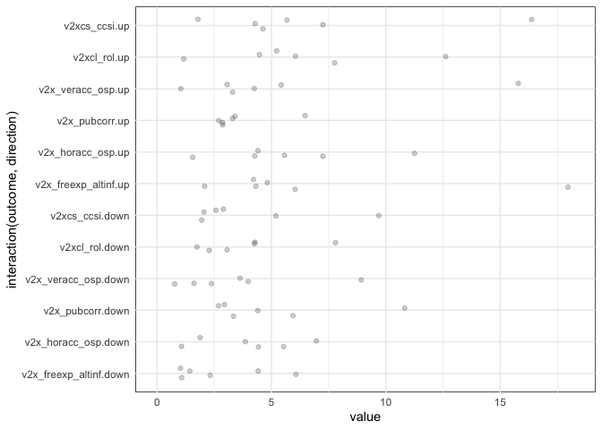<!-- -->

| variable            | mean |  max | n\_over\_1.3 |
|:--------------------|-----:|-----:|-------------:|
| v2x\_freexp\_altinf |  6.3 | 18.0 |           12 |
| v2xcs\_ccsi         |  5.7 | 16.4 |           12 |
| v2xcl\_rol          |  5.1 | 12.6 |           12 |
| v2x\_veracc\_osp    |  4.6 | 15.8 |           11 |
| v2x\_horacc\_osp    |  4.4 | 11.3 |           12 |
| v2x\_pubcorr        |  2.7 | 10.8 |            7 |

Keep.

## VD-y-trans

Transformations derived from the outcome indicators. Five and ten year
moving averages; squared terms; year to year diff.

    ## Warning: Removed 1 rows containing missing values (geom_point).

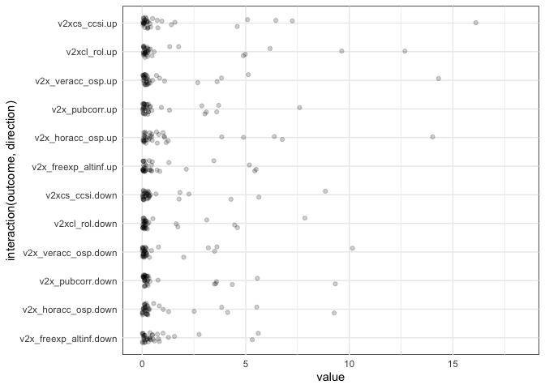<!-- -->

| variable                        | mean |  max | n\_over\_1.3 |
|:--------------------------------|-----:|-----:|-------------:|
| v2x\_freexp\_altinf\_squared    |  6.4 | 18.2 |           12 |
| v2xcs\_ccsi\_squared            |  5.8 | 16.1 |           12 |
| v2xcl\_rol\_squared             |  5.4 | 12.7 |           12 |
| v2x\_horacc\_osp\_squared       |  4.8 | 14.0 |           12 |
| v2x\_veracc\_osp\_squared       |  4.7 | 14.3 |           11 |
| v2x\_pubcorr\_squared           |  2.6 |  9.3 |            7 |
| v2x\_freexp\_altinf\_diff\_y2y  |  0.7 |  1.8 |            1 |
| v2xcl\_rol\_up\_ma10            |  0.5 |  1.3 |            1 |
| v2xcs\_ccsi\_up\_ma10           |  0.4 |  1.1 |            0 |
| v2x\_horacc\_osp\_up\_ma10      |  0.4 |  1.3 |            0 |
| v2xcs\_ccsi\_diff\_y2y          |  0.4 |  0.8 |            0 |
| v2xcl\_rol\_diff\_y2y           |  0.3 |  0.5 |            0 |
| v2x\_horacc\_osp\_down\_ma10    |  0.3 |  0.8 |            0 |
| v2x\_freexp\_altinf\_up\_ma10   |  0.3 |  0.8 |            0 |
| v2xcs\_ccsi\_up\_ma5            |  0.3 |  1.2 |            0 |
| v2xcs\_ccsi\_down\_ma10         |  0.3 |  1.4 |            1 |
| v2x\_pubcorr\_down\_ma10        |  0.3 |  0.8 |            0 |
| v2x\_horacc\_osp\_diff\_y2y     |  0.3 |  0.5 |            0 |
| v2x\_veracc\_osp\_down\_ma10    |  0.2 |  0.7 |            0 |
| v2x\_veracc\_osp\_diff\_y2y     |  0.2 |  0.4 |            0 |
| v2x\_horacc\_osp\_up\_ma5       |  0.2 |  1.3 |            0 |
| v2xcl\_rol\_down\_ma10          |  0.2 |  0.4 |            0 |
| v2x\_freexp\_altinf\_down\_ma10 |  0.2 |  0.5 |            0 |
| v2xcl\_rol\_down\_ma5           |  0.2 |  0.7 |            0 |
| v2xcl\_rol\_up\_ma5             |  0.2 |  0.4 |            0 |
| v2x\_horacc\_osp\_down\_ma5     |  0.2 |  0.5 |            0 |
| v2x\_freexp\_altinf\_up\_ma5    |  0.2 |  0.7 |            0 |
| v2xcs\_ccsi\_down\_ma5          |  0.2 |  0.4 |            0 |
| v2x\_veracc\_osp\_up\_ma10      |  0.1 |  0.4 |            0 |
| v2x\_veracc\_osp\_down\_ma5     |  0.1 |  0.5 |            0 |
| v2x\_pubcorr\_up\_ma10          |  0.1 |  0.3 |            0 |
| v2x\_pubcorr\_down\_ma5         |  0.1 |  0.3 |            0 |
| v2x\_freexp\_altinf\_down\_ma5  |  0.1 |  0.2 |            0 |
| v2x\_pubcorr\_diff\_y2y         |  0.1 |  0.4 |            0 |
| v2x\_veracc\_osp\_up\_ma5       |  0.1 |  0.5 |            0 |
| v2x\_pubcorr\_up\_ma5           |  0.1 |  0.2 |            0 |

The squared versions (`_squared`) matter, the rest (`_ma5`, `_ma10`,
`_diff_y2y`) can be dropped.

## VD-v2x

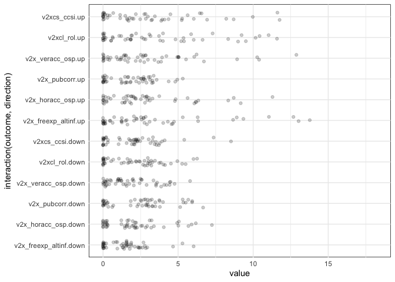<!-- -->

| variable                  | mean |  max | n\_over\_1.3 |
|:--------------------------|-----:|-----:|-------------:|
| lag0\_v2x\_diagacc        |  7.2 | 13.0 |           12 |
| lag0\_v2x\_clpol          |  6.9 | 13.8 |           12 |
| lag0\_v2x\_freexp         |  6.1 | 12.7 |           12 |
| lag0\_v2x\_civlib         |  5.5 | 11.0 |           12 |
| lag0\_v2x\_liberal        |  5.4 |  9.2 |           12 |
| lag0\_v2x\_frassoc\_thick |  5.3 | 10.0 |           12 |
| lag0\_v2x\_polyarchy      |  5.3 | 11.0 |           12 |
| lag0\_v2xcl\_disc         |  4.8 |  9.2 |           12 |
| lag0\_v2xnp\_pres         |  4.3 |  8.7 |           12 |
| lag0\_v2x\_EDcomp\_thick  |  4.1 | 10.3 |           12 |
| lag0\_v2x\_clpriv         |  4.1 | 10.4 |           12 |
| lag0\_v2xel\_frefair      |  3.8 | 12.9 |           12 |
| lag0\_v2x\_neopat         |  3.5 |  5.5 |           12 |
| lag0\_v2xlg\_legcon       |  3.5 | 11.3 |           10 |
| lag0\_v2x\_rule           |  3.4 |  5.9 |           11 |
| lag0\_v2x\_clphy          |  3.2 |  5.4 |           12 |
| lag0\_v2x\_cspart         |  3.1 |  5.6 |           12 |
| lag0\_v2x\_gencl          |  3.1 |  6.6 |           12 |
| lag0\_v2xcl\_acjst        |  3.1 |  5.9 |           11 |
| lag0\_v2xdl\_delib        |  3.0 |  4.5 |           12 |
| lag0\_v2x\_jucon          |  2.8 |  4.9 |           11 |
| lag0\_v2xnp\_regcorr      |  2.6 |  5.4 |           11 |
| lag0\_v2x\_corr           |  2.4 |  6.7 |            9 |
| lag0\_v2x\_egal           |  2.3 |  3.2 |           12 |
| lag0\_v2x\_execorr        |  2.3 |  5.3 |           11 |
| lag0\_v2xcl\_prpty        |  2.3 |  3.3 |           11 |
| lag0\_v2xcl\_dmove        |  2.2 |  6.0 |           11 |
| lag0\_v2x\_partip         |  2.2 |  3.9 |           12 |
| lag0\_v2xeg\_eqaccess     |  2.0 |  2.9 |           10 |
| lag0\_v2x\_gencs          |  1.9 |  3.3 |            9 |
| lag0\_v2xeg\_eqprotec     |  1.8 |  2.8 |            9 |
| lag0\_v2xnp\_client       |  1.8 |  2.7 |           10 |
| lag0\_v2xeg\_eqdr         |  1.5 |  2.1 |            7 |
| lag0\_v2x\_ex\_military   |  1.5 |  2.8 |            6 |
| lag0\_v2xcl\_slave        |  1.4 |  1.8 |            6 |
| lag0\_v2x\_elecreg        |  0.9 |  8.9 |            1 |
| lag0\_v2xex\_elecleg      |  0.8 |  3.9 |            2 |
| lag0\_v2xlg\_elecreg      |  0.6 |  5.5 |            1 |
| lag0\_v2x\_elecoff        |  0.6 |  2.9 |            1 |
| lag0\_v2x\_ex\_party      |  0.4 |  0.7 |            0 |
| lag0\_v2x\_ex\_confidence |  0.4 |  1.1 |            0 |
| lag0\_v2x\_ex\_hereditary |  0.1 |  0.3 |            0 |
| lag0\_v2x\_ex\_direlect   |  0.1 |  0.3 |            0 |
| lag0\_v2xex\_elecreg      |  0.1 |  0.4 |            0 |
| lag0\_v2xlg\_leginter     |  0.1 |  0.5 |            0 |
| lag0\_v2x\_hosinter       |  0.0 |  0.2 |            0 |
| lag0\_v2xel\_elecparl     |  0.0 |  0.1 |            0 |
| lag0\_v2x\_legabort       |  0.0 |  0.1 |            0 |
| lag0\_v2xel\_elecpres     |  0.0 |  0.0 |            0 |
| lag0\_v2x\_hosabort       |  0.0 |  0.0 |            0 |

Quite a few of these are good to keep. Arbitrarily: keep those with a
max value over 1.3.

Keep:

    ## c("lag0_v2x_civlib", "lag0_v2x_clphy", "lag0_v2x_clpol", "lag0_v2x_clpriv", 
    ## "lag0_v2x_corr", "lag0_v2x_cspart", "lag0_v2x_diagacc", "lag0_v2x_EDcomp_thick", 
    ## "lag0_v2x_egal", "lag0_v2x_elecoff", "lag0_v2x_elecreg", "lag0_v2x_ex_military", 
    ## "lag0_v2x_execorr", "lag0_v2x_frassoc_thick", "lag0_v2x_freexp", 
    ## "lag0_v2x_gencl", "lag0_v2x_gencs", "lag0_v2x_jucon", "lag0_v2x_liberal", 
    ## "lag0_v2x_neopat", "lag0_v2x_partip", "lag0_v2x_polyarchy", "lag0_v2x_rule", 
    ## "lag0_v2xcl_acjst", "lag0_v2xcl_disc", "lag0_v2xcl_dmove", "lag0_v2xcl_prpty", 
    ## "lag0_v2xcl_slave", "lag0_v2xdl_delib", "lag0_v2xeg_eqaccess", 
    ## "lag0_v2xeg_eqdr", "lag0_v2xeg_eqprotec", "lag0_v2xel_frefair", 
    ## "lag0_v2xex_elecleg", "lag0_v2xlg_elecreg", "lag0_v2xlg_legcon", 
    ## "lag0_v2xnp_client", "lag0_v2xnp_pres", "lag0_v2xnp_regcorr")

Drop:

    ## c("lag0_v2x_ex_confidence", "lag0_v2x_ex_direlect", "lag0_v2x_ex_hereditary", 
    ## "lag0_v2x_ex_party", "lag0_v2x_hosabort", "lag0_v2x_hosinter", 
    ## "lag0_v2x_legabort", "lag0_v2xel_elecparl", "lag0_v2xel_elecpres", 
    ## "lag0_v2xex_elecreg", "lag0_v2xlg_leginter")

## VD-v2

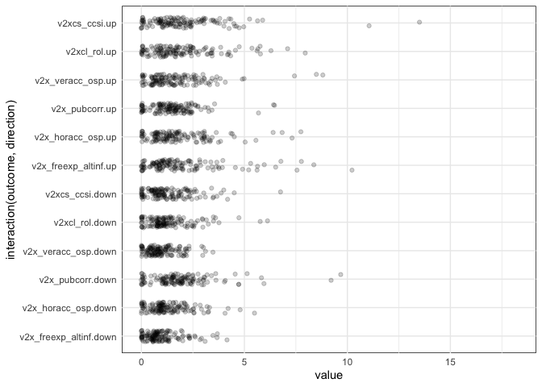<!-- -->

| variable                 | mean |  max | n\_over\_1.3 |
|:-------------------------|-----:|-----:|-------------:|
| lag0\_v2cseeorgs         |  4.7 | 11.1 |           12 |
| lag0\_v2csreprss         |  4.0 | 13.5 |           12 |
| lag0\_v2cldiscm          |  3.9 |  7.8 |           12 |
| lag0\_v2cldiscw          |  3.7 |  6.0 |           12 |
| lag0\_v2meharjrn         |  3.6 |  4.9 |           12 |
| lag0\_v2cltrnslw         |  3.5 |  6.0 |           11 |
| lag0\_v2merange          |  3.4 | 10.2 |           12 |
| lag0\_v2mecrit           |  3.1 |  7.6 |           12 |
| lag0\_v2clacjstm         |  3.1 |  5.6 |           12 |
| lag0\_v2mebias           |  3.1 |  5.3 |           12 |
| lag0\_v2mecenefm         |  3.0 |  6.5 |           12 |
| lag0\_v2meslfcen         |  3.0 |  8.4 |           11 |
| lag0\_v2mecorrpt         |  3.0 |  5.1 |           12 |
| lag0\_v2psbars           |  3.0 |  6.8 |           12 |
| lag0\_v2clacfree         |  3.0 |  5.9 |           12 |
| lag0\_v2elembaut         |  2.9 |  4.7 |           11 |
| lag0\_v2clfmove          |  2.9 |  8.0 |           11 |
| lag0\_v2lgoppart         |  2.8 |  7.3 |           10 |
| lag0\_v2cltort           |  2.7 |  4.6 |           12 |
| lag0\_v2dlcountr         |  2.7 |  5.8 |           12 |
| lag0\_v2clkill           |  2.6 |  4.2 |           11 |
| lag0\_v2clacjstw         |  2.6 |  5.8 |           10 |
| lag0\_v2exembez          |  2.6 |  4.7 |           11 |
| lag0\_v2cscnsult         |  2.6 |  4.3 |           11 |
| lag0\_v2lginvstp         |  2.5 |  7.7 |            8 |
| lag0\_v2psoppaut         |  2.5 |  3.7 |           11 |
| lag0\_v2exthftps         |  2.4 |  9.7 |            7 |
| lag0\_v2excrptps         |  2.4 |  9.2 |            6 |
| lag0\_v2clrspct          |  2.4 |  4.6 |           12 |
| lag0\_v2dlengage         |  2.4 |  3.8 |           12 |
| lag0\_v2csprtcpt         |  2.4 |  3.8 |           11 |
| lag0\_v2lgotovst         |  2.3 |  6.8 |            9 |
| lag0\_v2csantimv         |  2.3 |  4.3 |           11 |
| lag0\_v2elfrfair         |  2.2 |  7.4 |            7 |
| lag0\_v2csrlgrep         |  2.2 |  4.3 |            9 |
| lag0\_v2ellocons         |  2.2 |  8.8 |            8 |
| lag0\_v2dlconslt         |  2.2 |  4.0 |           11 |
| lag0\_v2exrescon         |  2.1 |  3.6 |           10 |
| lag0\_v2pssunpar         |  2.1 |  4.3 |           10 |
| lag0\_v2clstown          |  2.1 |  5.6 |            9 |
| lag0\_v2psparban         |  2.0 |  3.2 |           10 |
| lag0\_v2jucomp           |  1.9 |  3.4 |           10 |
| lag0\_v2clprptyw         |  1.8 |  3.0 |           11 |
| lag0\_v2cldmovem         |  1.8 |  6.3 |            6 |
| lag0\_v2exbribe          |  1.8 |  4.7 |            9 |
| lag0\_v2elintim          |  1.8 |  4.1 |            7 |
| lag0\_v2lgqstexp         |  1.8 |  3.0 |            8 |
| lag0\_v2clrelig          |  1.8 |  3.5 |            7 |
| lag0\_v2elmulpar         |  1.7 |  3.8 |            6 |
| lag0\_v2juhccomp         |  1.7 |  2.8 |            9 |
| lag0\_v2clprptym         |  1.7 |  2.8 |            8 |
| lag0\_v2pepwrsoc         |  1.7 |  2.4 |            9 |
| lag0\_v2juaccnt          |  1.7 |  4.0 |            8 |
| lag0\_v2elembcap         |  1.6 |  3.1 |            6 |
| lag0\_v2lgcomslo         |  1.6 |  3.1 |            6 |
| lag0\_v2cldmovew         |  1.6 |  3.4 |            8 |
| lag0\_v2juhcind          |  1.6 |  2.3 |            9 |
| lag0\_v2elirreg          |  1.6 |  3.0 |            7 |
| lag0\_v2dlreason         |  1.6 |  2.2 |            8 |
| lag0\_v2jucorrdc         |  1.5 |  3.2 |            6 |
| lag0\_v2juncind          |  1.5 |  2.5 |            7 |
| lag0\_v2clacjust         |  1.5 |  2.7 |            7 |
| lag0\_v2elaccept         |  1.5 |  4.9 |            6 |
| lag0\_v2elrgstry         |  1.5 |  2.8 |            6 |
| lag0\_v2pepwrort         |  1.5 |  3.2 |            6 |
| lag0\_v2elvotbuy         |  1.5 |  2.3 |            7 |
| lag0\_v2jureview         |  1.4 |  3.6 |            5 |
| lag0\_v2lgfunds          |  1.4 |  3.4 |            4 |
| lag0\_v2dlencmps         |  1.4 |  3.1 |            4 |
| lag0\_v2ellocumul        |  1.4 |  2.4 |            7 |
| lag0\_v2lglegplo         |  1.4 |  2.1 |            5 |
| lag0\_v2lgcrrpt          |  1.4 |  2.4 |            5 |
| lag0\_v2csrlgcon         |  1.3 |  2.8 |            5 |
| lag0\_v2pehealth         |  1.3 |  3.0 |            6 |
| lag0\_v2jupurge          |  1.3 |  2.0 |            6 |
| lag0\_v2psplats          |  1.3 |  2.0 |            6 |
| lag0\_v2elpdcamp         |  1.3 |  2.4 |            6 |
| lag0\_v2pepwrgen         |  1.3 |  2.4 |            4 |
| lag0\_v2clslavem         |  1.2 |  1.7 |            5 |
| lag0\_v2peedueq          |  1.2 |  1.8 |            6 |
| lag0\_v2csgender         |  1.2 |  2.3 |            5 |
| lag0\_v2eldonate         |  1.1 |  2.2 |            3 |
| lag0\_v2clslavef         |  1.1 |  1.9 |            3 |
| lag0\_v2elpaidig         |  1.1 |  2.1 |            5 |
| lag0\_v2exdfpphs         |  1.1 |  1.8 |            5 |
| lag0\_v2psprlnks         |  1.1 |  1.8 |            5 |
| lag0\_v2psorgs           |  1.1 |  1.9 |            4 |
| lag0\_v2clsocgrp         |  1.1 |  2.4 |            2 |
| lag0\_v2exdfvths         |  1.1 |  1.7 |            3 |
| lag0\_v2exremhsp         |  1.1 |  1.5 |            4 |
| lag0\_v2psprbrch         |  1.1 |  1.9 |            1 |
| lag0\_v2jupoatck         |  1.1 |  2.1 |            4 |
| lag0\_v2elpeace          |  1.1 |  1.6 |            2 |
| lag0\_v2pepwrses         |  1.0 |  1.8 |            3 |
| lag0\_v2elboycot         |  1.0 |  3.1 |            2 |
| lag0\_v2dlcommon         |  1.0 |  1.7 |            2 |
| lag0\_v2elfrcamp         |  1.0 |  1.5 |            4 |
| lag0\_v2pscnslnl         |  0.9 |  1.5 |            1 |
| lag0\_v2jupack           |  0.9 |  1.6 |            2 |
| lag0\_v2exdfdmhs         |  0.9 |  1.6 |            1 |
| lag0\_v2svstterr         |  0.9 |  2.2 |            1 |
| lag0\_v2elpubfin         |  0.8 |  1.1 |            0 |
| lag0\_v2exdfdshs         |  0.8 |  1.5 |            2 |
| lag0\_v2psnatpar         |  0.8 |  1.3 |            1 |
| lag0\_v2pscohesv         |  0.8 |  2.6 |            1 |
| lag0\_is\_elec           |  0.8 |  8.5 |            1 |
| lag0\_v2exdfcbhs         |  0.8 |  1.1 |            0 |
| lag0\_v2dlunivl          |  0.8 |  1.2 |            0 |
| lag0\_v2clrgunev         |  0.8 |  1.6 |            1 |
| lag0\_v2elasmoff         |  0.8 |  1.7 |            1 |
| lag0\_v2lgsrvlo          |  0.8 |  1.3 |            0 |
| lag0\_v2pscomprg         |  0.7 |  1.7 |            1 |
| lag0\_v2lgbicam          |  0.6 |  3.4 |            2 |
| lag0\_v2svdomaut         |  0.6 |  1.2 |            0 |
| lag0\_v2jureform         |  0.6 |  0.9 |            0 |
| lag0\_v2svinlaut         |  0.6 |  1.0 |            0 |
| lag0\_v2elprescumul      |  0.6 |  1.1 |            0 |
| lag0\_v2expathhs         |  0.5 |  2.1 |            1 |
| lag0\_v2elprescons       |  0.5 |  0.7 |            0 |
| lag0\_v2lgdsadlobin      |  0.5 |  0.7 |            0 |
| lag0\_is\_leg            |  0.5 |  2.9 |            2 |
| lag0\_v2ex\_hosw         |  0.2 |  0.3 |            0 |
| lag0\_v2ex\_hogw         |  0.2 |  0.4 |            0 |
| lag0\_v2ex\_elechos      |  0.1 |  0.2 |            0 |
| lag0\_v2ex\_legconhog    |  0.1 |  0.1 |            0 |
| lag0\_v2elreggov         |  0.1 |  0.3 |            0 |
| lag0\_v2ex\_legconhos    |  0.1 |  0.1 |            0 |
| lag0\_v2exhoshog         |  0.1 |  0.1 |            0 |
| lag0\_v2elrsthos         |  0.0 |  0.1 |            0 |
| lag0\_v2ellocgov         |  0.0 |  0.1 |            0 |
| lag0\_v2elrstrct         |  0.0 |  0.1 |            0 |
| lag0\_v2elmonref         |  0.0 |  0.1 |            0 |
| lag0\_v2elmonden         |  0.0 |  0.1 |            0 |
| lag0\_is\_election\_year |  0.0 |  0.1 |            0 |

Like above, this is more variable specific. Again using an arbitrary 1.3
max value.

Keep:

    ## c("lag0_is_elec", "lag0_is_leg", "lag0_v2clacfree", "lag0_v2clacjstm", 
    ## "lag0_v2clacjstw", "lag0_v2clacjust", "lag0_v2cldiscm", "lag0_v2cldiscw", 
    ## "lag0_v2cldmovem", "lag0_v2cldmovew", "lag0_v2clfmove", "lag0_v2clkill", 
    ## "lag0_v2clprptym", "lag0_v2clprptyw", "lag0_v2clrelig", "lag0_v2clrgunev", 
    ## "lag0_v2clrspct", "lag0_v2clslavef", "lag0_v2clslavem", "lag0_v2clsocgrp", 
    ## "lag0_v2clstown", "lag0_v2cltort", "lag0_v2cltrnslw", "lag0_v2csantimv", 
    ## "lag0_v2cscnsult", "lag0_v2cseeorgs", "lag0_v2csgender", "lag0_v2csprtcpt", 
    ## "lag0_v2csreprss", "lag0_v2csrlgcon", "lag0_v2csrlgrep", "lag0_v2dlcommon", 
    ## "lag0_v2dlconslt", "lag0_v2dlcountr", "lag0_v2dlencmps", "lag0_v2dlengage", 
    ## "lag0_v2dlreason", "lag0_v2elaccept", "lag0_v2elasmoff", "lag0_v2elboycot", 
    ## "lag0_v2eldonate", "lag0_v2elembaut", "lag0_v2elembcap", "lag0_v2elfrcamp", 
    ## "lag0_v2elfrfair", "lag0_v2elintim", "lag0_v2elirreg", "lag0_v2ellocons", 
    ## "lag0_v2ellocumul", "lag0_v2elmulpar", "lag0_v2elpaidig", "lag0_v2elpdcamp", 
    ## "lag0_v2elpeace", "lag0_v2elrgstry", "lag0_v2elvotbuy", "lag0_v2exbribe", 
    ## "lag0_v2excrptps", "lag0_v2exdfdmhs", "lag0_v2exdfdshs", "lag0_v2exdfpphs", 
    ## "lag0_v2exdfvths", "lag0_v2exembez", "lag0_v2expathhs", "lag0_v2exremhsp", 
    ## "lag0_v2exrescon", "lag0_v2exthftps", "lag0_v2juaccnt", "lag0_v2jucomp", 
    ## "lag0_v2jucorrdc", "lag0_v2juhccomp", "lag0_v2juhcind", "lag0_v2juncind", 
    ## "lag0_v2jupack", "lag0_v2jupoatck", "lag0_v2jupurge", "lag0_v2jureview", 
    ## "lag0_v2lgbicam", "lag0_v2lgcomslo", "lag0_v2lgcrrpt", "lag0_v2lgfunds", 
    ## "lag0_v2lginvstp", "lag0_v2lglegplo", "lag0_v2lgoppart", "lag0_v2lgotovst", 
    ## "lag0_v2lgqstexp", "lag0_v2mebias", "lag0_v2mecenefm", "lag0_v2mecorrpt", 
    ## "lag0_v2mecrit", "lag0_v2meharjrn", "lag0_v2merange", "lag0_v2meslfcen", 
    ## "lag0_v2peedueq", "lag0_v2pehealth", "lag0_v2pepwrgen", "lag0_v2pepwrort", 
    ## "lag0_v2pepwrses", "lag0_v2pepwrsoc", "lag0_v2psbars", "lag0_v2pscnslnl", 
    ## "lag0_v2pscohesv", "lag0_v2pscomprg", "lag0_v2psnatpar", "lag0_v2psoppaut", 
    ## "lag0_v2psorgs", "lag0_v2psparban", "lag0_v2psplats", "lag0_v2psprbrch", 
    ## "lag0_v2psprlnks", "lag0_v2pssunpar", "lag0_v2svstterr")

Drop:

    ## c("lag0_is_election_year", "lag0_v2dlunivl", "lag0_v2ellocgov", 
    ## "lag0_v2elmonden", "lag0_v2elmonref", "lag0_v2elprescons", "lag0_v2elprescumul", 
    ## "lag0_v2elpubfin", "lag0_v2elreggov", "lag0_v2elrsthos", "lag0_v2elrstrct", 
    ## "lag0_v2ex_elechos", "lag0_v2ex_hogw", "lag0_v2ex_hosw", "lag0_v2ex_legconhog", 
    ## "lag0_v2ex_legconhos", "lag0_v2exdfcbhs", "lag0_v2exhoshog", 
    ## "lag0_v2jureform", "lag0_v2lgdsadlobin", "lag0_v2lgsrvlo", "lag0_v2svdomaut", 
    ## "lag0_v2svinlaut")

## VD-diff (V-Dem variable changes from previous year)

These are year to year changes in the “v2” and “v2x” sets of variables.

<!-- -->

| variable                                     | mean | max | n\_over\_1.3 |
|:---------------------------------------------|-----:|----:|-------------:|
| lag0\_diff\_year\_prior\_v2x\_diagacc        |  1.0 | 2.1 |            3 |
| lag0\_diff\_year\_prior\_v2x\_clpol          |  0.9 | 1.3 |            1 |
| lag0\_diff\_year\_prior\_v2x\_freexp         |  0.7 | 1.7 |            1 |
| lag0\_diff\_year\_prior\_v2x\_civlib         |  0.6 | 1.1 |            0 |
| lag0\_diff\_year\_prior\_v2psbars            |  0.5 | 0.9 |            0 |
| lag0\_diff\_year\_prior\_v2xcl\_disc         |  0.4 | 0.8 |            0 |
| lag0\_diff\_year\_prior\_v2x\_clphy          |  0.4 | 1.0 |            0 |
| lag0\_diff\_year\_prior\_v2x\_frassoc\_thick |  0.3 | 0.7 |            0 |
| lag0\_diff\_year\_prior\_v2psoppaut          |  0.3 | 0.7 |            0 |
| lag0\_diff\_year\_prior\_v2xdl\_delib        |  0.3 | 0.7 |            0 |
| lag0\_diff\_year\_prior\_v2x\_liberal        |  0.3 | 0.4 |            0 |
| lag0\_diff\_year\_prior\_v2cltort            |  0.3 | 0.8 |            0 |
| lag0\_diff\_year\_prior\_v2x\_polyarchy      |  0.3 | 0.4 |            0 |
| lag0\_diff\_year\_prior\_v2psparban          |  0.3 | 0.6 |            0 |
| lag0\_diff\_year\_prior\_v2merange           |  0.3 | 0.8 |            0 |
| lag0\_diff\_year\_prior\_v2csreprss          |  0.3 | 0.5 |            0 |
| lag0\_diff\_year\_prior\_v2xnp\_pres         |  0.3 | 0.5 |            0 |
| lag0\_diff\_year\_prior\_v2cldiscw           |  0.2 | 0.5 |            0 |
| lag0\_diff\_year\_prior\_v2cseeorgs          |  0.2 | 0.6 |            0 |
| lag0\_diff\_year\_prior\_v2cldiscm           |  0.2 | 0.4 |            0 |
| lag0\_diff\_year\_prior\_v2mebias            |  0.2 | 0.6 |            0 |
| lag0\_diff\_year\_prior\_v2clkill            |  0.2 | 0.5 |            0 |
| lag0\_diff\_year\_prior\_v2mecenefm          |  0.2 | 0.5 |            0 |
| lag0\_diff\_year\_prior\_v2x\_cspart         |  0.2 | 0.6 |            0 |
| lag0\_diff\_year\_prior\_v2x\_rule           |  0.2 | 0.6 |            0 |
| lag0\_diff\_year\_prior\_v2xlg\_legcon       |  0.2 | 0.5 |            0 |
| lag0\_diff\_year\_prior\_v2pssunpar          |  0.2 | 0.5 |            0 |
| lag0\_diff\_year\_prior\_v2meharjrn          |  0.2 | 0.5 |            0 |
| lag0\_diff\_year\_prior\_v2x\_EDcomp\_thick  |  0.2 | 0.3 |            0 |
| lag0\_diff\_year\_prior\_v2clacfree          |  0.2 | 0.5 |            0 |
| lag0\_diff\_year\_prior\_v2elembaut          |  0.2 | 0.5 |            0 |
| lag0\_diff\_year\_prior\_v2dlconslt          |  0.2 | 0.5 |            0 |
| lag0\_diff\_year\_prior\_v2dlengage          |  0.2 | 0.5 |            0 |
| lag0\_diff\_year\_prior\_v2mecrit            |  0.2 | 0.5 |            0 |
| lag0\_diff\_year\_prior\_v2mecorrpt          |  0.2 | 0.5 |            0 |
| lag0\_diff\_year\_prior\_v2csprtcpt          |  0.2 | 0.7 |            0 |
| lag0\_diff\_year\_prior\_v2cltrnslw          |  0.2 | 0.3 |            0 |
| lag0\_diff\_year\_prior\_v2x\_clpriv         |  0.2 | 0.4 |            0 |
| lag0\_diff\_year\_prior\_v2meslfcen          |  0.2 | 0.4 |            0 |
| lag0\_diff\_year\_prior\_v2psnatpar          |  0.2 | 0.5 |            0 |
| lag0\_diff\_year\_prior\_v2dlcountr          |  0.2 | 0.4 |            0 |
| lag0\_diff\_year\_prior\_v2exrescon          |  0.2 | 0.3 |            0 |
| lag0\_diff\_year\_prior\_v2x\_partip         |  0.1 | 0.3 |            0 |
| lag0\_diff\_year\_prior\_v2x\_jucon          |  0.1 | 0.3 |            0 |
| lag0\_diff\_year\_prior\_v2lgoppart          |  0.1 | 0.4 |            0 |
| lag0\_diff\_year\_prior\_v2x\_execorr        |  0.1 | 0.7 |            0 |
| lag0\_diff\_year\_prior\_v2lginvstp          |  0.1 | 0.4 |            0 |
| lag0\_diff\_year\_prior\_v2csantimv          |  0.1 | 0.2 |            0 |
| lag0\_diff\_year\_prior\_v2xel\_frefair      |  0.1 | 0.2 |            0 |
| lag0\_diff\_year\_prior\_v2x\_corr           |  0.1 | 0.7 |            0 |
| lag0\_diff\_year\_prior\_v2x\_neopat         |  0.1 | 0.3 |            0 |
| lag0\_diff\_year\_prior\_v2xcl\_dmove        |  0.1 | 0.3 |            0 |
| lag0\_diff\_year\_prior\_v2clsocgrp          |  0.1 | 0.3 |            0 |
| lag0\_diff\_year\_prior\_v2cscnsult          |  0.1 | 0.2 |            0 |
| lag0\_diff\_year\_prior\_v2csrlgrep          |  0.1 | 0.2 |            0 |
| lag0\_diff\_year\_prior\_v2xcl\_acjst        |  0.1 | 0.2 |            0 |
| lag0\_diff\_year\_prior\_v2lgotovst          |  0.1 | 0.3 |            0 |
| lag0\_diff\_year\_prior\_v2cldmovem          |  0.1 | 0.3 |            0 |
| lag0\_diff\_year\_prior\_v2juhcind           |  0.1 | 0.3 |            0 |
| lag0\_diff\_year\_prior\_v2x\_gencl          |  0.1 | 0.2 |            0 |
| lag0\_diff\_year\_prior\_v2clrspct           |  0.1 | 0.2 |            0 |
| lag0\_diff\_year\_prior\_v2clfmove           |  0.1 | 0.4 |            0 |
| lag0\_diff\_year\_prior\_v2psplats           |  0.1 | 0.4 |            0 |
| lag0\_diff\_year\_prior\_v2x\_gencs          |  0.1 | 0.3 |            0 |
| lag0\_diff\_year\_prior\_v2exembez           |  0.1 | 0.4 |            0 |
| lag0\_diff\_year\_prior\_v2xlg\_leginter     |  0.1 | 0.7 |            0 |
| lag0\_diff\_year\_prior\_v2eldonate          |  0.1 | 0.2 |            0 |
| lag0\_diff\_year\_prior\_v2clacjstw          |  0.1 | 0.2 |            0 |
| lag0\_diff\_year\_prior\_v2xnp\_client       |  0.1 | 0.2 |            0 |
| lag0\_diff\_year\_prior\_v2elmulpar          |  0.1 | 0.2 |            0 |
| lag0\_diff\_year\_prior\_v2jureform          |  0.1 | 0.2 |            0 |
| lag0\_diff\_year\_prior\_v2clacjstm          |  0.1 | 0.1 |            0 |
| lag0\_diff\_year\_prior\_v2juncind           |  0.1 | 0.2 |            0 |
| lag0\_diff\_year\_prior\_v2xex\_elecleg      |  0.1 | 0.2 |            0 |
| lag0\_diff\_year\_prior\_v2jucomp            |  0.1 | 0.2 |            0 |
| lag0\_diff\_year\_prior\_v2ellocons          |  0.1 | 0.6 |            0 |
| lag0\_diff\_year\_prior\_v2xnp\_regcorr      |  0.1 | 0.3 |            0 |
| lag0\_diff\_year\_prior\_v2psorgs            |  0.1 | 0.2 |            0 |
| lag0\_diff\_year\_prior\_v2psprlnks          |  0.1 | 0.3 |            0 |
| lag0\_diff\_year\_prior\_v2juhccomp          |  0.1 | 0.1 |            0 |
| lag0\_diff\_year\_prior\_v2lgfunds           |  0.1 | 0.2 |            0 |
| lag0\_diff\_year\_prior\_v2exdfdshs          |  0.1 | 0.2 |            0 |
| lag0\_diff\_year\_prior\_v2exremhsp          |  0.1 | 0.1 |            0 |
| lag0\_diff\_year\_prior\_v2dlreason          |  0.1 | 0.2 |            0 |
| lag0\_diff\_year\_prior\_v2lgqstexp          |  0.1 | 0.2 |            0 |
| lag0\_diff\_year\_prior\_v2x\_ex\_military   |  0.1 | 0.1 |            0 |
| lag0\_diff\_year\_prior\_v2exbribe           |  0.1 | 0.3 |            0 |
| lag0\_diff\_year\_prior\_v2lgdsadlobin       |  0.1 | 0.3 |            0 |
| lag0\_diff\_year\_prior\_v2x\_elecoff        |  0.1 | 0.3 |            0 |
| lag0\_diff\_year\_prior\_v2xcl\_prpty        |  0.1 | 0.2 |            0 |
| lag0\_diff\_year\_prior\_v2lgcrrpt           |  0.1 | 0.3 |            0 |
| lag0\_diff\_year\_prior\_v2cldmovew          |  0.1 | 0.2 |            0 |
| lag0\_diff\_year\_prior\_v2clrelig           |  0.1 | 0.1 |            0 |
| lag0\_diff\_year\_prior\_v2clprptym          |  0.1 | 0.3 |            0 |
| lag0\_diff\_year\_prior\_v2exthftps          |  0.1 | 0.2 |            0 |
| lag0\_diff\_year\_prior\_v2lgbicam           |  0.1 | 0.5 |            0 |
| lag0\_diff\_year\_prior\_v2psprbrch          |  0.1 | 0.1 |            0 |
| lag0\_diff\_year\_prior\_v2svstterr          |  0.1 | 0.1 |            0 |
| lag0\_diff\_year\_prior\_v2xcl\_slave        |  0.1 | 0.2 |            0 |
| lag0\_diff\_year\_prior\_v2pepwrses          |  0.1 | 0.1 |            0 |
| lag0\_diff\_year\_prior\_v2elfrfair          |  0.1 | 0.1 |            0 |
| lag0\_diff\_year\_prior\_v2lgcomslo          |  0.1 | 0.1 |            0 |
| lag0\_diff\_year\_prior\_v2dlencmps          |  0.1 | 0.1 |            0 |
| lag0\_diff\_year\_prior\_v2clslavem          |  0.1 | 0.2 |            0 |
| lag0\_diff\_year\_prior\_v2jureview          |  0.1 | 0.2 |            0 |
| lag0\_diff\_year\_prior\_v2dlcommon          |  0.1 | 0.2 |            0 |
| lag0\_diff\_year\_prior\_v2excrptps          |  0.1 | 0.3 |            0 |
| lag0\_diff\_year\_prior\_v2pscohesv          |  0.1 | 0.1 |            0 |
| lag0\_diff\_year\_prior\_v2elfrcamp          |  0.1 | 0.1 |            0 |
| lag0\_diff\_year\_prior\_v2exdfvths          |  0.1 | 0.2 |            0 |
| lag0\_diff\_year\_prior\_v2elirreg           |  0.1 | 0.1 |            0 |
| lag0\_diff\_year\_prior\_v2elpubfin          |  0.1 | 0.2 |            0 |
| lag0\_diff\_year\_prior\_v2elembcap          |  0.1 | 0.1 |            0 |
| lag0\_diff\_year\_prior\_v2expathhs          |  0.1 | 0.2 |            0 |
| lag0\_diff\_year\_prior\_v2csgender          |  0.1 | 0.1 |            0 |
| lag0\_diff\_year\_prior\_v2elpdcamp          |  0.1 | 0.1 |            0 |
| lag0\_diff\_year\_prior\_v2elintim           |  0.0 | 0.2 |            0 |
| lag0\_diff\_year\_prior\_v2jupurge           |  0.0 | 0.2 |            0 |
| lag0\_diff\_year\_prior\_v2lglegplo          |  0.0 | 0.1 |            0 |
| lag0\_diff\_year\_prior\_v2elpaidig          |  0.0 | 0.1 |            0 |
| lag0\_diff\_year\_prior\_v2pscnslnl          |  0.0 | 0.1 |            0 |
| lag0\_diff\_year\_prior\_v2csrlgcon          |  0.0 | 0.2 |            0 |
| lag0\_diff\_year\_prior\_v2exdfpphs          |  0.0 | 0.1 |            0 |
| lag0\_diff\_year\_prior\_v2xeg\_eqdr         |  0.0 | 0.1 |            0 |
| lag0\_diff\_year\_prior\_v2clprptyw          |  0.0 | 0.1 |            0 |
| lag0\_diff\_year\_prior\_v2svdomaut          |  0.0 | 0.1 |            0 |
| lag0\_diff\_year\_prior\_v2clstown           |  0.0 | 0.1 |            0 |
| lag0\_diff\_year\_prior\_v2lgsrvlo           |  0.0 | 0.1 |            0 |
| lag0\_diff\_year\_prior\_v2elaccept          |  0.0 | 0.1 |            0 |
| lag0\_diff\_year\_prior\_v2x\_egal           |  0.0 | 0.1 |            0 |
| lag0\_diff\_year\_prior\_v2exdfcbhs          |  0.0 | 0.1 |            0 |
| lag0\_diff\_year\_prior\_v2clslavef          |  0.0 | 0.1 |            0 |
| lag0\_diff\_year\_prior\_v2xeg\_eqprotec     |  0.0 | 0.1 |            0 |
| lag0\_diff\_year\_prior\_v2exdfdmhs          |  0.0 | 0.1 |            0 |
| lag0\_diff\_year\_prior\_v2elrgstry          |  0.0 | 0.1 |            0 |
| lag0\_diff\_year\_prior\_v2svinlaut          |  0.0 | 0.1 |            0 |
| lag0\_diff\_year\_prior\_v2pepwrort          |  0.0 | 0.1 |            0 |
| lag0\_diff\_year\_prior\_v2clrgunev          |  0.0 | 0.1 |            0 |
| lag0\_diff\_year\_prior\_v2jucorrdc          |  0.0 | 0.1 |            0 |
| lag0\_diff\_year\_prior\_v2elboycot          |  0.0 | 0.1 |            0 |
| lag0\_diff\_year\_prior\_v2xeg\_eqaccess     |  0.0 | 0.1 |            0 |
| lag0\_diff\_year\_prior\_v2elasmoff          |  0.0 | 0.1 |            0 |
| lag0\_diff\_year\_prior\_v2x\_hosinter       |  0.0 | 0.2 |            0 |
| lag0\_diff\_year\_prior\_v2juaccnt           |  0.0 | 0.1 |            0 |
| lag0\_diff\_year\_prior\_v2x\_ex\_party      |  0.0 | 0.1 |            0 |
| lag0\_diff\_year\_prior\_v2pepwrsoc          |  0.0 | 0.1 |            0 |
| lag0\_diff\_year\_prior\_v2jupoatck          |  0.0 | 0.1 |            0 |
| lag0\_diff\_year\_prior\_v2clacjust          |  0.0 | 0.1 |            0 |
| lag0\_diff\_year\_prior\_v2elprescons        |  0.0 | 0.1 |            0 |
| lag0\_diff\_year\_prior\_v2elvotbuy          |  0.0 | 0.1 |            0 |
| lag0\_diff\_year\_prior\_v2pscomprg          |  0.0 | 0.1 |            0 |
| lag0\_diff\_year\_prior\_v2dlunivl           |  0.0 | 0.1 |            0 |
| lag0\_diff\_year\_prior\_v2pepwrgen          |  0.0 | 0.1 |            0 |
| lag0\_diff\_year\_prior\_v2pehealth          |  0.0 | 0.1 |            0 |
| lag0\_diff\_year\_prior\_v2elpeace           |  0.0 | 0.1 |            0 |
| lag0\_diff\_year\_prior\_v2x\_elecreg        |  0.0 | 0.2 |            0 |
| lag0\_diff\_year\_prior\_v2xlg\_elecreg      |  0.0 | 0.1 |            0 |
| lag0\_diff\_year\_prior\_v2peedueq           |  0.0 | 0.0 |            0 |
| lag0\_diff\_year\_prior\_v2jupack            |  0.0 | 0.0 |            0 |
| lag0\_diff\_year\_prior\_v2ex\_elechos       |  0.0 | 0.0 |            0 |
| lag0\_diff\_year\_prior\_v2exhoshog          |  0.0 | 0.1 |            0 |
| lag0\_diff\_year\_prior\_v2xel\_elecparl     |  0.0 | 0.1 |            0 |
| lag0\_diff\_year\_prior\_v2x\_ex\_confidence |  0.0 | 0.0 |            0 |
| lag0\_diff\_year\_prior\_v2xex\_elecreg      |  0.0 | 0.0 |            0 |
| lag0\_diff\_year\_prior\_v2ex\_hosw          |  0.0 | 0.0 |            0 |
| lag0\_diff\_year\_prior\_v2ex\_hogw          |  0.0 | 0.0 |            0 |
| lag0\_diff\_year\_prior\_v2ellocumul         |  0.0 | 0.1 |            0 |
| lag0\_diff\_year\_prior\_v2x\_legabort       |  0.0 | 0.1 |            0 |
| lag0\_diff\_year\_prior\_v2xel\_elecpres     |  0.0 | 0.0 |            0 |
| lag0\_diff\_year\_prior\_v2elprescumul       |  0.0 | 0.0 |            0 |
| lag0\_diff\_year\_prior\_v2x\_ex\_direlect   |  0.0 | 0.0 |            0 |
| lag0\_diff\_year\_prior\_v2ex\_legconhos     |  0.0 | 0.0 |            0 |
| lag0\_diff\_year\_prior\_v2ex\_legconhog     |  0.0 | 0.0 |            0 |
| lag0\_diff\_year\_prior\_v2x\_ex\_hereditary |  0.0 | 0.0 |            0 |
| lag0\_diff\_year\_prior\_v2x\_hosabort       |  0.0 | 0.0 |            0 |
| lag0\_diff\_year\_prior\_v2elrsthos          |  0.0 | 0.0 |            0 |
| lag0\_diff\_year\_prior\_v2elmonden          |  0.0 | 0.0 |            0 |
| lag0\_diff\_year\_prior\_v2elmonref          |  0.0 | 0.0 |            0 |
| lag0\_diff\_year\_prior\_v2elrstrct          |  0.0 | 0.0 |            0 |
| lag0\_diff\_year\_prior\_v2elreggov          |  0.0 | 0.0 |            0 |
| lag0\_diff\_year\_prior\_v2ellocgov          |  0.0 | 0.0 |            0 |

Not useful. Drop all of these.
